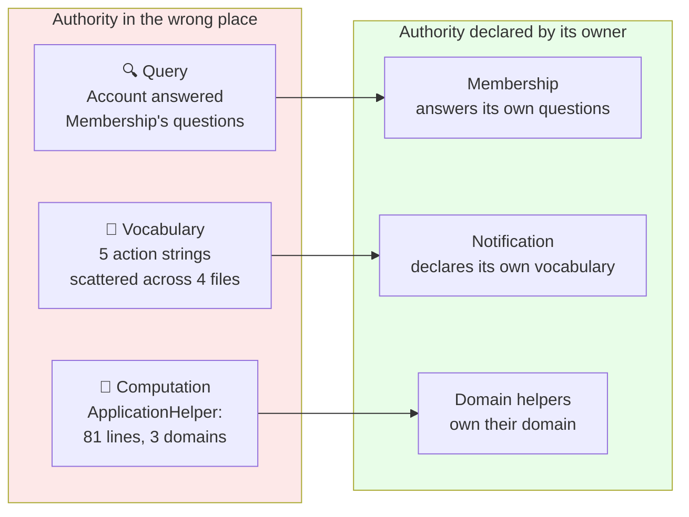
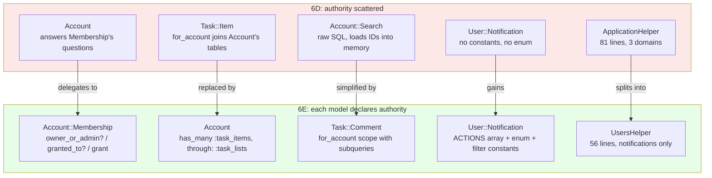

<p align="center">
<small>
<code>MENU:</code> <a href="https://github.com/railswhey/app/tree/MAP?tab=readme-ov-file">MAP</a> | <strong>README</strong> | <a href="/docs/00-INSTALLATION.md">Installation</a> | <a href="/docs/01-FEATURES.md">Features &amp; Screenshots</a> | <a href="/docs/02-TESTING.md">Testing</a> | <a href="/docs/governance/MANIFESTO.md">Manifesto</a>
</small>
</p>

<h1 align="center" style="border-bottom: none;">
  
  Rails Whey App
  
</h1>

<p align="center">
  
</p>

A full-stack task management app built with Ruby on Rails. This branch applies one principle across the codebase: each model declares its own authority. Membership gains class methods that answer its own questions. Account declares `has_many :task_items, through: :task_lists`. Notification declares action constants with an enum. Helpers reorganize by domain. 28 files change; no behavioral tests change.

| | |
|---|---|
| **Branch** | `6E-declared-authority` |
| **Ruby** | 4.0 |
| **Rails** | 8.1 |
| **Rubycritic** | 91.72 |
| **LOC** | 1717 |

**Table of contents:**

- [🎯 The concept](#-the-concept)
- [📊 The numbers](#-the-numbers)
- [🤔 The problem](#-the-problem)
- [🔬 The evidence](#-the-evidence)
- [➡️ What comes next](#️-what-comes-next)
- [🏛️ Thesis checkpoint](#️-thesis-checkpoint)
- [🤖 The agent's view](#-the-agents-view)
- [🚀 Quick start](#-quick-start)
- [🧪 Testing](#-testing)
- [🗺️ The map](#️-the-map)

---

## 🎯 The concept

> **One rule:** if it's your data, it's your responsibility to answer questions about it.

6A–6D made targeted extractions — a PORO for authorization, a PORO for crypto, constants for status, query objects for search. Each fixed one problem in one place. 6E applies the principle across the entire codebase.

Three categories of authority were misplaced:



Each piece of logic was correct. Each sat in the wrong place.

---

## 📊 The numbers

| | Before (6D) | After (6E) |
|---|---|---|
| Modified files | — | 28 |
| New files | — | 0 |
| Behavioral test changes | — | 0 |
| Rubycritic | 91.58 | 91.72 |

**Model shifts:**

| Model | Before | After | Change |
|---|---|---|---|
| Account | 35 lines | 28 lines | −7 (membership methods delegate) |
| Account::Membership | 17 lines | 23 lines | +6 (gains class methods + role constants) |
| Account::Search | 39 lines | 25 lines | −14 (raw SQL → scope calls) |
| User::Notification | 27 lines | 41 lines | +14 (gains constants + enum) |
| Task::Comment | 17 lines | 21 lines | +4 (gains `for_account` scope) |

**Helper shifts:**

| Helper | Before | After |
|---|---|---|
| ApplicationHelper | 81 lines | 33 lines |
| UsersHelper | 4 lines | 56 lines |
| TaskListsHelper | 4 lines | 15 lines |
| TaskItemsHelper | 63 lines | 49 lines |

Models that gained authority grew. Files that lost misplaced logic shrank. Twenty-eight files changed; zero behavioral tests changed.

---

## 🤔 The problem

Code landed where it was convenient for the caller, not where it belongs by domain. It's like keeping your socks in the kitchen just because it's closer to the laundry room — convenient for you, disastrous for anyone else navigating the house.

Five places where authority was misplaced:

**Account answered Membership's questions.** `owner_or_admin?`, `member?`, `add_member` were one-liner wrappers. The data — the role column — lives in Membership. But Account answered the questions, because the caller had an account and a user.

**Task::Item knew about Account's tables.** The `for_account` scope joined `task_lists` and filtered by `account_id`. The relationship path existed but wasn't declared — `has_many :task_items, through: :task_lists`.

**Account::Search built raw SQL with string interpolation.** It loaded all `task_item_ids` and `task_list_ids` into Ruby arrays for an OR clause. The database could handle subqueries. Nobody asked it to.

**Notification actions were magic strings.** `"transfer_accepted"` and `"invitation_received"` appeared as raw literals across four files — `Account::Invitation`, `Task::List::Transfer`, `User::Notification`'s filter scope, and `ApplicationHelper`. No constants, no enum. A typo silently stored garbage.

**ApplicationHelper mixed three domains** — navigation chrome, notification helpers reaching into `User::Notification`'s domain, and `user_initials` computing from `User` attributes. 81 lines because Rails generates one helper and everything gravitates there. `task_lists_selector` lived in `TaskItemsHelper` instead of `TaskListsHelper`.

---

## 🔬 The evidence

**Pattern 1: Membership answers its own questions**

```ruby
class Account::Membership < ApplicationRecord
  OWNER = "owner"
  ADMIN = "admin"
  COLLABORATOR = "collaborator"

  enum :role, { owner: OWNER, admin: ADMIN, collaborator: COLLABORATOR }
  scope :owner_or_admin, -> { where(role: [OWNER, ADMIN]) }

  def self.owner_or_admin?(user) = owner_or_admin.exists?(user: user)
  def self.granted_to?(user)     = exists?(user: user)
  def self.grant(user, role:)    = find_or_create_by!(user: user) { it.role = role }

  def removable_by?(user)        = !owner? && self.user != user
end
```

Account delegates without changing its public API:

```ruby
class Account < ApplicationRecord
  has_many :memberships, dependent: :destroy
  has_many :task_lists, dependent: :destroy, class_name: "Task::List"
  has_many :task_items, through: :task_lists
  # ...

  def member?(user)           = memberships.granted_to?(user)
  def add_member(user, role:) = memberships.grant(user, role:)
  def owner_or_admin?(user)   = memberships.owner_or_admin?(user)

  def search(query)
    Account::Search.new(self).with(query.to_s.strip)
  end
end
```

The class methods work on association proxies — `account.memberships.owner_or_admin?(user)` is scoped to that account automatically.

**Pattern 2: Account declares `has_many :task_items, through: :task_lists`**

```ruby
# Before — Task::Item joins across the boundary
scope :for_account, ->(account_id) {
  joins(:task_list).where(task_lists: { account_id: account_id })
}
# Callers: Task::Item.for_account(Current.account_id)

# After — Account declares the path
has_many :task_items, through: :task_lists
# Callers: Current.account.task_items
```

**Pattern 3: Comments gain a subquery scope**

```ruby
# Before — raw SQL, loads IDs into memory
Task::Comment.where(
  "(commentable_type = 'Task::Item' AND commentable_id IN (?)) OR ...",
  task_items.ids.presence || [0],
  task_lists.ids.presence || [0]
)

# After — subqueries stay in the database
class Task::Comment < ApplicationRecord
  scope :for_account, ->(account) {
    where(commentable_type: "Task::Item", commentable_id: account.task_items.select(:id))
    .or(where(commentable_type: "Task::List", commentable_id: account.task_lists.select(:id)))
  }
end
```

**Pattern 4: Notification declares its vocabulary**

```ruby
class User::Notification < ApplicationRecord
  UNREAD = "unread"
  INVITES = "invites"
  TRANSFERS = "transfers"

  ACTIONS = [
    INVITATION_RECEIVED = "invitation_received",
    INVITATION_ACCEPTED = "invitation_accepted",
    TRANSFER_REQUESTED  = "transfer_requested",
    TRANSFER_ACCEPTED   = "transfer_accepted",
    TRANSFER_REJECTED   = "transfer_rejected"
  ].freeze

  enum :action, ACTIONS.to_h { [it, it] }

  scope :filter_by, ->(type) {
    case type
    when UNREAD    then unread
    when INVITES   then where(action: [INVITATION_RECEIVED, INVITATION_ACCEPTED])
    when TRANSFERS then where(action: [TRANSFER_REQUESTED, TRANSFER_ACCEPTED, TRANSFER_REJECTED])
    else all
    end
  }
end
```

An invalid action now raises `ArgumentError` instead of silently storing garbage. A typo in a constant raises `NameError` instead of silently persisting.



---

## ➡️ What comes next

Authority is declared. But association names inside namespaces still repeat what the namespace already says. `Task::List` calls its children `task_items` — inside the `Task::` namespace, the `task_` prefix is redundant.

Branch `6F-contextual-names` drops the prefix inside namespaces. `Task::List` calls children `items`. Account keeps the full names at the boundary — `task_lists` — because from Account's perspective, the prefix IS the context. Forty-two files change. Zero net line change. Zero behavioral test changes. ✌️

---

## 🏛️ Thesis checkpoint

Authorization logic declared explicitly across the codebase — Principle 4 at the policy layer. No authorization gem. The authority is the model's own knowledge of its membership structure, formalized and made consistent. Every permission check traces back to a model predicate.

---

## 🤖 The agent's view

Before 6E, every lookup starts in the wrong file. Account-scoped task items? Discover `Task::Item.for_account` on a 71-line file. Comments? Parse raw SQL in Account::Search. Valid notification actions? Grep four files. Each question sends the agent to someone else's house.

After 6E, every lookup starts in the right file. Account (28 lines) shows `has_many :task_items, through: :task_lists`. `Task::Comment.for_account(account)` is a standard composable scope. `User::Notification` (41 lines) lists every valid action in the `ACTIONS` array. For rendering, `UsersHelper` (56 lines) uses pattern matching on `[action, notifiable]` tuples.

Magic strings are the highest-risk pattern for agents. `action: "transfer_accepted"` has no programmatic check — a typo silently persists. `User::Notification::TRANSFER_ACCEPTED` raises `NameError` at load time. The shift from runtime silence to load-time failure is the practical benefit. Raw SQL is similarly opaque — agents can't compose or safely modify it. Subqueries through `.select(:id)` are standard ActiveRecord that any agent understands.

---

## 🚀 Quick start

Prerequisites: [mise](https://mise.jdx.dev/) (manages Ruby, Node, Mailpit)

```sh
git clone git@github.com:railswhey/app.git -b 6E-declared-authority 6E-declared-authority
cd 6E-declared-authority
mise install                 # Ruby 4.0.1 + Node 22 + Mailpit 1.29.2
bin/setup                    # bundle install, db:prepare, starts dev server
```

> See [Installation guide](./docs/00-INSTALLATION.md) for detailed setup, demo accounts, and E2E test setup.

## 🧪 Testing

Full CI pipeline (run after changes):

```sh
bin/ci                       # setup + RuboCop + Brakeman + bundler-audit + tests
```

Individual commands for faster feedback during development:

```sh
bin/rails test               # integration tests (Minitest)
mise run e2e:web             # Playwright navigation smoke test (fast, ~15s)
mise run e2e:web:full        # all Playwright specs (~5min)
mise run e2e:api             # curl + jq smoke tests (requires running server)
mise run e2e:test            # all E2E (e2e:web fast + e2e:api)
```

> See [Testing guide](./docs/02-TESTING.md) for running subsets, CI pipeline details, and E2E deep dives.

## 🗺️ The map

This branch is one point on a 28-branch gradient — from a single fat controller (1A) to fully isolated engines (7D). Every point is a valid, defensible choice. The goal is not to reach the end, but to see that the path exists.

For the full gradient, the manifesto, and the project's governance, see the [MAP](https://github.com/railswhey/app/tree/MAP?tab=readme-ov-file).
