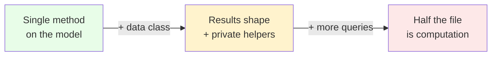
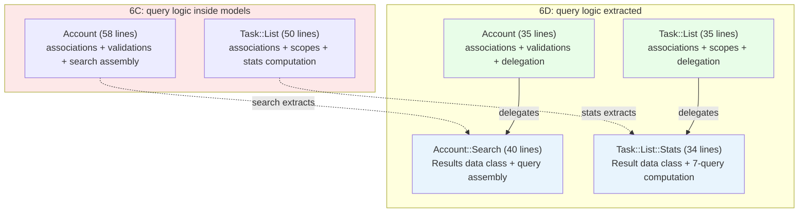

<p align="center">
<small>
<code>MENU:</code> <a href="https://github.com/railswhey/app/tree/MAP?tab=readme-ov-file">MAP</a> | <strong>README</strong> | <a href="/docs/00-INSTALLATION.md">Installation</a> | <a href="/docs/01-FEATURES.md">Features &amp; Screenshots</a> | <a href="/docs/02-TESTING.md">Testing</a> | <a href="/docs/governance/MANIFESTO.md">Manifesto</a>
</small>
</p>

<h1 align="center" style="border-bottom: none;">
  
  Rails Whey App
  
</h1>

<p align="center">
  
</p>

A full-stack task management app built with Ruby on Rails. This branch extracts two query objects — `Account::Search` and `Task::List::Stats` — from models where computed query logic had grown to dominate the host. Each AR model sheds the computation into a plain Ruby object and keeps a one-line delegation. Account drops from 58 to 35 lines, `Task::List` from 50 to 35.

| | |
|---|---|
| **Branch** | `6D-query-objects` |
| **Ruby** | 4.0 |
| **Rails** | 8.1 |
| **Rubycritic** | 91.58 |
| **LOC** | 1735 |

**Table of contents:**

- [🎯 The concept](#-the-concept)
- [📊 The numbers](#-the-numbers)
- [🤔 The problem](#-the-problem)
- [🔬 The evidence](#-the-evidence)
- [➡️ What comes next](#️-what-comes-next)
- [🏛️ Thesis checkpoint](#️-thesis-checkpoint)
- [🤖 The agent's view](#-the-agents-view)
- [🚀 Quick start](#-quick-start)
- [🧪 Testing](#-testing)
- [🗺️ The map](#️-the-map)

---

## 🎯 The concept

> **One rule:** when a computation outgrows its host model, give the computation its own object.

6A–6C named domain concepts — authorization became `Account::Member`, cryptographic identity became `User::Token::Secret`, task status became `Task::COMPLETED` / `Task::INCOMPLETE`. Each gave a *thing* its own name. 6D names a different kind of thing: a *responsibility*. The query logic isn't missing a name — it's missing a home.

`Account::Search` assembles search results across task items, task lists, and comments. `Task::List::Stats` computes 9 statistics from 7 queries. Both are plain Ruby classes that take a model, assemble data from its relations, and return a typed `Data.define` result.

The AR models keep the public API. `account.search(query)` and `list.stats` still work — each delegates to its query object in a single line. Controllers, views, and tests don't change. The computation moved; the interface didn't.

---

## 📊 The numbers

| | Before (6C) | After (6D) |
|---|---|---|
| Lines in Account | 58 | 35 |
| Lines in Task::List | 50 | 35 |
| Lines in Account::Search | — | 40 |
| Lines in Task::List::Stats | — | 34 |
| New files | — | 2 |
| Behavioral test changes | — | 0 |
| Rubycritic | 91.45 | 91.58 |

Total LOC grew slightly — compressed inline code expanded into properly structured classes with private helpers and `Data` return types. Rubycritic ticked up +0.13 because smaller, focused classes score better on per-file complexity.

---

## 🤔 The problem

Two models carried computed query logic that dominated their host.

Account was 58 lines — 25 were search: a `SearchResults` data class, 3-model assembly, polymorphic comment scoping. Task::List was 50 lines — 17 were stats: a `Stats` data class with 9 fields, 7 queries. In both cases, the remaining ~33 lines were the model's actual identity — associations, validations, scopes.

Neither model needs to know how to assemble cross-model search results or compute derived statistics. Those are responsibilities *performed on* the model's data, not properties *of* the model.



Each started as a single method on the model that owns the data — `account.search(query)` was the natural starting point, `list.stats` was the natural place. Then each grew. Each addition was small and local. But the accumulation shifted each model's center of gravity from what it *is* to what it *computes*. The model was doing two jobs, and the second job was winning.

This is the same gravitational pull that put authorization in Current (fixed by 6A) and crypto in User::Token (fixed by 6B). The data lives inside a model, so any code that uses that data gravitates there — path of least resistance.

---

## 🔬 The evidence

**Pattern 1: Account sheds search**

Account after extraction — 35 lines, one-line delegation:

```ruby
class Account < ApplicationRecord
  # ... associations, validations, membership methods ...

  def search(query)
    Account::Search.new(self).with(query.to_s.strip)
  end
end
```

The query object — 40 lines, owns the Results data class and the polymorphic comment scoping:

```ruby
class Account::Search
  Results = Data.define(:task_items, :task_lists, :comments)

  attr_reader :account

  def initialize(account)
    @account = account
  end

  def empty
    Results.new(task_items: Task::Item.none, task_lists: Task::List.none, comments: Task::Comment.none)
  end

  def with(query)
    return empty if query.size <= 1

    Results.new(
      task_items: task_items.search(query).includes(:task_list).order(created_at: :desc).limit(20),
      task_lists: task_lists.search(query).limit(10),
      comments:   comments(query)
    )
  end

  private

  def task_lists = account.task_lists
  def task_items = Task::Item.for_account(account.id)

  def comments(query)
    Task::Comment.where(
      "(commentable_type = 'Task::Item' AND commentable_id IN (?)) OR " \
      "(commentable_type = 'Task::List' AND commentable_id IN (?))",
      task_items.ids.presence || [0],
      task_lists.ids.presence || [0]
    ).search(query).includes(:user, :commentable).order(created_at: :desc).limit(10)
  end
end
```

**Pattern 2: Task::List sheds stats**

Task::List after extraction — 35 lines, one-line delegation:

```ruby
class Task::List < ApplicationRecord
  # ... associations, scopes, validations ...

  def stats
    Task::List::Stats.new(self).call
  end
end
```

The query object — 34 lines, owns the Result data class and the 7-query computation:

```ruby
class Task::List::Stats
  Result = Data.define(:total, :done, :pending, :pct, :assigned, :comments_count,
                       :last_activity, :preview_items, :list_comments)

  attr_reader :task_list

  def initialize(task_list)
    @task_list = task_list
  end

  def call
    total = task_items.count
    done  = task_items.completed.count

    Result.new(
      total:, done:,
      pending:        total - done,
      pct:            total > 0 ? (done * 100.0 / total).round : 0,
      assigned:       task_items.where.not(assigned_user_id: nil).count,
      comments_count: comments.count,
      last_activity:  task_items.order(updated_at: :desc).pick(:updated_at) || task_list.created_at,
      preview_items:  task_items.incomplete.order(created_at: :desc).limit(5).includes(:assigned_user),
      list_comments:  comments.chronological.includes(:user)
    )
  end

  private

  def task_items = task_list.task_items
  def comments = task_list.comments
end
```



Red: models with mixed responsibilities. Green: models after extraction. Blue: query objects with single responsibilities.

---

## ➡️ What comes next

The query logic has a home. Each model is lighter, each query object is focused, and the public API hasn't changed.

But authority is still scattered. Account answers Membership's questions. `Task::Item` joins across domain boundaries through `for_account`. Notification actions are magic strings across four files.

Branch `6E-declared-authority` applies one principle: each model declares its own authority. If it's your data, it's your responsibility. Twenty-eight files change. ✌️

---

## 🏛️ Thesis checkpoint

Query objects are plain Ruby classes — Principle 4 applied to the data access layer. Each query has one job, one file, one test surface. Principle 8 ensures the query logic is traceable to its source requirements. The indirection cost is real: delegation chains are longer than inline methods. But the model stays pristine as a semantic router — `account.search(query)` reads as a sentence — while the query object holds the implementation in isolation.

---

## 🤖 The agent's view

Before 6D, an agent modifying search loads `account.rb` — 58 lines mixing associations, validations, and search logic. It must separate which methods serve search and which serve Account's identity. After 6D, search lives in `account/search.rb` — 40 lines where every method serves search. One file, one concern. Same for stats: `task/list/stats.rb` — 34 lines, one `call` method, one `Result` data class. Adding a field means adding one line to the `Result` definition and one line to the `call` method.

The `Data.define` return types are legible contracts. An agent can inspect `Results` to know the available fields — `task_items`, `task_lists`, `comments` — without reading the implementation. The shape is declared in the type, not scattered across method bodies.

The trade-off is navigation cost. Tracing a search query means following the delegation chain across two files instead of reading one 58-line file top to bottom. Each file the agent opens is focused and self-contained — the counter is cleaner, but the walk is longer.

---

## 🚀 Quick start

Prerequisites: [mise](https://mise.jdx.dev/) (manages Ruby, Node, Mailpit)

```sh
git clone git@github.com:railswhey/app.git -b 6D-query-objects 6D-query-objects
cd 6D-query-objects
mise install                 # Ruby 4.0.1 + Node 22 + Mailpit 1.29.2
bin/setup                    # bundle install, db:prepare, starts dev server
```

> See [Installation guide](./docs/00-INSTALLATION.md) for detailed setup, demo accounts, and E2E test setup.

## 🧪 Testing

Full CI pipeline (run after changes):

```sh
bin/ci                       # setup + RuboCop + Brakeman + bundler-audit + tests
```

Individual commands for faster feedback during development:

```sh
bin/rails test               # integration tests (Minitest)
mise run e2e:web             # Playwright navigation smoke test (fast, ~15s)
mise run e2e:web:full        # all Playwright specs (~5min)
mise run e2e:api             # curl + jq smoke tests (requires running server)
mise run e2e:test            # all E2E (e2e:web fast + e2e:api)
```

> See [Testing guide](./docs/02-TESTING.md) for running subsets, CI pipeline details, and E2E deep dives.

## 🗺️ The map

This branch is one point on a 28-branch gradient — from a single fat controller (1A) to fully isolated engines (7D). Every point is a valid, defensible choice. The goal is not to reach the end, but to see that the path exists.

For the full gradient, the manifesto, and the project's governance, see the [MAP](https://github.com/railswhey/app/tree/MAP?tab=readme-ov-file).
