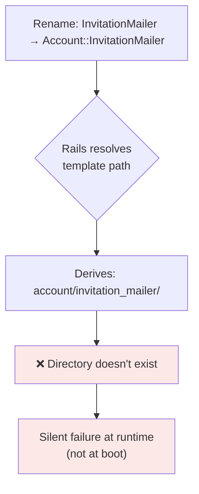
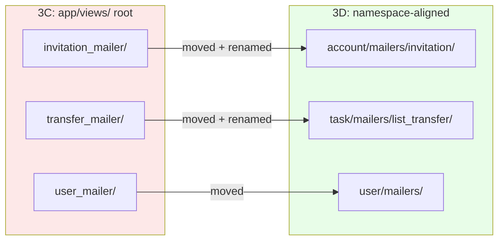

<p align="center">
<small>
<code>MENU:</code> <a href="https://github.com/railswhey/app/tree/MAP?tab=readme-ov-file">MAP</a> | <strong>README</strong> | <a href="/docs/00-INSTALLATION.md">Installation</a> | <a href="/docs/01-FEATURES.md">Features &amp; Screenshots</a> | <a href="/docs/02-TESTING.md">Testing</a> | <a href="/docs/governance/MANIFESTO.md">Manifesto</a>
</small>
</p>

<h1 align="center" style="border-bottom: none;">
  
  Rails Whey App
  
</h1>

<p align="center">
  
</p>

Two mailer classes gain domain prefixes, all three relocate view templates into `{namespace}/mailers/` directories, and every mailer declares `default template_path:` — replacing Rails' implicit path guessing with an explicit contract. Namespace discipline now spans controllers, views, and mailers.

| | |
|---|---|
| **Branch** | `3D-context-mailers` |
| **Ruby** | 4.0 |
| **Rails** | 8.1 |
| **Rubycritic** | 84.71 |
| **LOC** | 1390 |

**Table of contents:**

- [🎯 The concept](#-the-concept)
- [📊 The numbers](#-the-numbers)
- [🤔 The problem](#-the-problem)
- [🔬 The evidence](#-the-evidence)
- [🤖 The agent's view](#-the-agents-view)
- [➡️ What comes next](#️-what-comes-next)
- [🏛️ Thesis checkpoint](#️-thesis-checkpoint)
- [🚀 Quick start](#-quick-start)
- [🧪 Testing](#-testing)
- [🗺️ The map](#️-the-map)

---

## 🎯 The concept

> **One rule:** declare the path; don't let Rails guess it from the class name. You outgrow convention-over-configuration the moment you fundamentally alter the architecture that convention was designed for.

3A through 3C aligned controllers and views to domain namespaces. Each time, mailers were deferred. This branch closes the gap. Two classes gain domain prefixes: `InvitationMailer` → `Account::InvitationMailer`, `TransferMailer` → `Task::ListTransferMailer`. `UserMailer` keeps its name — it already identifies its domain. All three get one explicit line — `default template_path:` — that replaces the framework's implicit convention with a visible contract.

---

## 📊 The numbers

| | Before (3C) | After (3D) |
|---|---|---|
| Mailer view directories at `app/views/` root | 3 | 0 |
| Mailer files renamed/moved | — | 2 |
| Mailer view files moved | — | 8 |
| `default template_path:` declarations | 0 | 3 |

Fifth consecutive branch where Rubycritic (84.71) and LOC (1390) hold flat. The entire 3-series is structural alignment — no method bodies changed, no new logic was written.

---

## 🤔 The problem

After 3C, three mailer directories sat at the `app/views/` root:

```
app/views/
  account/                  ← namespaced controller views
  task/                     ← namespaced controller views
  user/                     ← namespaced controller views
  invitation_mailer/        ← flat mailer views (no namespace)
  transfer_mailer/          ← flat mailer views (no namespace)
  user_mailer/              ← flat mailer views (no namespace)
  shared/
  layouts/
```

Same level, different kind of thing. `account/` holds namespaced controller views. `invitation_mailer/` holds email templates for the account domain — but nothing in the path says so. `InvitationMailer` is called exclusively from `Account::InvitationsController`. `TransferMailer` exclusively from `Task::List::TransfersController`. The call sites live in namespaced controllers. The mailers don't reflect that relationship.

Rails auto-derives the view path from the class name. Rename `InvitationMailer` to `Account::InvitationMailer` without declaring a template path, and Rails silently looks for a directory that doesn't exist. No error at boot. Since mailers often run in background jobs, the failure explodes at runtime — when the email actually fires:



The implicit convention that worked for a flat architecture becomes a trap under namespacing. What was a cheap deferral in 3A becomes a maintenance trap by 3D — later branches (3E onward) operate under the assumption that namespace discipline is complete.

---

## 🔬 The evidence

**Pattern 1: Class naming follows a contextual rule**

Add a namespace prefix only when it adds meaningful domain signal:

| Mailer | Rule | `template_path:` |
|---|---|---|
| `Account::InvitationMailer` | Prefix added — belongs to account domain | `account/mailers/invitation` |
| `Task::ListTransferMailer` | Flattened — `Task::List::` compressed into name | `task/mailers/list_transfer` |
| `UserMailer` | Unchanged — name already carries domain signal | `user/mailers` |

All three declare `default template_path:`. One line per mailer, no boilerplate explosion — but the shift is significant. From "the framework guesses" to "the code declares":

```ruby
class Account::InvitationMailer < ApplicationMailer
  default template_path: "account/mailers/invitation"

  def invite(invitation)
    @invitation = invitation
    @accept_url = show_invitation_url(invitation.token)
    mail(
      to: invitation.email,
      subject: "You've been invited to #{invitation.account.name}"
    )
  end
end
```

**Pattern 2: View templates move into namespace directories**



Three root-level directories disappear. The `mailers/` subdirectory within each namespace creates an unambiguous boundary between controller views and email templates.

---

## 🤖 The agent's view

Before: an agent modifying the invitation email had to know the Rails convention — class name underscored = view directory. The path was an invisible dot to connect. After: `Account::InvitationMailer` contains `default template_path: "account/mailers/invitation"`. The path is in the file. No convention to memorize, no guessing game.

The `{namespace}/mailers/` pattern creates a uniform lookup: an agent searching for email templates in any namespace knows to check `{namespace}/mailers/`. An agent renaming a class sees the `template_path:` line and knows to update it. The failure mode becomes visible in the code instead of hiding in the framework's unwritten rules.

---

## ➡️ What comes next

Namespace discipline covers controllers, views, and mailers. The routing layer tells a different story — nine raw HTTP verb declarations bypass the `resource`/`resources` DSL.

Branch `3E-singular-resources` replaces all nine with proper DSL calls. The routing layer catches up. ✌️

---

## 🏛️ Thesis checkpoint

This branch introduces the first explicit interface declaration in the arc. `default template_path:` is a one-line contract that replaces an implicit convention — Principle 4 applied to making the framework's own conventions visible rather than importing external tools. The behavioral contract holds because tests assert on email delivery, not on template paths (Principle 1). The moment the application moved beyond a flat architecture, implicit conventions became liabilities. This branch begins paying them down.

---

## 🚀 Quick start

Prerequisites: [mise](https://mise.jdx.dev/) (manages Ruby, Node, Mailpit)

```sh
git clone git@github.com:railswhey/app.git -b 3D-context-mailers 3D-context-mailers
cd 3D-context-mailers
mise install                 # Ruby 4.0.1 + Node 22 + Mailpit 1.29.2
bin/setup                    # bundle install, db:prepare, starts dev server
```

> See [Installation guide](./docs/00-INSTALLATION.md) for detailed setup, demo accounts, and E2E test setup.

## 🧪 Testing

Full CI pipeline (run after changes):

```sh
bin/ci                       # setup + RuboCop + Brakeman + bundler-audit + tests
```

Individual commands for faster feedback during development:

```sh
bin/rails test               # integration tests (Minitest)
mise run e2e:web             # Playwright navigation smoke test (fast, ~15s)
mise run e2e:web:full        # all Playwright specs (~5min)
mise run e2e:api             # curl + jq smoke tests (requires running server)
mise run e2e:test            # all E2E (e2e:web fast + e2e:api)
```

> See [Testing guide](./docs/02-TESTING.md) for running subsets, CI pipeline details, and E2E deep dives.

## 🗺️ The map

This branch is one point on a 28-branch gradient — from a single fat controller (1A) to fully isolated engines (7D). Every point is a valid, defensible choice. The goal is not to reach the end, but to see that the path exists.

For the full gradient, the manifesto, and the project's governance, see the [MAP](https://github.com/railswhey/app/tree/MAP?tab=readme-ov-file).
