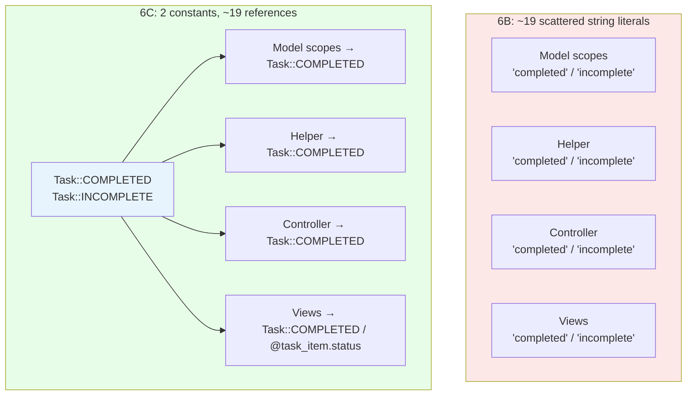
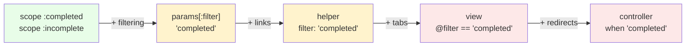

<p align="center">
<small>
<code>MENU:</code> <a href="https://github.com/railswhey/app/tree/MAP?tab=readme-ov-file">MAP</a> | <strong>README</strong> | <a href="/docs/00-INSTALLATION.md">Installation</a> | <a href="/docs/01-FEATURES.md">Features &amp; Screenshots</a> | <a href="/docs/02-TESTING.md">Testing</a> | <a href="/docs/governance/MANIFESTO.md">Manifesto</a>
</small>
</p>

<h1 align="center" style="border-bottom: none;">
  
  Rails Whey App
  
</h1>

<p align="center">
  
</p>

A full-stack task management app built with Ruby on Rails. This branch names the task status vocabulary. `"completed"` and `"incomplete"` were typed ~19 times across 6 files — magic strings with nothing connecting them. `Task::COMPLETED` and `Task::INCOMPLETE` give those values one canonical home. A `Task::Item#status` method puts the boolean-to-string translation in one place.

| | |
|---|---|
| **Branch** | `6C-task-status` |
| **Ruby** | 4.0 |
| **Rails** | 8.1 |
| **Rubycritic** | 91.45 |
| **LOC** | 1717 |

**Table of contents:**

- [🎯 The concept](#-the-concept)
- [📊 The numbers](#-the-numbers)
- [🤔 The problem](#-the-problem)
- [🔬 The evidence](#-the-evidence)
- [➡️ What comes next](#️-what-comes-next)
- [🏛️ Thesis checkpoint](#️-thesis-checkpoint)
- [🤖 The agent's view](#-the-agents-view)
- [🚀 Quick start](#-quick-start)
- [🧪 Testing](#-testing)
- [🗺️ The map](#️-the-map)

---

## 🎯 The concept

> **One rule:** if the code speaks a word in multiple places, give it one canonical home.

Not every domain concept that needs a name needs a class. `Task::COMPLETED` and `Task::INCOMPLETE` replace ~19 scattered string literals across model scopes, a helper, a controller, and views. A `Task::Item#status` method puts the boolean-to-string translation in one place.

The code already spoke these words — `scope :completed`, `completed?`, `incomplete?`. The constants don't invent anything. They anchor what was already there, so a typo becomes a `NameError` instead of a silent fall-through.



This is the third naming extraction in Family 6. `Account::Member` named authorization (PORO). `User::Token::Secret` named cryptographic identity (PORO). `Task::COMPLETED` / `Task::INCOMPLETE` names completion status (constants). The tool matches the concept's weight: classes for behavior, constants for vocabulary.

---

## 📊 The numbers

| | Before (6B) | After (6C) |
|---|---|---|
| Constants added to `Task` | 0 | 2 |
| Methods added to `Task::Item` | — | 1 (`status`) |
| String literals replaced | — | ~19 |
| New files | — | 0 |
| Modified files | — | 6 |
| Behavioral test changes | — | 0 |
| Rubycritic | 91.46 | 91.45 |

Rubycritic holds at -0.01. Static analysis sees a string literal and a constant reference as identical complexity — both are one token, one comparison. But a developer sees the difference between a typo that silently falls through and a `NameError` that stops the build. The structural complexity is identical; the semantic clarity is night and day.

---

## 🤔 The problem

The strings `"completed"` and `"incomplete"` appeared ~19 times across 6 files. Each occurrence was an independent decision to type the same word — the string equivalent of magic numbers. A typo in any one — `"complted"` in a helper, `"imcomplete"` in a view — silently falls through to the `else` branch of a `case` statement.

The sprawl happened organically. The status started as scope names: `scope :completed`. Then filtering needed it as a URL parameter. Then the helper needed it for link generation. Then the view for tab highlighting. Then the controller for redirect logic. Each addition was local and small. Nobody noticed because every layer had its own reason to use the word, and the string always worked.



---

## 🔬 The evidence

**Pattern 1: Constants replace scattered strings**

The `Task` module gains two constants:

```ruby
module Task
  COMPLETED  = "completed"
  INCOMPLETE = "incomplete"
end
```

Every `case` statement, link helper, and view that used raw strings now references the constant:

```ruby
# Before — magic strings
scope :filter_by, ->(value) {
  case value
  when "completed"  then completed.order(completed_at: :desc)
  when "incomplete" then incomplete.order(created_at: :desc)
  else order(Arel.sql("..."))
  end
}

# After — constants
scope :filter_by, ->(value) {
  case value
  when Task::COMPLETED  then completed.order(completed_at: :desc)
  when Task::INCOMPLETE then incomplete.order(created_at: :desc)
  else order(Arel.sql("..."))
  end
}
```

The same pattern applies across all six modified files: helper link generation, controller redirect logic, view filter tabs, and empty-state messages all reference `Task::COMPLETED` and `Task::INCOMPLETE` instead of raw strings.

**Pattern 2: Status gets a method**

```ruby
# Before — inline derivation in the view
<%= @task_item.completed? ? "completed" : "incomplete" %>

# After — named method on the model
<%= @task_item.status %>

# Task::Item
def status
  completed? ? Task::COMPLETED : Task::INCOMPLETE
end
```

The boolean-to-string translation moves from the view to the model. One definition, one place to change.

---

## ➡️ What comes next

Family 6 has named three domain concepts: authorization (PORO), cryptographic identity (PORO), completion status (constants). Each was a concept the code already used but never owned.

But naming isn't the only thing models carry that doesn't belong to them. `Account` has 25 lines of search assembly. `Task::List` has 17 lines of stats computation. Neither model needs to know how to assemble those results.

Branch `6D-query-objects` extracts two query objects. `Account::Search` assembles search results. `Task::List::Stats` computes 9 statistics from 7 queries. Each AR model drops to ~35 lines and a one-line delegation. ✌️

---

## 🏛️ Thesis checkpoint

Constants that name state transitions — Principle 4 at its simplest. No state machine gem. Just Ruby constants that make implicit status logic explicit. Principle 1 holds: the tests assert on HTTP responses carrying status values, not on how those values are defined internally. The flat Rubycritic score proves what static analysis can and cannot see: it cannot distinguish a magic string from a typed constant. The value is not in reduced complexity — it is in changing silent fall-throughs into loud `NameError`s.

---

## 🤖 The agent's view

Before 6C, renaming the status vocabulary — changing `"completed"` to `"done"` — means finding ~19 string literals across 6 files. Grepping for a common English word is noisy. Missing one produces a silent bug. After 6C, the agent changes two constants in `task.rb`. Every reference is a constant lookup, so missing one produces a `NameError` — visible, loud, caught by any test run.

The `Task::Item#status` method eliminates inline derivation. Before 6C, a view displayed `@task_item.completed? ? "completed" : "incomplete"`. After 6C, `@task_item.status` is a method call the agent follows to one definition.

---

## 🚀 Quick start

Prerequisites: [mise](https://mise.jdx.dev/) (manages Ruby, Node, Mailpit)

```sh
git clone git@github.com:railswhey/app.git -b 6C-task-status 6C-task-status
cd 6C-task-status
mise install                 # Ruby 4.0.1 + Node 22 + Mailpit 1.29.2
bin/setup                    # bundle install, db:prepare, starts dev server
```

> See [Installation guide](./docs/00-INSTALLATION.md) for detailed setup, demo accounts, and E2E test setup.

## 🧪 Testing

Full CI pipeline (run after changes):

```sh
bin/ci                       # setup + RuboCop + Brakeman + bundler-audit + tests
```

Individual commands for faster feedback during development:

```sh
bin/rails test               # integration tests (Minitest)
mise run e2e:web             # Playwright navigation smoke test (fast, ~15s)
mise run e2e:web:full        # all Playwright specs (~5min)
mise run e2e:api             # curl + jq smoke tests (requires running server)
mise run e2e:test            # all E2E (e2e:web fast + e2e:api)
```

> See [Testing guide](./docs/02-TESTING.md) for running subsets, CI pipeline details, and E2E deep dives.

## 🗺️ The map

This branch is one point on a 28-branch gradient — from a single fat controller (1A) to fully isolated engines (7D). Every point is a valid, defensible choice. The goal is not to reach the end, but to see that the path exists.

For the full gradient, the manifesto, and the project's governance, see the [MAP](https://github.com/railswhey/app/tree/MAP?tab=readme-ov-file).
