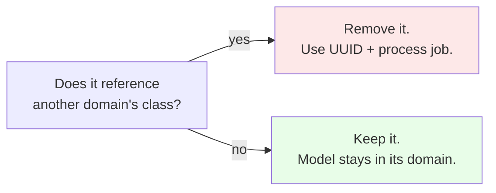
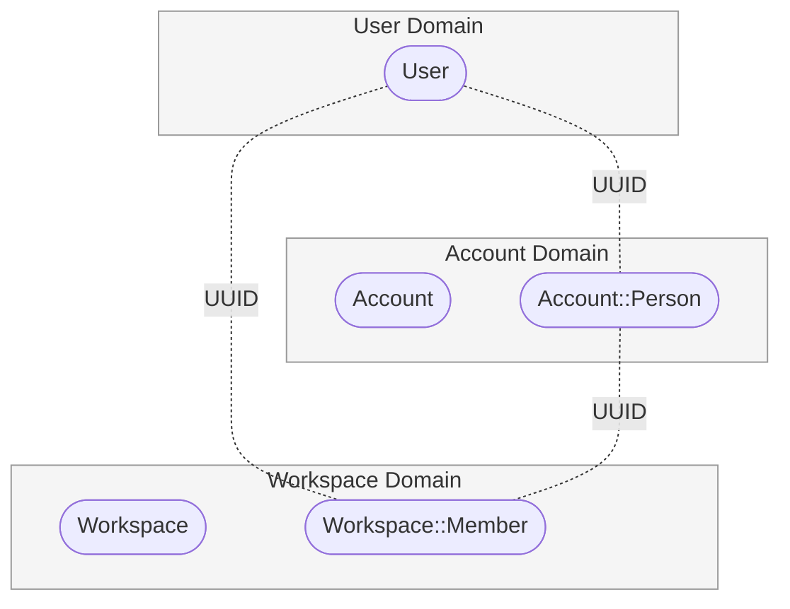
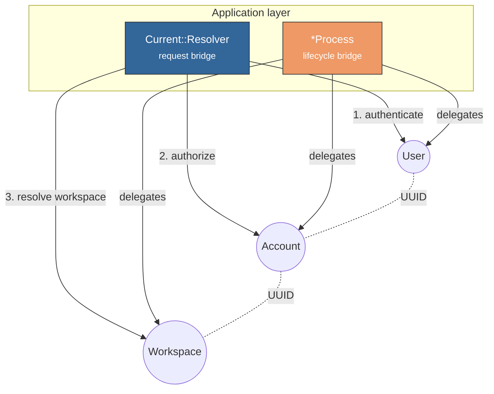
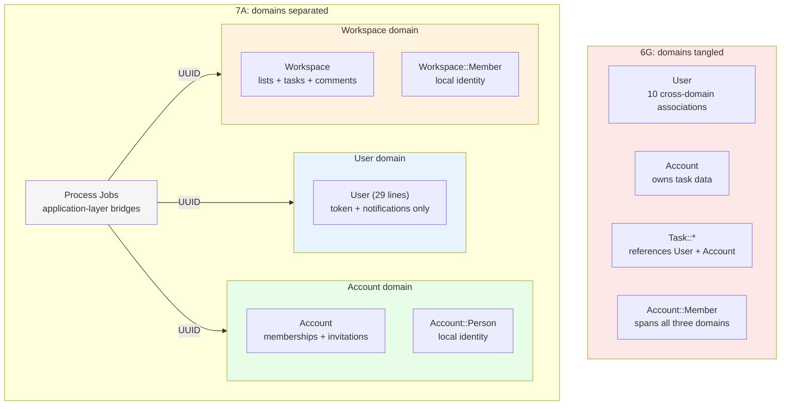

<p align="center">
<small>
<code>MENU:</code> <a href="https://github.com/railswhey/app/tree/MAP?tab=readme-ov-file">MAP</a> | <strong>README</strong> | <a href="/docs/00-INSTALLATION.md">Installation</a> | <a href="/docs/01-FEATURES.md">Features &amp; Screenshots</a> | <a href="/docs/02-TESTING.md">Testing</a> | <a href="/docs/governance/MANIFESTO.md">Manifesto</a>
</small>
</p>

<h1 align="center" style="border-bottom: none;">
  
  Rails Whey App
  
</h1>

<p align="center">
  
</p>

A full-stack task management app built with Ruby on Rails. This branch draws domain boundaries between User, Account, and Workspace. Each bounded context owns its data, its services, and its local representation of identity. Cross-domain orchestrations move to Process jobs at the application layer. `Task::*` becomes `Workspace::*`. 176 files change; no behavioral tests change; Rubycritic rises from 92.08 to 93.80.

| | |
|---|---|
| **Branch** | `7A-domain-boundaries` |
| **Ruby** | 4.0 |
| **Rails** | 8.1 |
| **Rubycritic** | 93.80 |
| **LOC** | 1785 |

**Table of contents:**

- [🎯 The concept](#-the-concept)
- [📊 The numbers](#-the-numbers)
- [🤔 The problem](#-the-problem)
- [🔬 The evidence](#-the-evidence)
- [➡️ What comes next](#️-what-comes-next)
- [🏛️ Thesis checkpoint](#️-thesis-checkpoint)
- [🤖 The agent's view](#-the-agents-view)
- [🚀 Quick start](#-quick-start)
- [🧪 Testing](#-testing)
- [🗺️ The map](#️-the-map)

---

## 🎯 The concept

> **One rule:** no model references another domain's classes.

6G named the orchestrations — but every orchestration still reached across domain boundaries. Three domains traversed in one call chain, connected by foreign keys that made the coupling invisible.

7A draws the lines. Three bounded contexts:

| Domain | What it owns | Local identity |
|---|---|---|
| **User** | Authentication, tokens, notifications | — (upstream supplier) |
| **Account** | Memberships, invitations | `Account::Person` |
| **Workspace** | Lists, tasks, comments, transfers | `Workspace::Member` |



`Account::Person` and `Workspace::Member` are local copies of user identity — `uuid`, `email`, `username` copied from User at creation time. Neither holds a foreign key to `users`. The UUID is the correlation key: a shared value, not a structural dependency.



Two bridges connect the domains. `Current::Resolver` translates credentials into a per-request context holding user, person, account, and workspace. Process jobs (`User::SignUpProcess`, `Account::AcceptInvitationProcess`, etc.) orchestrate lifecycle events — each calling domain services that touch only their own bounded context.



`Task::*` becomes `Workspace::*`. `Task::Item` becomes `Workspace::Task`. `Task::List` becomes `Workspace::List`. The old namespace implied a "task" domain that never existed as a bounded context.

---

## 📊 The numbers

| | Before (6G) | After (7A) |
|---|---|---|
| Files changed | — | 176 |
| Insertions / deletions | — | 1858 / 1356 |
| Net line change | — | +502 |
| Behavioral test changes | — | 0 |
| Rubycritic | 92.08 | 93.80 |
| LOC | 1799 | 1785 |

Rubycritic jumped +1.72 — the largest single-version gain since 4B. LOC dropped despite 16 new model files. A class that does one thing within one domain ends up shorter than a class that spans three.

---

## 🤔 The problem

Three domains tangled through foreign key associations.

**User reached everywhere.** 10 cross-domain associations — memberships, accounts, task lists, comments, transfers. Rename `Task::Comment` and User breaks.

**Account owned Task data.** `has_many :task_lists`, `has_many :task_items`, `has_many :outgoing_transfers`. Task domain data accessed through Account's interface.

**`Account::Member` spanned all three.** 75 lines that authenticated a User, resolved their Account, and loaded Task data. Every controller depended on it.

`belongs_to :user` is one line. It gives you `comment.user`, `transfer.transferred_by` — all working, all readable, all creating structural dependencies invisible until you try to change one side. The first `belongs_to` is natural. The third crosses a domain boundary. By the time Transfer references both User and Account, three domains are wired together. Naming the crossing (6G) didn't eliminate the crossing.

---

## 🔬 The evidence

**Pattern 1: Models that know only their domain**

User before — 45 lines, 10 cross-domain associations. User after — 29 lines, zero:

```ruby
class User < ApplicationRecord
  has_secure_password

  has_one :token, dependent: :destroy
  has_many :notifications, dependent: :destroy

  validates :uuid, presence: true, format: { with: UUID::REGEXP }, uniqueness: true
  # ... email, username, password validations, normalizations

  def initials = Persona.initials(email: email, username: username)
end
```

Account follows the same pattern — from 7 cross-domain associations down to 3, all within its own domain.

**Pattern 2: Local representations linked by UUID**

```ruby
class Workspace::Member < ApplicationRecord
  belongs_to :workspace, optional: true
  has_many :comments, dependent: :destroy
  has_many :assigned_tasks, foreign_key: :assigned_member_id, class_name: "Task"
  has_many :initiated_transfers, foreign_key: :initiated_by_id, class_name: "List::Transfer"

  validates :uuid, presence: true, format: { with: UUID::REGEXP }, uniqueness: true
  validates :email, presence: true, format: { with: Persona::EMAIL }

  def initials = Persona.initials(email: email, username: username)
end
```

No foreign key to `users`. The UUID is the only link. The tradeoff: data can go stale if the user updates their profile. But each domain's schema is self-contained — no cross-domain join needed for display or membership checks.

**Pattern 3: Process jobs as application-layer bridges**

Before (6G), `User::Registration` called across three domains in one chain:

```ruby
user.transaction do
  user
    .tap(&:save!)
    .tap(&:create_token!)
    .then { Account::Workspace.for!(it) }
end
```

After (7A), `User::SignUpProcess` coordinates three independent domain services:

```ruby
class User::SignUpProcess < ApplicationJob
  def perform(params)
    user = nil

    ActiveRecord::Base.transaction do
      user = User::Registration.call(params)

      if user.persisted?
        uuid, email, username = user.values_at(:uuid, :email, :username)

        Account::Setup.call(uuid:, email:, username:)

        Workspace::Setup.call(uuid:, email:, username:)
      end
    end

    if user.persisted?
      UserMailer.with(user:, token: user.generate_token_for(:email_confirmation))
                .email_confirmation.deliver_later
    end

    user.persisted? ? [:ok, user] : [:err, user]
  end
end
```

Each domain service touches only its own tables. `Account::Setup` is 17 lines. `Workspace::Setup` is 13. `Account::Teardown` is 11. The UUID is the shared key — no domain service calls another domain's classes.



---

## ➡️ What comes next

The boundaries are drawn. No model references another domain's classes. But the Process jobs are procedural scripts — the steps have no identity, the intermediate state has no home.

Branch `7B-process-managers` extracts the two most complex Process jobs into nested Manager Structs — callable objects with named steps, intermediate state, and distinct lifecycle phases. ✌️

---

## 🏛️ Thesis checkpoint

Bounded contexts with local identity — Principle 4 applied at the domain level. Each domain owns its models, its namespace, its identity scheme. The behavioral tests don't care where the model files live, only that the HTTP contracts hold.

---

## 🤖 The agent's view

Before 7A, modifying task logic required ~200 lines of cross-domain context. After 7A, the same agent reads `Workspace::Task`, `Workspace::Member`, and `Current::Scope` — three workspace-domain files totaling ~60 lines. The workspace is self-contained.

The split introduces naming drift. Controllers live in `Web::Task::*` while models are `Workspace::*`. An agent searching for the model behind `Task::ItemsController` won't find `Task::Item` — it's `Workspace::Task` now. JBuilder templates contain mappings like `json.task_list_id item.workspace_list_id`. The API says `task_list_id`; the column is `workspace_list_id`. An agent reading the API contract and searching for `task_list_id` on the model hits a dead end. These shims preserve backward compatibility but are invisible traps between layers.

Three autonomous domains mean additive growth stays local. A new workspace feature adds models to `app/models/workspace/` without touching Account or User. Process jobs live in `app/jobs/` organized by actor — `app/jobs/user/` for user-initiated processes, `app/jobs/account/` for account-centric ones.

But bounded production code without the testing contract is a map without a compass. After 7A, testing moves from "unit test the model" to "test against the route abstraction layer and process job interfaces." The production code tells the agent *what* the domain does. The tests tell it *how* the domain is allowed to be used.

---

## 🚀 Quick start

Prerequisites: [mise](https://mise.jdx.dev/) (manages Ruby, Node, Mailpit)

```sh
git clone git@github.com:railswhey/app.git -b 7A-domain-boundaries 7A-domain-boundaries
cd 7A-domain-boundaries
mise install                 # Ruby 4.0.1 + Node 22 + Mailpit 1.29.2
bin/setup                    # bundle install, db:prepare, starts dev server
```

> See [Installation guide](./docs/00-INSTALLATION.md) for detailed setup, demo accounts, and E2E test setup.

## 🧪 Testing

Full CI pipeline (run after changes):

```sh
bin/ci                       # setup + RuboCop + Brakeman + bundler-audit + tests
```

Individual commands for faster feedback during development:

```sh
bin/rails test               # integration tests (Minitest)
mise run e2e:web             # Playwright navigation smoke test (fast, ~15s)
mise run e2e:web:full        # all Playwright specs (~5min)
mise run e2e:api             # curl + jq smoke tests (requires running server)
mise run e2e:test            # all E2E (e2e:web fast + e2e:api)
```

> See [Testing guide](./docs/02-TESTING.md) for running subsets, CI pipeline details, and E2E deep dives.

## 🗺️ The map

This branch is one point on a 28-branch gradient — from a single fat controller (1A) to fully isolated engines (7D). Every point is a valid, defensible choice. The goal is not to reach the end, but to see that the path exists.

For the full gradient, the manifesto, and the project's governance, see the [MAP](https://github.com/railswhey/app/tree/MAP?tab=readme-ov-file).
