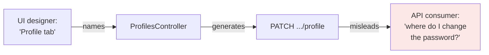
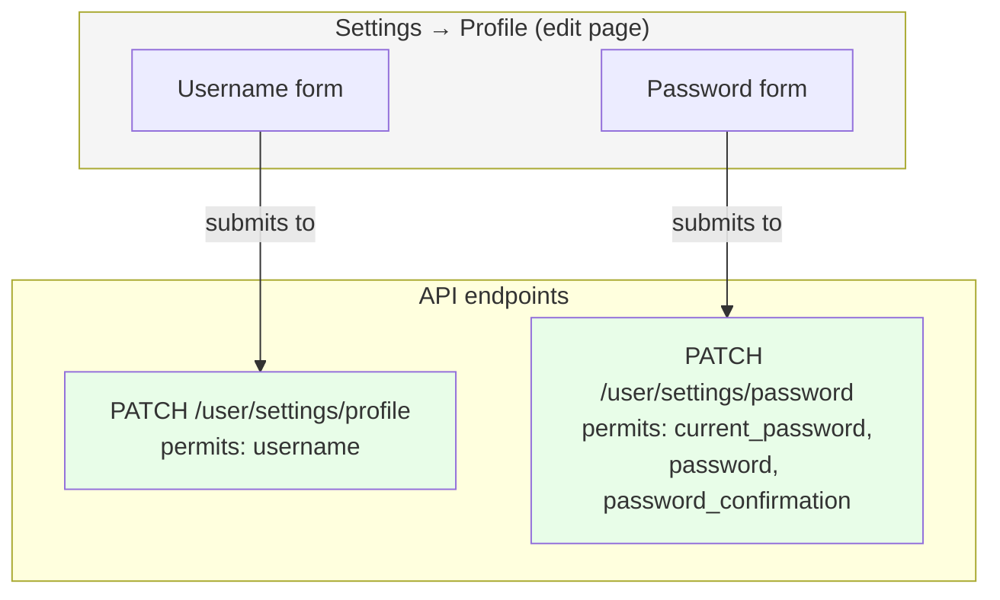
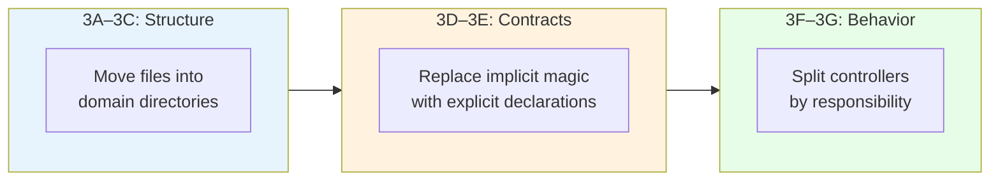

<p align="center">
<small>
<code>MENU:</code> <a href="https://github.com/railswhey/app/tree/MAP?tab=readme-ov-file">MAP</a> | <strong>README</strong> | <a href="/docs/00-INSTALLATION.md">Installation</a> | <a href="/docs/01-FEATURES.md">Features &amp; Screenshots</a> | <a href="/docs/02-TESTING.md">Testing</a> | <a href="/docs/governance/MANIFESTO.md">Manifesto</a>
</small>
</p>

<h1 align="center" style="border-bottom: none;">
  
  Rails Whey App
  
</h1>

<p align="center">
  
</p>

A full-stack task management app built with Ruby on Rails. This branch extracts the authenticated password change from `User::Settings::ProfilesController` into its own `User::Settings::PasswordsController`, giving the operation a domain-accurate API endpoint instead of one shaped by the UI's page layout.

| | |
|---|---|
| **Branch** | `3G-domain-naming` |
| **Ruby** | 4.0 |
| **Rails** | 8.1 |
| **Rubycritic** | 83.22 |
| **LOC** | 1417 |

**Table of contents:**

- [🎯 The concept](#-the-concept)
- [📊 The numbers](#-the-numbers)
- [🤔 The problem](#-the-problem)
- [🔬 The evidence](#-the-evidence)
- [🤖 The agent's view](#-the-agents-view)
- [➡️ What comes next](#️-what-comes-next)
- [🏛️ Thesis checkpoint](#️-thesis-checkpoint)
- [🚀 Quick start](#-quick-start)
- [🧪 Testing](#-testing)
- [🗺️ The map](#️-the-map)

---

## 🎯 The concept

> **One rule:** name the operation, not the page.

`PATCH /user/settings/profile` was the API endpoint for changing a password. The name came from the UI — the settings screen has a "Profile" tab, the password form lives on that tab, so the route reflected the page. The URL says "profile." The action is "password."

This branch follows what Rails has supported since day one: one resource per controller. `User::Settings::PasswordsController` owns the password change. `User::Settings::ProfilesController` owns the username update. The profile page still renders both forms — the username form submits to `PATCH /user/settings/profile`, the password form submits to `PATCH /user/settings/password`. Two domain-accurate endpoints, one page. UI organization and API naming become independent concerns.

The arc's smallest diff and the last step in Family 3.

---

## 📊 The numbers

| | Before (3F) | After (3G) |
|---|---|---|
| Controllers mixing username + password | 1 | 0 |
| `ProfilesController` permitted params | 5 | 1 (`:username`) |
| Routes under `namespace :settings` | 2 | 3 |

Rubycritic dropped from 83.92 to 83.22. Same pattern as every controller split in the arc: more single-responsibility files, lower aggregate score. The metric penalizes file count. The design improvement is real.

---

## 🤔 The problem

After 3F, `ProfilesController#update` accepted params for two unrelated operations:

```ruby
# 3F — ProfilesController mixes two operations
def user_profile_params
  params.require(:user).permit(
    :username,
    :current_password,
    :password,
    :password_confirmation,
    :password_challenge
  )
end
```

A mobile app, a coding agent, or a `curl` command had to know that the settings page groups username and password together to find the password operation. The name "profile" gave no signal that password params were accepted.

The visual grouping hijacked the backend logic:



The settings page shows username and password on the same screen. One page encourages one controller, one route. The UI grouping hardens into the API shape. A web user sees a page with two sections — it works. An API consumer sees a URL called "profile" and must discover by reading the params that it also changes passwords.

The test suite already knew these were different operations — two separate test files existed, both routing through the same URL. The tests encoded the domain separation before the routes did.

---

## 🔬 The evidence

**Each controller now permits only its own params:**

```ruby
# ProfilesController — username only
def user_profile_params
  params.require(:user).permit(:username)
end
```

```ruby
# PasswordsController — password only
def user_password_params
  params.require(:user).permit(
    :current_password, :password,
    :password_confirmation, :password_challenge
  )
end
```

**One resource added to the route file:**

```ruby
namespace :settings do
  resource :profile,  only: [:edit, :update]
  resource :password, only: [:update]         # ← new
  resource :token,    only: [:edit, :update]
end
```

No override. The resource name matches the controller. The URL says "password."

**The page renders both forms. The routes separate them:**



A redesign that moves the password form to a separate page requires zero route changes. An API version that deprecates the profile endpoint doesn't affect the password endpoint. The concerns are independent.

---

## 🤖 The agent's view

An agent asked to "find the endpoint for changing a password" searches for `password` in controller file names. In 3F, it finds `user/passwords_controller.rb` (the guest password reset) but not the authenticated password change, buried inside `user/settings/profiles_controller.rb`. After 3G, `user/settings/passwords_controller.rb` is a direct hit. The file name matches the operation.

The test suite mirrors the problem. In 3F, password-change tests lived in `profiles_test.rb`. An agent adding a test for password validation would search for `password` in test file names, find `passwords_test.rb` (guest reset tests), and miss the authenticated tests entirely. After 3G, `settings/passwords_test.rb` is the right file on the first search.

The cost compounds with scale. One mismatch between a UI-derived name and a domain operation is a minor detour. A dozen means agents spend more tokens on backtracking than on the task they were asked to perform. Domain-accurate naming prevents the accumulation.

Across the full Family 3 arc: structural alignment (3A–3C) shrank the search space from 26 flat files to scoped directories. Explicit contracts (3D–3E) gave agents metadata in the code — `template_path:`, `param: :token`, DSL declarations — instead of requiring convention inference. Behavioral decoupling (3F–3G) reduced reasoning complexity — a single-audience controller is easier to reason about than a mixed-audience one with `only:` filters parsed by absence. Each phase compounded the previous one's gains.

---

## ➡️ What comes next

Family 3 is complete. Seven branches (3A through 3G) took 26 flat controllers and gave them domain-aligned namespaces, nested structure, matching views, mailer alignment, proper DSL routes, override elimination, and accurate API naming. Every controller now has a name that says what it does, not where it appears on screen.

The arc had three phases:



Each phase was necessary for the next: you can't split a controller by lifecycle until it lives in the right namespace, and you can't declare explicit paths until the directory structure is stable.

But every controller still serves two products. `User::SessionsController#create` handles HTML sign-in and JSON token exchange in the same method through `respond_to` blocks. Session cookies vs bearer tokens, different response shapes, different error conventions — tangled in every action across all controllers.

Branch `4A-separation-of-entry-points` makes the break: two controller families (`Web::` for HTML, `API::V1::` for JSON), two base controllers, two route scopes. Each controller speaks one language. The `respond_to` blocks disappear. ✌️

---

## 🏛️ Thesis checkpoint

Naming is the most underrated design tool. This branch renames controllers, routes, and views to reflect domain language rather than implementation language — Principle 4 at the naming level. Views followed controllers through every rename (Principle 6). The Controller Era ends here with a Rubycritic score of 83.22 — a 3.74-point climb from the baseline using nothing but structural reorganization and standard Rails conventions.

Structure before behavior is the right sequence, but structure alone is not architecture. The directory tree that looked pristine in 3B now has classes whose internal design matches their external organization. The [Manifesto](/docs/governance/MANIFESTO.md) calls this the gradient — the Controller Era proved the first segment exists.

---

## 🚀 Quick start

Prerequisites: [mise](https://mise.jdx.dev/) (manages Ruby, Node, Mailpit)

```sh
git clone git@github.com:railswhey/app.git -b 3G-domain-naming 3G-domain-naming
cd 3G-domain-naming
mise install                 # Ruby 4.0.1 + Node 22 + Mailpit 1.29.2
bin/setup                    # bundle install, db:prepare, starts dev server
```

> See [Installation guide](./docs/00-INSTALLATION.md) for detailed setup, demo accounts, and E2E test setup.

## 🧪 Testing

Full CI pipeline (run after changes):

```sh
bin/ci                       # setup + RuboCop + Brakeman + bundler-audit + tests
```

Individual commands for faster feedback during development:

```sh
bin/rails test               # integration tests (Minitest)
mise run e2e:web             # Playwright navigation smoke test (fast, ~15s)
mise run e2e:web:full        # all Playwright specs (~5min)
mise run e2e:api             # curl + jq smoke tests (requires running server)
mise run e2e:test            # all E2E (e2e:web fast + e2e:api)
```

> See [Testing guide](./docs/02-TESTING.md) for running subsets, CI pipeline details, and E2E deep dives.

## 🗺️ The map

This branch is one point on a 28-branch gradient — from a single fat controller (1A) to fully isolated engines (7D). Every point is a valid, defensible choice. The goal is not to reach the end, but to see that the path exists.

For the full gradient, the manifesto, and the project's governance, see the [MAP](https://github.com/railswhey/app/tree/MAP?tab=readme-ov-file).
