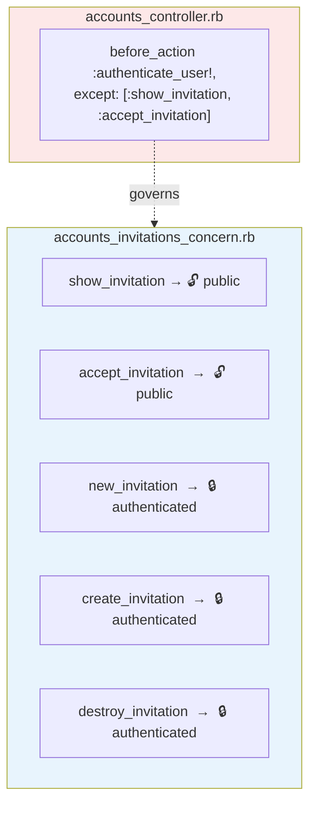
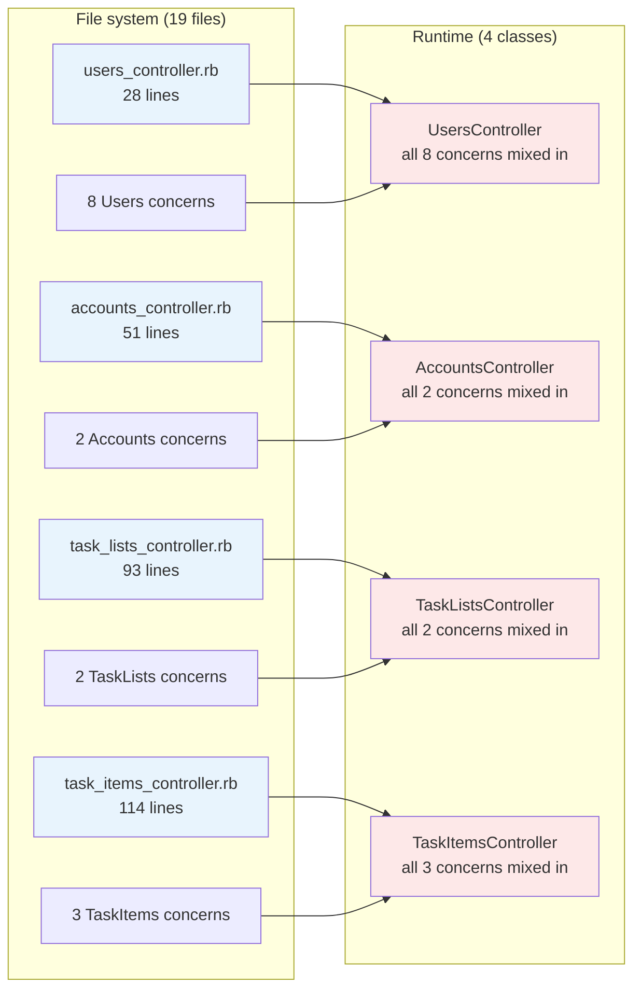

<p align="center">
<small>
<code>MENU:</code> <a href="https://github.com/railswhey/app/tree/MAP?tab=readme-ov-file">MAP</a> | <strong>README</strong> | <a href="/docs/00-INSTALLATION.md">Installation</a> | <a href="/docs/01-FEATURES.md">Features &amp; Screenshots</a> | <a href="/docs/02-TESTING.md">Testing</a> | <a href="/docs/governance/MANIFESTO.md">Manifesto</a>
</small>
</p>

<h1 align="center" style="border-bottom: none;">
  
  Rails Whey App
  
</h1>

<p align="center">
  
</p>

A full-stack task management app built with Ruby on Rails. This branch applies `ActiveSupport::Concern` to the four fat controllers from `1A-fat-controller`. Fifteen concern modules extract the non-CRUD actions into focused files. The controllers shrink to 28–114 lines each. The class model doesn't change.

| | |
|---|---|
| **Branch** | `1B-extract-concerns` |
| **Ruby** | 4.0 |
| **Rails** | 8.1 |
| **Rubycritic** | 84.95 |
| **LOC** | 1377 |

**Table of contents:**

- [🎯 The concept](#-the-concept)
- [📊 The numbers](#-the-numbers)
- [🔒 The split contract](#-the-split-contract)
- [🔬 The evidence](#-the-evidence)
- [🤖 The agent's paradox](#-the-agents-paradox)
- [➡️ What comes next](#️-what-comes-next)
- [🏛️ Thesis checkpoint](#️-thesis-checkpoint)
- [🚀 Quick start](#-quick-start)
- [🧪 Testing](#-testing)
- [🗺️ The map](#️-the-map)

---

## 🎯 The concept

> **One rule:** extract the file, keep the class.

1A left four controllers above 200 lines, each a catch-all for unrelated workflows. The boundaries were already visible — prefixed action names, clustered private methods, opposing filter lists — but the file system stored everything in one place.

This branch gives each workflow its own file using `ActiveSupport::Concern`. Fifteen modules absorb the non-CRUD actions. Controllers keep only CRUD and `before_action` declarations.

Tests pass without edits. No routes change. The behavioral contract is identical to 1A — the only thing that changed is which file you open.

---

## 📊 The numbers

Rubycritic: 79.48 → 84.95 — the largest single-branch gain in Families 1 and 2. But the tool evaluates per-file complexity and is blind to cross-file coupling. Splitting a 277-line controller into a 93-line controller and two concern modules reduces every per-file metric without changing the runtime architecture. The score improved because the files got smaller, not because the system got simpler.

Total LOC grew from 1310 to 1377. The 67-line increase is boilerplate: fifteen `module ... extend ActiveSupport::Concern ... end` wrappers. Every extraction adds 3–4 lines of ceremony.

Controllers shrank to 28, 51, 93, and 114 lines. The two largest concerns — `TaskListsTransfersConcern` (142 lines) and `AccountsInvitationsConcern` (130 lines) — are longer than the controllers they came from. The smallest, `UsersSettingsConcern`, is 9 lines.

The house looks spotless. The metrics say so. But what happens when you open the closet?

---

## 🔒 The split contract

The concern moved the action. It didn't move the lock.

`UsersSettingsConcern` — the smallest extracted file — is 9 lines:

```ruby
module UsersSettingsConcern
  extend ActiveSupport::Concern

  def settings
    render :settings
  end
end
```

Does `settings` require authentication? The concern doesn't say. The answer lives in `UsersController`'s `before_action` list, in a different file. The action is in one room; the lock is on a completely different door.

Multiply across 15 concerns. Every concern's access rules live in its parent controller. No concern file is self-contained in the security sense — each one is half a contract, with the other half defined elsewhere.



This happens because `ActiveSupport::Concern` is a module mixin system. When you `include` a concern, Ruby copies its methods into the controller's method table. At runtime, it's one object — same instance variables, same callback chain, same private namespace. A concern is a file drawer in the same cabinet, not a separate cabinet.

---

## 🔬 The evidence

The file system says 19 files. The runtime says 4 classes.



Blue is what you see browsing the codebase. Red is what Rails sees when a request arrives. The gap between these two views is the ceiling that concerns cannot raise.

The runtime unity has teeth. `private` in a concern is a Ruby illusion — those methods mix into the controller and share the same namespace as every other concern's private methods. If two concerns both define `comment_params`, the last-included module wins silently. No warning, no error. Instance variables leak the same way: a concern setting `@account` exposes it to every other concern in the class.

The file boundary suggests isolation. The runtime doesn't enforce it.

---

## 🤖 The agent's paradox

For single-concern edits, the token cost dropped sharply. An agent fixing a comment bug loads 59 lines instead of 277 — a 4.7x reduction. The median concern file is 49 lines. File names encode the domain, so an agent finds invitation logic by name without reading any file.

But here's the paradox: by optimizing files to be perfectly digestible for AI, we've created a structural blind spot.

An agent working inside `AccountsInvitationsConcern` sees the action methods but not the `before_action` chain — that lives in `AccountsController`. If it adds a new public action to the concern and doesn't update the controller's filter list, the action inherits the wrong access rule. The failure is silent.

In 1A, the agent loaded one 214-line file and had everything — actions, authorization, helpers — in a single buffer. In 1B, the same information splits across two files: fewer tokens, but a cognitive leap across an implicit boundary. Lower token count, higher reasoning complexity. The architecture is cheaper to load but harder to reason about correctly.

---

## ➡️ What comes next

Branch `2A-multi-controllers` takes the step concerns can't: it gives each workflow its own class. The 15 modules become standalone controllers — `UserNotificationsController`, `AccountInvitationsController`, `TaskListTransfersController`. Each owns its own `before_action`. No `except:` lists. No `only:` lists spanning concerns.

Method names shed their prefixes. `create_comment` becomes `create`. `new_transfer` becomes `new`. The class name carries the context.

The split that 1B made at the file level now happens at the class level. The gap between file-system view and runtime view closes. ✌️

---

## 🏛️ Thesis checkpoint

Principle 4 in action — but at its ceiling. `ActiveSupport::Concern` is a legitimate Rails tool used exactly as the framework intends. Principle 1 validates the extraction: zero test edits needed, because the tests couple to HTTP contracts, not to file organization. But the extraction reveals the tool's limit. The isolation is cosmetic — a file-system convenience the runtime does not enforce. Private methods collide silently, instance variables leak, the authorization contract fractures across files, and the Rubycritic jump measures smaller files, not simpler architecture. The real separation — giving each workflow its own class, its own callback chain, its own runtime identity — requires moving the boundary from the file to the class. That is the step concerns cannot take.

---

## 🚀 Quick start

Prerequisites: [mise](https://mise.jdx.dev/) (manages Ruby, Node, Mailpit)

```sh
git clone git@github.com:railswhey/app.git -b 1B-extract-concerns 1B-extract-concerns
cd 1B-extract-concerns
mise install                 # Ruby 4.0.1 + Node 22 + Mailpit 1.29.2
bin/setup                    # bundle install, db:prepare, starts dev server
```

> See [Installation guide](./docs/00-INSTALLATION.md) for detailed setup, demo accounts, and E2E test setup.

## 🧪 Testing

Full CI pipeline (run after changes):

```sh
bin/ci                       # setup + RuboCop + Brakeman + bundler-audit + tests
```

Individual commands for faster feedback during development:

```sh
bin/rails test               # integration tests (Minitest)
mise run e2e:web             # Playwright navigation smoke test (fast, ~15s)
mise run e2e:web:full        # all Playwright specs (~5min)
mise run e2e:api             # curl + jq smoke tests (requires running server)
mise run e2e:test            # all E2E (e2e:web fast + e2e:api)
```

> See [Testing guide](./docs/02-TESTING.md) for running subsets, CI pipeline details, and E2E deep dives.

## 🗺️ The map

This branch is one point on a 28-branch gradient — from a single fat controller (1A) to fully isolated engines (7D). Every point is a valid, defensible choice. The goal is not to reach the end, but to see that the path exists.

For the full gradient, the manifesto, and the project's governance, see the [MAP](https://github.com/railswhey/app/tree/MAP?tab=readme-ov-file).
