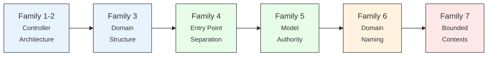

<small>
<code>MENU:</code> <strong>README</strong> | <a href="/docs/03-THE-GRADIENT.md">The Gradient</a> | <a href="/docs/00-INSTALLATION.md">Installation</a> | <a href="/docs/01-FEATURES.md">Features &amp; Screenshots</a> | <a href="/docs/02-TESTING.md">Testing</a> | <a href="/docs/governance/MANIFESTO.md">Manifesto</a>
</small>

<h1 align="center" style="border-bottom: none;">
  
  Rails Whey App
  
</h1>

  

**The Rails Way has more room in it than most people think.** This project exists to prove it — _**twenty-eight versions**_ of the same application, each applying one architectural rule, using only what Rails gives you out of the box. ✌️

## 📚 Table of contents <!-- omit in toc -->

- [📢 Disclaimer](#-disclaimer)
- [🗺️ The Gradient](#️-the-gradient)
- [🤖 Built for the AI era](#-built-for-the-ai-era)
- [🌿 Repository Branches](#-repository-branches)
- [👋 About](#-about)

## 📢 Disclaimer

[Ruby on Rails](https://rubyonrails.org/) is a highly productive MVC framework whose [primary value proposition is to be a one-person framework](https://www.youtube.com/watch?v=iqXjGiQ_D-A) — empowering individuals to be as productive as entire teams. And this doesn't only apply to individuals. [Shopify](https://shopify.engineering/) has thousands of developers working on a monolithic and modular Rails application with millions of lines of code.

**The main challenge of any growing system is to accommodate its complexity well.** As codebases grow, it's natural to reach for service objects, interactors, and external architecture patterns. But there's a design spectrum within Rails itself that most teams never fully explore.

This project demonstrates that spectrum. No gems required. No external architecture imported. Just controllers, models, concerns, callbacks, scopes, engines — the framework's own tools, applied with discipline. **Twenty-eight branches** trace a continuous path from a single fat controller to fully isolated bounded contexts with separate databases.

This is a full-stack task management app with collaboration, multi-account workspaces, notifications, full-text search, and a REST API — implemented in twenty-eight versions to gradually demonstrate the pros and cons of each approach. Enjoy! ✌️😊

> **Why "Rails Whey"?** Whey protein is the simplest building block for strength — no exotic stacks, no over-engineered formulas, just the essential nutrient applied with discipline. That's exactly what this project does with Rails: the framework's own building blocks, taken seriously. The name is not a label. It is the thesis. → [Read the Manifesto](/docs/governance/MANIFESTO.md) 🦾

<a href="#-table-of-contents-">⬆ back to top</a>

## 🗺️ The Gradient

The branches are organized into **seven families**. Each family tackles one architectural concern. Together they trace an unbroken arc:

**Every branch applies a single rule.** Every rule removes one category of accidental complexity. The code quality score (Rubycritic, 0–100) rises from **79** to **94** as the architecture deepens — not despite the added structure, but because of it.

Every branch README is a deep dive — not just a changelog. Here's what you'll find inside each one:

| Section | What it gives you |
|---|---|
| 🎯 **The concept** | The single rule the branch applies |
| 📊 **The numbers** | Before/after metrics — LOC, Rubycritic, file counts |
| 🔬 **The evidence** | Code examples, mermaid diagrams, structural analysis |
| 🤖 **The agent's view** | How the change affects AI coding agents |
| 🏛️ **Thesis checkpoint** | How the branch connects back to the [Constitution](/docs/governance/CONSTITUTION.md) |
| ➡️ **What comes next** | Why the next branch exists |

👉 **[Read The Gradient →](/docs/03-THE-GRADIENT.md)** for the full narrative — family by family, rule by rule, with honest tradeoffs at every step.

<a href="#-table-of-contents-">⬆ back to top</a>

## 🤖 Built for the AI era

Architecture isn't just for humans anymore. Every branch measures its impact on coding agents — context window cost, token overhead, and reasoning complexity.

The trade-off runs through the entire gradient. In [1A-fat-controller](https://github.com/railswhey/app/tree/1A-fat-controller?tab=readme-ov-file), an agent fixing a comment bug loads 277 lines to reach 40 lines of signal — a **7× token overhead**. But everything lives in one file: authorization, actions, helpers. Easy to reason about, expensive to load.

By [7D-shared-kernel](https://github.com/railswhey/app/tree/7D-shared-kernel?tab=readme-ov-file), engine isolation cuts the working set by **60–77%**. But the agent now navigates cross-engine boundaries, and tests live in the host — not inside the engines. Cheaper to load, harder to reason about.

**Every point on the gradient presents a different trade-off for agents too.** Every branch README includes a 🤖 section with the concrete numbers.

<a href="#-table-of-contents-">⬆ back to top</a>

## 🌿 Repository Branches

This repository has **twenty-eight** branches that represent the application's architectural evolution. Every branch contains its own README explaining the design decisions and what changed from the previous branch.

> [!TIP]
> **Where to start?** Pick [1A-fat-controller](https://github.com/railswhey/app/tree/1A-fat-controller?tab=readme-ov-file) — the messy starting point we all recognize. Then read 1B to see the first cleanup. Follow the numbers, or jump to any family that matches your current challenge.

**Family 1 & 2 - Controller Architecture**

| Branch | LOC | Score | Rule |
|---|---|---|---|
| [**1A**: fat-controller](https://github.com/railswhey/app/tree/1A-fat-controller?tab=readme-ov-file) | 1310 | 79.48 | If it touches the model, it goes in the controller. |
| [**1B**: extract-concerns](https://github.com/railswhey/app/tree/1B-extract-concerns?tab=readme-ov-file) | 1377 | 84.95 |Extract the file, keep the class. |
| [**2A**: multi-controllers](https://github.com/railswhey/app/tree/2A-multi-controllers?tab=readme-ov-file) | 1355 | 83.02 | One class per responsibility, not one class per entity. |
| [**2B**: rest-actions-only](https://github.com/railswhey/app/tree/2B-rest-actions-only?tab=readme-ov-file) | 1390 | 84.71 | If the action doesn't fit the 7 verbs, the resource model is wrong. |

**Family 3 - Domain Structure**

| Branch | LOC | Score | Rule |
|---|---|---|---|
| [**3A**: namespaced-controllers](https://github.com/railswhey/app/tree/3A-namespaced-controllers?tab=readme-ov-file) | 1390 | 84.71 | The prefix becomes the folder. |
| [**3B**: nested-namespaces](https://github.com/railswhey/app/tree/3B-nested-namespaces?tab=readme-ov-file) | 1390 | 84.71 | If the prefix survived the namespace, the namespace isn't deep enough. |
| [**3C**: context-views](https://github.com/railswhey/app/tree/3C-context-views?tab=readme-ov-file) | 1390 | 84.71 | Domain in the path, resource in the name. |
| [**3D**: context-mailers](https://github.com/railswhey/app/tree/3D-context-mailers?tab=readme-ov-file) | 1390 | 84.71 | Declare the path; don't let Rails guess it from the class name. |
| [**3E**: singular-resources](https://github.com/railswhey/app/tree/3E-singular-resources?tab=readme-ov-file) | 1389 | 84.41 | Express every route as a resource declaration. |
| [**3F**: resource-discipline](https://github.com/railswhey/app/tree/3F-resource-discipline?tab=readme-ov-file) | 1397 | 83.92 | Fix the name, not the route. |
| [**3G**: domain-naming](https://github.com/railswhey/app/tree/3G-domain-naming?tab=readme-ov-file) | 1417 | 83.22 | Name the operation, not the page. |

**Family 4 - Entry Point Separation**

| Branch | LOC | Score | Rule |
|---|---|---|---|
| [**4A**: separation-of-entry-points](https://github.com/railswhey/app/tree/4A-separation-of-entry-points?tab=readme-ov-file) | 1741 | 78.55 | One controller, one format, one product. |
| [**4B**: controller-deduplication](https://github.com/railswhey/app/tree/4B-controller-deduplication?tab=readme-ov-file) | 1667 | 87.13 | Match the extraction tool to the relationship. |

**Family 5 - Model Authority**

| Branch | LOC | Score | Rule |
|---|---|---|---|
| [**5A**: fat-models](https://github.com/railswhey/app/tree/5A-fat-models?tab=readme-ov-file) | 1640 | 91.51 | If two controllers compute the same thing, the model should compute it once. |
| [**5B**: model-callbacks](https://github.com/railswhey/app/tree/5B-model-callbacks?tab=readme-ov-file) | 1638 | 91.23 | If every creation path should trigger the effect, the model owns the event. |
| [**5C**: unified-vocabulary](https://github.com/railswhey/app/tree/5C-unified-vocabulary?tab=readme-ov-file) | 1641 | 91.18 | The model's name should match the controller's namespace. |
| [**5D**: model-authority](https://github.com/railswhey/app/tree/5D-model-authority?tab=readme-ov-file) | 1646 | 91.21 | Ask the model that owns the data; don't reach through its associations. |

**Family 6 - Domain Naming**

| Branch | LOC | Score | Rule |
|---|---|---|---|
| [**6A**: member-object](https://github.com/railswhey/app/tree/6A-member-object?tab=readme-ov-file) | 1696 | 91.36 | When a concept outgrows its infrastructure home, give it a class and a name. |
| [**6B**: token-secret](https://github.com/railswhey/app/tree/6B-token-secret?tab=readme-ov-file) | 1712 | 91.46 | When pure functions share a file with persistence logic, they need their own home. |
| [**6C**: task-status](https://github.com/railswhey/app/tree/6C-task-status?tab=readme-ov-file) | 1717 | 91.45 | If the code speaks a word in multiple places, give it one canonical home. |
| [**6D**: query-objects](https://github.com/railswhey/app/tree/6D-query-objects?tab=readme-ov-file) | 1735 | 91.58 | When a computation outgrows its host model, give it its own object. |
| [**6E**: declared-authority](https://github.com/railswhey/app/tree/6E-declared-authority?tab=readme-ov-file) | 1717 | 91.72 | If it's your data, it's your responsibility to answer questions about it. |
| [**6F**: contextual-names](https://github.com/railswhey/app/tree/6F-contextual-names?tab=readme-ov-file) | 1717 | 91.72 | If the namespace already says it, the name drops the prefix. |
| [**6G**: named-orchestrations](https://github.com/railswhey/app/tree/6G-named-orchestrations?tab=readme-ov-file) | 1799 | 92.08 | Multi-model coordination gets its own name. |

**Family 7 - Bounded Contexts & Isolation**

| Branch | LOC | Score | Rule |
|---|---|---|---|
| [**7A**: domain-boundaries](https://github.com/railswhey/app/tree/7A-domain-boundaries?tab=readme-ov-file) | 1785 | 93.80 | No model references another domain's classes. |
| [**7B**: process-managers](https://github.com/railswhey/app/tree/7B-process-managers?tab=readme-ov-file) | 1793 | 93.67 | When intermediate state accumulates across lifecycle phases, give the orchestration its own object. |
| [**7C**: domain-databases](https://github.com/railswhey/app/tree/7C-domain-databases?tab=readme-ov-file) | 1818 | 93.81 | Each bounded context owns its own database. |
| [**7D**: shared-kernel](https://github.com/railswhey/app/tree/7D-shared-kernel?tab=readme-ov-file) | 1832 | 94.55 | The host app keeps only what both interfaces share. Everything else moves to an engine. |

The following commands were used to generate the reports:
- **LOC** (lines of code): `bin/rails stats`
- **Score** (code quality): `bin/rails rubycritic`

<a href="#-table-of-contents-">⬆ back to top</a>

## 👋 About

[Rodrigo Serradura](https://github.com/serradura) created this project. He is the creator of [Solid Process](https://github.com/solid-process) and [rails-way-app](https://github.com/solid-process/rails-way-app) — the V1 that started it all with eighteen branches exploring how far MVC design can go.

Rails Whey App is the evolution — same mission, deeper reach. From 18 to 28 branches, from orthogonal models to fully isolated bounded contexts with separate databases. The application is richer, the stack is modern (Ruby 4, Rails 8), and the gradient now covers the entire architecture spectrum.

In the Rails community, we have people at different stages of their careers and companies in various phases — validating ideas, refining products, scaling systems. The goal here is to help them on their journey, by sharing knowledge and practical references.

Ruby and Rails rock!!! And the mission here is to add value to such great tools by demonstrating their full power. This project is a gift to the community — explore it, learn from it, challenge it. It's all here for you 🤘🦾

<a href="#-table-of-contents-">⬆ back to top</a>

