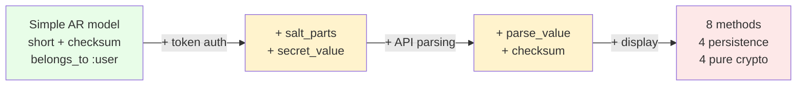
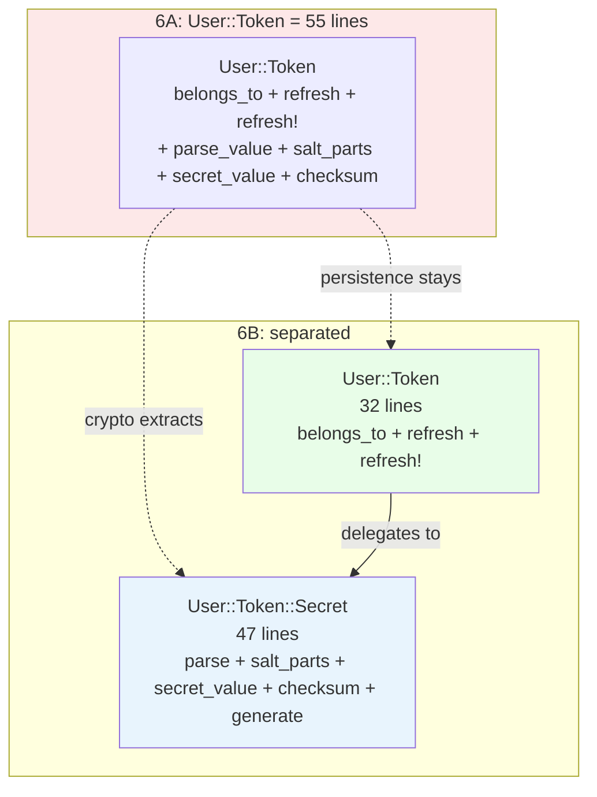

<p align="center">
<small>
<code>MENU:</code> <a href="https://github.com/railswhey/app/tree/MAP?tab=readme-ov-file">MAP</a> | <strong>README</strong> | <a href="/docs/00-INSTALLATION.md">Installation</a> | <a href="/docs/01-FEATURES.md">Features &amp; Screenshots</a> | <a href="/docs/02-TESTING.md">Testing</a> | <a href="/docs/governance/MANIFESTO.md">Manifesto</a>
</small>
</p>

<h1 align="center" style="border-bottom: none;">
  
  Rails Whey App
  
</h1>

<p align="center">
  
</p>

A full-stack task management app built with Ruby on Rails. This branch introduces the second PORO. `User::Token` was doing two jobs — persisting tokens and implementing cryptography — in one 55-line file. `User::Token::Secret` gives the crypto side its own home: a plain Ruby object that knows what a token is without knowing how it's stored.

| | |
|---|---|
| **Branch** | `6B-token-secret` |
| **Ruby** | 4.0 |
| **Rails** | 8.1 |
| **Rubycritic** | 91.46 |
| **LOC** | 1712 |

**Table of contents:**

- [🎯 The concept](#-the-concept)
- [📊 The numbers](#-the-numbers)
- [🤔 The problem](#-the-problem)
- [🔬 The evidence](#-the-evidence)
- [➡️ What comes next](#️-what-comes-next)
- [🏛️ Thesis checkpoint](#️-thesis-checkpoint)
- [🤖 The agent's view](#-the-agents-view)
- [🚀 Quick start](#-quick-start)
- [🧪 Testing](#-testing)
- [🗺️ The map](#️-the-map)

---

## 🎯 The concept

> **One rule:** when pure functions share a file with persistence logic, the pure functions need their own home.

`User::Token` was 55 lines doing two jobs. Persistence: `belongs_to :user`, `before_validation :refresh`, `refresh!` with retry. Cryptography: salt derivation, secret construction, SHA256 checksumming, token parsing. Four of eight methods never touched the database — a crypto library entangled inside a persistence model.

`User::Token::Secret` separates the two. The naming follows 6A's natural-language pattern: a **token** is the persisted record (short, checksum, user_id in the database). A **secret** is the cryptographic value — generated, parsed, checksummed. The code already spoke this word: the existing method was called `secret_value`.

This pairs with 6A: `Account::Member` named authorization, `User::Token::Secret` names cryptographic identity. Two POROs, two domain concepts that were hiding inside infrastructure.

---

## 📊 The numbers

| | Before (6A) | After (6B) |
|---|---|---|
| Lines in User::Token | 55 | 32 |
| Lines in User::Token::Secret | — | 47 |
| New files | — | 1 |
| Modified files | — | 2 |
| Behavioral test changes | — | 0 |
| Rubycritic | 91.36 | 91.46 |

55 lines of mixed concerns became 32 + 47. The total grew because naming has a cost — each responsibility gets its own constants, validations, and boundaries. The question is not "why did the code get bigger?" but "can you now change the hashing algorithm without reading past `belongs_to :user`?" You can.

---

## 🤔 The problem

The token started simple: a `short` column, a `checksum` column, a `belongs_to :user`. Then authentication needed to verify tokens without storing the raw secret — so crypto methods appeared. Then the API needed parsing. Then views needed display. Each addition was small. The method count grew from 2 to 8, but the class still "worked."

Nobody noticed that half the methods have nothing to do with the database:



The crypto methods are pure functions — they take strings and return strings. They never call `self`, never access instance variables, never touch the database. They lived on an ActiveRecord class because that's where the token model was.

`Account::Member::Authorization` called `User::Token.parse_value` and `User::Token.checksum` to verify API tokens — reaching into a persistence class for pure computation.

---

## 🔬 The evidence

**Pattern 1: Crypto logic moves to the PORO**

`User::Token::Secret` — 47 lines, zero database access:

```ruby
class User::Token::Secret
  include ActiveModel::Model
  include ActiveModel::Attributes

  SHORT_LENGTH = 8
  LONG_LENGTH = 32
  LONG_MASKED = "X" * LONG_LENGTH
  VALUE_SEPARATOR = "_"

  attribute :short, :string
  attribute :long, :string

  validates :long, presence: true, length: { is: LONG_LENGTH }
  validates :short, presence: true, length: { is: SHORT_LENGTH }

  def self.parse(arg)
    arg.split(VALUE_SEPARATOR)
  end

  def self.salt_parts(short:)
    a, b, c, d, e, f, g, h = short.chars
    [ "#{h}#{c}", "#{e}#{g}", "#{b}#{d}", "#{f}#{a}" ]
  end

  def self.secret_value(short:, long:)
    salt1, salt2, salt3, salt4 = salt_parts(short:)
    "#{salt2}_#{salt3}.:#{long}:.#{salt4}-#{salt1}"
  end

  def self.checksum(...)
    Digest::SHA256.hexdigest(secret_value(...))
  end

  def value
    "#{short}#{VALUE_SEPARATOR}#{long || LONG_MASKED}"
  end

  def generate(secure_random: SecureRandom)
    self.short = secure_random.base58(SHORT_LENGTH)
    self.long = secure_random.base58(LONG_LENGTH)
    self
  end
end
```

Every method is a pure function or operates on `ActiveModel::Attributes` state.

The AR model slims to 32 lines of persistence and delegation:

```ruby
class User::Token < ApplicationRecord
  belongs_to :user

  attribute :long, :string

  before_validation :refresh, on: :create

  validates :long, presence: true, length: { is: Secret::LONG_LENGTH }
  validates :short, presence: true, length: { is: Secret::SHORT_LENGTH }

  def value
    Secret.new(short:, long:).value
  end

  def refresh(secure_random: SecureRandom)
    Secret.new.generate(secure_random:).then do |secret|
      self.short = secret.short
      self.long = secret.long
      self.checksum = Secret.checksum(short:, long:)
    end
  end

  def refresh!(...)
    attempts ||= 1
    refresh(...).then { save! }.then { self }
  rescue ActiveRecord::RecordNotUnique
    retry if (attempts += 1) <= 3
  end
end
```

Every method either persists data or delegates to `Secret`. The crypto operations are gone.

**Pattern 2: Authorization references the Secret directly**

```ruby
# Before (6A) — Authorization calls AR class methods
short, long = User::Token.parse_value(member.user_token)
checksum = User::Token.checksum(short:, long:)

# After (6B) — Authorization calls the PORO
short, long = User::Token::Secret.parse(member.user_token)
checksum = User::Token::Secret.checksum(short:, long:)
```

Two lines changed. The query — `where(user_tokens: { short:, checksum: })` — is identical.



---

## ➡️ What comes next

The member has a name. The secret has a name. Both were domain concepts that outgrew their infrastructure homes. Both needed their own classes.

But not every domain concept that lacks a name needs a class. The strings `"completed"` and `"incomplete"` appear across 6 files. Each occurrence independently types the same word. A typo in any one silently falls through to the wrong branch of a `case` statement.

Branch `6C-task-status` canonicalizes the vocabulary. `Task::COMPLETED` and `Task::INCOMPLETE` give those values a home. No new files, no new classes — two constants and a method. Family 6's naming principle applies at every scale: POROs for authorization and cryptography, constants for scattered string literals. ✌️

---

## 🏛️ Thesis checkpoint

Cryptographic identity extracted into a PORO — Principle 4 applied at the security boundary. The token generation, validation, and rotation logic lives in one object instead of scattered across controllers and models. Principle 8 ensures every security decision is traceable to its source.

---

## 🤖 The agent's view

Before 6B, an agent modifying the hashing algorithm must load `user/token.rb` — 55 lines mixing persistence and crypto. The agent processes noise to reach the signal. After 6B, crypto lives in `user/token/secret.rb` — 47 lines doing one thing. The file name is a roadmap: an agent that sees `Secret` knows it will find cryptographic operations, not database callbacks.

The trade-off is file count — two files instead of one. But the hop is one level deep, and the naming clarity pays for it immediately. An agent working on authentication never touches persistence. An agent working on token storage never touches cryptography.

---

## 🚀 Quick start

Prerequisites: [mise](https://mise.jdx.dev/) (manages Ruby, Node, Mailpit)

```sh
git clone git@github.com:railswhey/app.git -b 6B-token-secret 6B-token-secret
cd 6B-token-secret
mise install                 # Ruby 4.0.1 + Node 22 + Mailpit 1.29.2
bin/setup                    # bundle install, db:prepare, starts dev server
```

> See [Installation guide](./docs/00-INSTALLATION.md) for detailed setup, demo accounts, and E2E test setup.

## 🧪 Testing

Full CI pipeline (run after changes):

```sh
bin/ci                       # setup + RuboCop + Brakeman + bundler-audit + tests
```

Individual commands for faster feedback during development:

```sh
bin/rails test               # integration tests (Minitest)
mise run e2e:web             # Playwright navigation smoke test (fast, ~15s)
mise run e2e:web:full        # all Playwright specs (~5min)
mise run e2e:api             # curl + jq smoke tests (requires running server)
mise run e2e:test            # all E2E (e2e:web fast + e2e:api)
```

> See [Testing guide](./docs/02-TESTING.md) for running subsets, CI pipeline details, and E2E deep dives.

## 🗺️ The map

This branch is one point on a 28-branch gradient — from a single fat controller (1A) to fully isolated engines (7D). Every point is a valid, defensible choice. The goal is not to reach the end, but to see that the path exists.

For the full gradient, the manifesto, and the project's governance, see the [MAP](https://github.com/railswhey/app/tree/MAP?tab=readme-ov-file).
