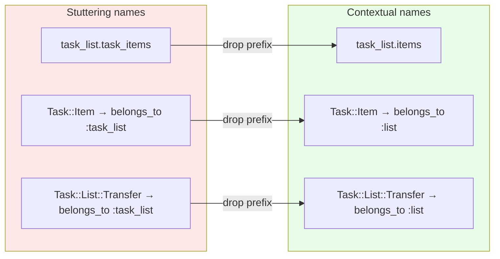
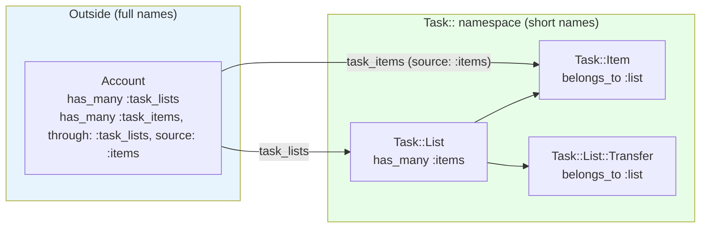

<p align="center">
<small>
<code>MENU:</code> <a href="https://github.com/railswhey/app/tree/MAP?tab=readme-ov-file">MAP</a> | <strong>README</strong> | <a href="/docs/00-INSTALLATION.md">Installation</a> | <a href="/docs/01-FEATURES.md">Features &amp; Screenshots</a> | <a href="/docs/02-TESTING.md">Testing</a> | <a href="/docs/governance/MANIFESTO.md">Manifesto</a>
</small>
</p>

<h1 align="center" style="border-bottom: none;">
  
  Rails Whey App
  
</h1>

<p align="center">
  
</p>

A full-stack task management app built with Ruby on Rails. This branch renames associations inside the `Task` namespace to drop prefixes the namespace already provides. `Task::List` calls its children `items` instead of `task_items`. `Task::Item` calls its parent `list` instead of `task_list`. Account keeps the full names at the boundary. Database columns don't change; `foreign_key: :task_list_id` bridges Ruby names to SQL columns. 42 files change; every insertion has a matching deletion; no behavioral tests change.

| | |
|---|---|
| **Branch** | `6F-contextual-names` |
| **Ruby** | 4.0 |
| **Rails** | 8.1 |
| **Rubycritic** | 91.72 |
| **LOC** | 1717 |

**Table of contents:**

- [🎯 The concept](#-the-concept)
- [📊 The numbers](#-the-numbers)
- [🤔 The problem](#-the-problem)
- [🔬 The evidence](#-the-evidence)
- [➡️ What comes next](#️-what-comes-next)
- [🏛️ Thesis checkpoint](#️-thesis-checkpoint)
- [🤖 The agent's view](#-the-agents-view)
- [🚀 Quick start](#-quick-start)
- [🧪 Testing](#-testing)
- [🗺️ The map](#️-the-map)

---

## 🎯 The concept

> **One rule:** if the namespace already says it, the name drops the prefix.

Inside `Task::List`, items can only mean task items. Inside `Task::Item`, list can only mean the task list. The `task_` prefix repeats context the namespace already provides.

| Model | Before | After |
|---|---|---|
| `Task::List` | `has_many :task_items` | `has_many :items` |
| `Task::Item` | `belongs_to :task_list` | `belongs_to :list` |
| `Task::List::Transfer` | `belongs_to :task_list` | `belongs_to :list` |

Account keeps `task_lists` and `task_items` — outside the `Task` namespace, the prefix IS information. Database columns stay unchanged; `foreign_key: :task_list_id` bridges Ruby names to SQL columns. No migration, no schema change.

---

## 📊 The numbers

| | Before (6E) | After (6F) |
|---|---|---|
| Files changed | — | 42 |
| Insertions / deletions | — | 97 / 97 |
| Net line change | — | 0 |
| Behavioral test changes | — | 0 |
| Rubycritic | 91.72 | 91.72 |

42 files touched across models, controllers, views, mailers, seeds, tests, and fixtures. Every change is mechanical — `task_items` → `items`, `task_list` → `list`. 97 insertions, 97 deletions, zero logic changes. Rubycritic stays flat — static analysis cannot see that shorter, context-appropriate names reduce cognitive load on every read.

---

## 🤔 The problem

The names stutter. It's like introducing yourself as "Smith John" to your brother "Smith David" — the family context is already established, repeating the last name is noise.



`task_list.task_items` — "task" appears twice in a single method chain. Inside `Task::Item`, calling the parent `task_list` when the class already says `Task::`. Inside `Task::List::Transfer`, three levels of namespace, and the association echoes the second level. None of this is broken. The problem is noise: information-free repetition the reader processes and discards on every line.

Rails generates association names from table names — the table is `task_items`, so `has_many` defaults to `:task_items`. When 5C introduced the `Task::` namespace, the names stayed. The pattern self-reinforced: once `Task::List` calls its children `task_items`, every caller copies that name. 42 files later, the redundancy is load-bearing.

---

## 🔬 The evidence

**Model declarations change, database stays**

```ruby
# Task::List — before
has_many :task_items, foreign_key: :task_list_id, dependent: :destroy, class_name: "Task::Item"

# Task::List — after
has_many :items, foreign_key: :task_list_id, dependent: :destroy, class_name: "Task::Item"
```

```ruby
# Task::Item — before
belongs_to :task_list, class_name: "Task::List"

# Task::Item — after
belongs_to :list, foreign_key: :task_list_id, class_name: "Task::List"
```

The `foreign_key: :task_list_id` acts as a translation dictionary — it tells Rails "when I say `list` in Ruby, I mean the column `task_list_id` in the database."

**Callers adopt shorter names**

```ruby
# Before
@task_item = @task_list.task_items.find(params[:item_id])

# After
@task_item = @task_list.items.find(params[:item_id])
```

**Account keeps the prefix — the boundary rule**

```ruby
class Account < ApplicationRecord
  has_many :task_lists,  dependent: :destroy, class_name: "Task::List"
  has_many :task_items,  through: :task_lists, source: :items
end
```

`source: :items` is the only change — it tells Rails that Account's `:task_items` follows `Task::List#items` (the renamed association). Inside the namespace, the prefix is noise. Outside, it is signal.



---

## ➡️ What comes next

Association names match their context. The vocabulary is clean. The authority is declared.

What remains: callbacks that coordinate multiple models. When `user.save` triggers account creation, membership assignment, inbox setup, and email dispatch, the call site reveals nothing about that workflow. Side effects hide inside `after_create` and `after_commit` hooks scattered across models. The orchestration has no name.

Branch `6G-named-orchestrations` extracts multi-model coordination from callbacks into named classes. Six orchestration objects emerge — `User::Registration`, `User::PasswordReset`, `Account::Workspace`, `Account::Invitation::Lifecycle`, `Task::List::Transfer::Facilitation`, and `User::Notification::Delivery`. Models that fire side effects on save now declare only their own structure. The orchestration logic gets its own home and its own name. ✌️

---

## 🏛️ Thesis checkpoint

Association names that reflect domain context — Principle 4 at the naming layer. The naming *is* the documentation.

---

## 🤖 The agent's view

`list.items` is shorter than `task_list.task_items`. Across 42 files, hundreds of call sites, and every future session, the cumulative token saving adds up. After 6F, the most natural name IS the correct name — an agent generating code for a Task controller will naturally write `@task_list.items`, exactly what it would write if naming from scratch.

The one correctness trap is the Account boundary. An agent that learns "we shortened the names" and applies the pattern to Account would break the code — `account.items` doesn't exist. Account's `source: :items` annotation makes the boundary visible: `task_items` goes through `task_lists` via `source: :items`, which implies `Task::List` calls them `items`.

---

## 🚀 Quick start

Prerequisites: [mise](https://mise.jdx.dev/) (manages Ruby, Node, Mailpit)

```sh
git clone git@github.com:railswhey/app.git -b 6F-contextual-names 6F-contextual-names
cd 6F-contextual-names
mise install                 # Ruby 4.0.1 + Node 22 + Mailpit 1.29.2
bin/setup                    # bundle install, db:prepare, starts dev server
```

> See [Installation guide](./docs/00-INSTALLATION.md) for detailed setup, demo accounts, and E2E test setup.

## 🧪 Testing

Full CI pipeline (run after changes):

```sh
bin/ci                       # setup + RuboCop + Brakeman + bundler-audit + tests
```

Individual commands for faster feedback during development:

```sh
bin/rails test               # integration tests (Minitest)
mise run e2e:web             # Playwright navigation smoke test (fast, ~15s)
mise run e2e:web:full        # all Playwright specs (~5min)
mise run e2e:api             # curl + jq smoke tests (requires running server)
mise run e2e:test            # all E2E (e2e:web fast + e2e:api)
```

> See [Testing guide](./docs/02-TESTING.md) for running subsets, CI pipeline details, and E2E deep dives.

## 🗺️ The map

This branch is one point on a 28-branch gradient — from a single fat controller (1A) to fully isolated engines (7D). Every point is a valid, defensible choice. The goal is not to reach the end, but to see that the path exists.

For the full gradient, the manifesto, and the project's governance, see the [MAP](https://github.com/railswhey/app/tree/MAP?tab=readme-ov-file).
