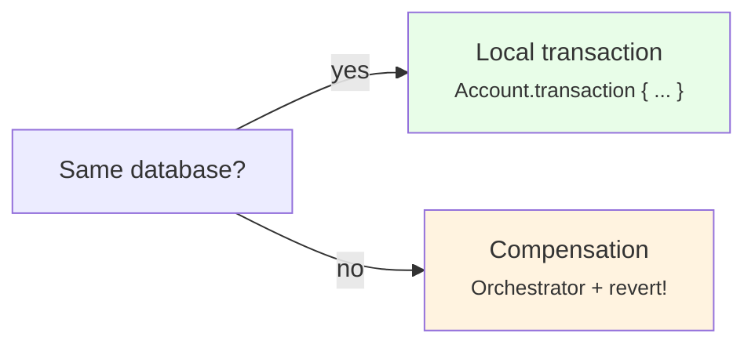
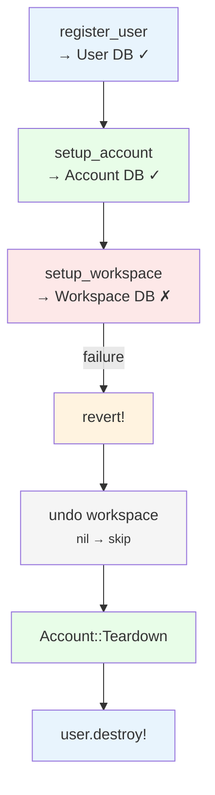
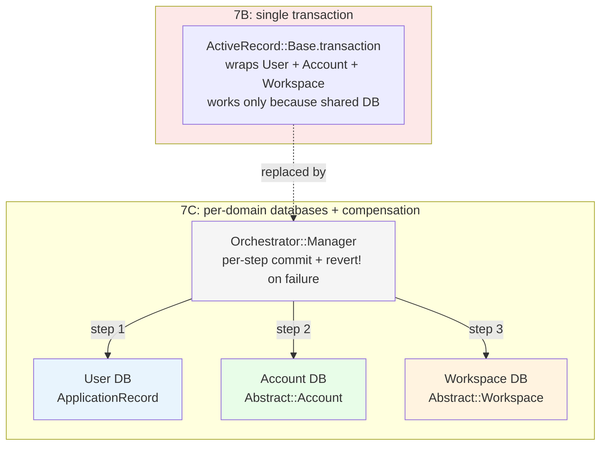

<p align="center">
<small>
<code>MENU:</code> <a href="https://github.com/railswhey/app/tree/MAP?tab=readme-ov-file">MAP</a> | <strong>README</strong> | <a href="/docs/00-INSTALLATION.md">Installation</a> | <a href="/docs/01-FEATURES.md">Features &amp; Screenshots</a> | <a href="/docs/02-TESTING.md">Testing</a> | <a href="/docs/governance/MANIFESTO.md">Manifesto</a>
</small>
</p>

<h1 align="center" style="border-bottom: none;">
  
  Rails Whey App
  
</h1>

<p align="center">
  
</p>

A full-stack task management app built with Ruby on Rails. This branch splits the single database into three — one per bounded context (User, Account, Workspace) — using Rails 8 multi-database support. Process managers drop `ActiveRecord::Base.transaction` and adopt the orchestrator pattern using `Orchestrator.new(...)`, a Struct factory with a `Revertible` mixin that provides explicit compensation on failure. No behavioral tests change.

| | |
|---|---|
| **Branch** | `7C-domain-databases` |
| **Ruby** | 4.0 |
| **Rails** | 8.1 |
| **Rubycritic** | 93.81 |
| **LOC** | 1818 |

**Table of contents:**

- [🎯 The concept](#-the-concept)
- [📊 The numbers](#-the-numbers)
- [🤔 The problem](#-the-problem)
- [🔬 The evidence](#-the-evidence)
- [➡️ What comes next](#️-what-comes-next)
- [🏛️ Thesis checkpoint](#️-thesis-checkpoint)
- [🤖 The agent's view](#-the-agents-view)
- [🚀 Quick start](#-quick-start)
- [🧪 Testing](#-testing)
- [🗺️ The map](#️-the-map)

---

## 🎯 The concept

> **One rule:** each bounded context owns its own database, and process managers coordinate across them without cross-database transactions.

7A drew domain boundaries. 7B gave complex orchestrations Manager Structs. But all three domains shared one SQLite database. `ActiveRecord::Base.transaction` wrapped cross-domain operations as a single unit. The boundaries existed in code but not in storage.

7C enforces the boundary at the database level:

| Database | Base record | Tables | Migrations |
|---|---|---|---|
| primary (User) | `ApplicationRecord` | `users`, `user_tokens`, `user_notifications` | `db/migrate/` |
| account | `Abstract::Account` | `accounts`, `account_people`, `account_memberships`, `account_invitations` | `db/account_migrate/` |
| workspace | `Abstract::Workspace` | `workspaces`, `workspace_members`, `workspace_lists`, `workspace_tasks`, `workspace_comments`, `workspace_list_transfers` | `db/workspace_migrate/` |



User stays on `ApplicationRecord` — Rails' primary database uses standard paths. Process managers replace the single cross-domain transaction with per-domain local transactions and explicit compensation.

---

## 📊 The numbers

| | Before (7B) | After (7C) |
|---|---|---|
| Files changed | — | 41 |
| Net line change | — | +55 |
| Behavioral test changes | — | 0 |
| Rubycritic | 93.67 | 93.81 |
| LOC | 1793 | 1818 |

Ten models change one line each (inheritance swap). Four new files: two abstract base records, two compensating services. Five process managers rewritten.

Rubycritic climbs +0.14 — the `Orchestrator` pattern replaces nested `ActiveRecord::Base.transaction` blocks with flat method sequences.

---

## 🤔 The problem

Three bounded contexts share one database. The boundaries are in the code but not in storage. Rails makes this invisible: `ApplicationRecord` connects to one database, `ActiveRecord::Base.transaction` wraps one connection, every model inherits the same base class.

7B's process managers wrap cross-domain operations in a single transaction:

```ruby
# 7B — single transaction wrapping three domains
Manager = Struct.new(:user) do
  def call(params)
    ActiveRecord::Base.transaction do       # assumes shared database
      register_user(params)                  # writes to User DB
      setup_account_and_workspace if user.persisted?  # writes to Account DB + Workspace DB
    end
    # ...
  end
end
```

If Account and Workspace had their own databases, this transaction would only wrap the primary (User) connection. A failure in `Workspace::Setup` after `Account::Setup` has committed leaves an Account without a matching Workspace.

The single transaction also hides a design question: which steps share a transactional boundary? `AcceptInvitationProcess` accepts an invitation and adds a person (both Account DB), then adds a workspace member (Workspace DB) and notifies the inviter (User DB). In 7B, one transaction wraps all four identically. With separate databases, the first two should be a local transaction; the last two need different handling.

---

## 🔬 The evidence

**Pattern 1: Three databases, three base records**

```ruby
# app/models/application_record.rb — User domain (primary)
class ApplicationRecord < ActiveRecord::Base
  primary_abstract_class
  connects_to database: { writing: :primary, reading: :primary }
end

# app/models/abstract/account.rb — Account domain
class Abstract::Account < ActiveRecord::Base
  self.abstract_class = true
  connects_to database: { writing: :account, reading: :account }
end

# app/models/abstract/workspace.rb — Workspace domain
class Abstract::Workspace < ActiveRecord::Base
  self.abstract_class = true
  connects_to database: { writing: :workspace, reading: :workspace }
end
```

Every Account model changes one line: `< ApplicationRecord` → `< Abstract::Account`. Same for Workspace. User models stay on `ApplicationRecord`.

**Pattern 2: Orchestrator with revert**

`Orchestrator.new(...)` is a Struct factory that includes a `Revertible` mixin:

```ruby
module Orchestrator
  module Revertible
    private

    def undo(condition)
      yield rescue ActiveRecord::ActiveRecordError if condition
    end
  end

  def self.new(...) = Struct.new(...).tap { it.include(Revertible) }
end
```

Eleven lines. The `undo` helper skips nil fields and rescues AR errors during compensation. The sign-up process becomes an orchestrator:

```ruby
class User::SignUpProcess < ApplicationJob
  Manager = Orchestrator.new(:user, :account, :workspace) do
    def call(params)
      register_user(params)

      return [:err, user] unless user.persisted?

      setup_account(user:)
      setup_workspace(user:)
      send_email_confirmation

      [:ok, user]
    rescue ActiveRecord::ActiveRecordError => e
      revert!

      [:err, e]
    end

    private

    def register_user(params)
      self.user = User::Registration.call(params)
    end

    def setup_account(user:)
      uuid, email, username = user.values_at(:uuid, :email, :username)
      self.account = Account::Setup.call(uuid:, email:, username:)
    end

    def setup_workspace(user:)
      uuid, email, username = user.values_at(:uuid, :email, :username)
      self.workspace = Workspace::Setup.call(uuid:, email:, username:)
    end

    def send_email_confirmation
      UserMailer.with(user:, token: user.generate_token_for(:email_confirmation))
                .email_confirmation.deliver_later
    end

    def revert!
      undo(workspace) { workspace.destroy! }
      undo(account)   { Account::Teardown.call(uuid: user.uuid) }
      user.destroy!
    end
  end

  def perform(...) = Manager.new.call(...)
end
```

No `ActiveRecord::Base.transaction`. Each domain service commits to its own database. If `Workspace::Setup` fails, `revert!` runs in reverse order. The struct fields track what was created. The `undo` guard skips uncreated steps.



**The sharp knife.** `Revertible` is a synchronous, in-memory compensation mechanism — not an ACID transaction. If the Ruby process dies mid-revert (OOM, network drop), the compensation stack in RAM is gone. Orphaned records remain across databases with no automatic repair. This is not a flaw — it is the cost of replacing a database lock with application-level compensation. A Postgres transaction guarantees atomicity independent of process health. `Revertible` guarantees it only if the process survives the entire revert. The natural evolution is background reconciliation — a sweep job that detects inconsistent state and either completes or reverses interrupted processes. That job is not in 7C. Documenting this gap is the honest part.

**The front-end cost.** Three physically separated databases make cross-database joins impossible. A view that shows a workspace task with its assigned member's email requires two separate queries — one to the workspace database, one to the account database — assembled in Ruby. The UUID that replaced the foreign key becomes the merge key in application code. SQL's optimizer can no longer help. Local identity copies (`Account::Person`, `Workspace::Member`) mitigate this for display — email and username are local — but any query that spans domains becomes application-layer assembly. This is the structural consequence of database-level isolation, paid once per cross-domain view.

**Pattern 3: Local transactions within an orchestration**

Steps sharing a database use local transactions:

```ruby
def accept(user:, account:, invitation:)
  uuid, email, username = user.values_at(:uuid, :email, :username)

  Account.transaction do
    invitation.accept!
    self.person = Account::Person::Add.new(account:).call(uuid:, email:, username:)
  end
end
```

`Account.transaction` wraps only Account DB steps. Workspace and User steps commit independently.

**Pattern 4: Command-compensation pairs**

| Forward | Compensation | Domain |
|---|---|---|
| `User::Registration.call(params)` | `user.destroy!` | User |
| `Account::Setup.call(uuid:, ...)` | `Account::Teardown.call(uuid:)` | Account |
| `Workspace::Setup.call(uuid:, ...)` | `workspace.destroy!` | Workspace |
| `Account::Person::Add` | `Account::Person::Remove` | Account |
| `Workspace::Member::Add` | `Workspace::Member::Remove` | Workspace |
| `invitation.accept!` | `invitation.revert!` | Account |



---

## ➡️ What comes next

7C gave each bounded context its own database. Process managers coordinate with explicit compensation. But all three domains are served by the same Web and API controllers in a single host application.

Branch `7D-shared-kernel` extracts the Web and API layers into mountable Rails engines. Each bounded context gets its own engine. The host application becomes a headless Shared Kernel: no controllers, no views, no routes — just configuration, initializers, and domain model loading. The domain boundaries that exist in data and in code finally extend to the delivery layer. ✌️

---

## 🏛️ Thesis checkpoint

Per-domain databases with explicit compensation — Principle 4 at the data isolation level. Rails multi-database support (standard since Rails 6) provides the mechanism. No external infrastructure. The framework's own tools achieve what microservice advocates typically require separate services to accomplish. The trade-off is explicit: `Revertible` replaces database-guaranteed atomicity with application-level best-effort compensation. The `Orchestrator` pattern is a starting point, not a destination.

---

## 🤖 The agent's view

In 7B, an agent could wrap everything in `ActiveRecord::Base.transaction` and be correct. After 7C, the same agent must answer: which database does this step write to? If it's a new domain, the agent adds a struct field, stores the result, adds an `undo` call in `revert!` in reverse order, and ensures the domain service uses a local transaction. The `Orchestrator` pattern makes this mechanical but the agent must understand the shape.

Model inheritance changes are invisible. `< Abstract::Account` vs `< ApplicationRecord` doesn't change how an agent reads a model — associations, validations, scopes, and callbacks work identically. The cost of 7C is concentrated in the process managers. Everything else is the same.

---

## 🚀 Quick start

Prerequisites: [mise](https://mise.jdx.dev/) (manages Ruby, Node, Mailpit)

```sh
git clone git@github.com:railswhey/app.git -b 7C-domain-databases 7C-domain-databases
cd 7C-domain-databases
mise install                 # Ruby 4.0.1 + Node 22 + Mailpit 1.29.2
bin/setup                    # bundle install, db:prepare, starts dev server
```

> See [Installation guide](./docs/00-INSTALLATION.md) for detailed setup, demo accounts, and E2E test setup.

## 🧪 Testing

Full CI pipeline (run after changes):

```sh
bin/ci                       # setup + RuboCop + Brakeman + bundler-audit + tests
```

Individual commands for faster feedback during development:

```sh
bin/rails test               # integration tests (Minitest)
mise run e2e:web             # Playwright navigation smoke test (fast, ~15s)
mise run e2e:web:full        # all Playwright specs (~5min)
mise run e2e:api             # curl + jq smoke tests (requires running server)
mise run e2e:test            # all E2E (e2e:web fast + e2e:api)
```

> See [Testing guide](./docs/02-TESTING.md) for running subsets, CI pipeline details, and E2E deep dives.

## 🗺️ The map

This branch is one point on a 28-branch gradient — from a single fat controller (1A) to fully isolated engines (7D). Every point is a valid, defensible choice. The goal is not to reach the end, but to see that the path exists.

For the full gradient, the manifesto, and the project's governance, see the [MAP](https://github.com/railswhey/app/tree/MAP?tab=readme-ov-file).
