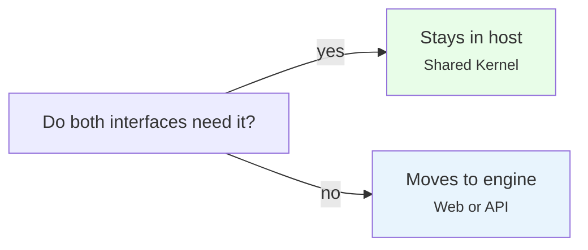
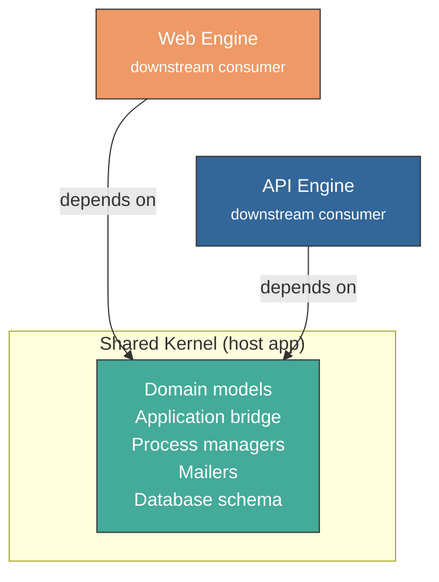
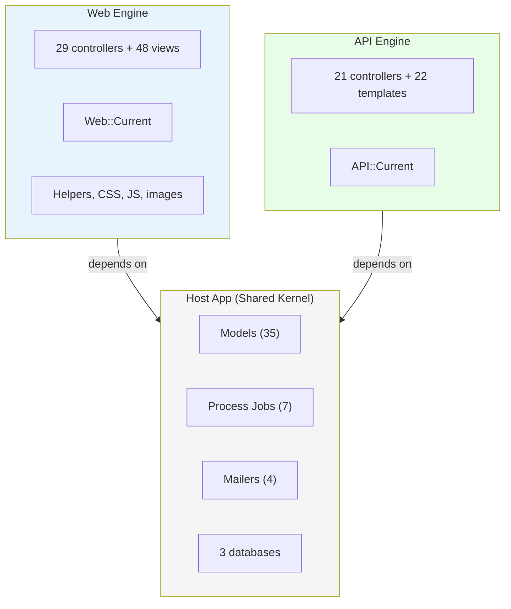
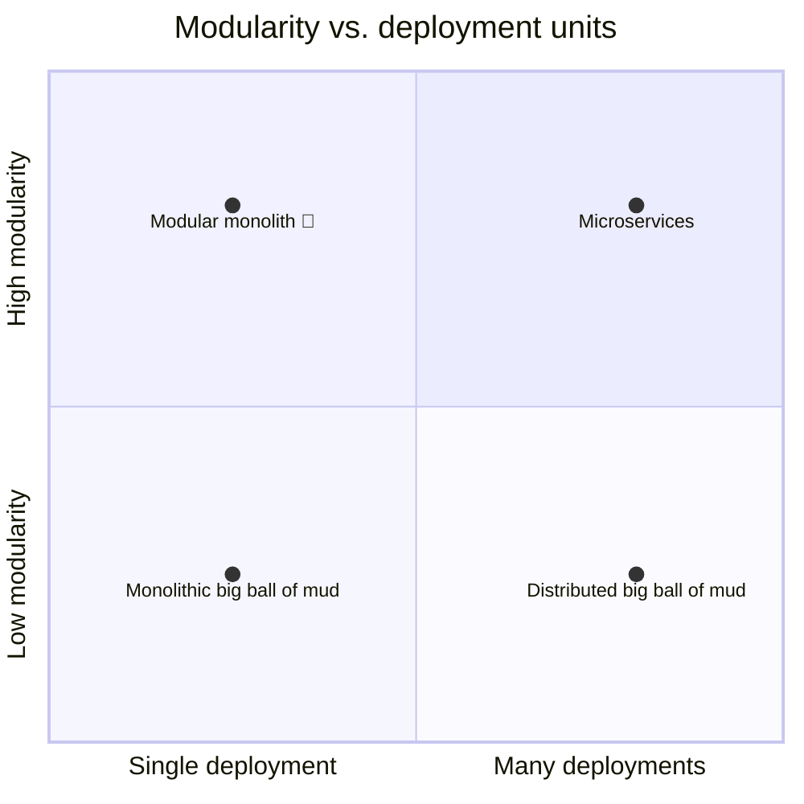

<p align="center">
<small>
<code>MENU:</code> <a href="https://github.com/railswhey/app/tree/MAP?tab=readme-ov-file">MAP</a> | <strong>README</strong> | <a href="/docs/00-INSTALLATION.md">Installation</a> | <a href="/docs/01-FEATURES.md">Features &amp; Screenshots</a> | <a href="/docs/02-TESTING.md">Testing</a> | <a href="/docs/governance/MANIFESTO.md">Manifesto</a>
</small>
</p>

<h1 align="center" style="border-bottom: none;">
  
  Rails Whey App
  
</h1>

<p align="center">
  
</p>

This branch extracts Web and API into mountable Rails engines. The host app becomes a headless Shared Kernel: domain models, process managers, mailers, and databases — no controllers, no routes, views limited to mailer templates. `ApplicationController` is deleted; `Current` is demoted from a `CurrentAttributes` subclass to a plain namespace. Each engine defines its own. No behavioral tests change.

|                |                    |
| -------------- | ------------------ |
| **Branch**     | `7D-shared-kernel` |
| **Ruby**       | 4.0                |
| **Rails**      | 8.1                |
| **Rubycritic** | 94.55              |
| **LOC**        | 1832               |

**Table of contents:**

- [🎯 The concept](#-the-concept)
- [🤔 The problem](#-the-problem)
- [🔬 The evidence](#-the-evidence)
- [📊 The numbers](#-the-numbers)
- [🤖 The agent's view](#-the-agents-view)
- [🏛️ Thesis checkpoint](#️-thesis-checkpoint)
- [➡️ What comes next](#️-what-comes-next)
- [🚀 Quick start](#-quick-start)
- [🧪 Testing](#-testing)
- [🗺️ The map](#️-the-map)

---

## 🎯 The concept

> **One rule:** the host app keeps only what both interfaces share. Everything else moves to an engine.



Web moves to `engines/web/`. API moves to `engines/api/`. Both are mountable engines with `isolate_namespace`. The host retains only the shared core: models, `Current::*` POROs, process managers, mailers, and databases.

| Layer       | Host (Shared Kernel)             | Web Engine         | API Engine         |
| ----------- | -------------------------------- | ------------------ | ------------------ |
| Controllers | None                             | 29                 | 21                 |
| Views       | Mailer templates only            | 48 ERB             | 22 Jbuilder        |
| Models      | 35 (domain + `Current::*` POROs) | 1 (`Web::Current`) | 1 (`API::Current`) |
| Jobs        | All 7 process managers           | —                  | —                  |
| Mailers     | All 4                            | —                  | —                  |

Engines depend on the kernel. The kernel depends on no engine. Engines don't depend on each other. Separation by load path — the strongest boundary Ruby offers short of separate processes.



---

## 🤔 The problem

`ApplicationController` was a lie. It claimed shared behavior it never provided.

An audit of 7C revealed: eight method groups Web-only, two overridden with no shared body, one trivial one-liner. **Zero lines of shared implementation.**

`Current` had the same problem. A single `CurrentAttributes` class hid two different authentication strategies — session-based for Web, token-based for API — behind one generalized `authorize!` method. Web never passes `user_token`. API never passes `user_id`. The generality masked two distinct contracts.

The same conflation ran through `app/`: 62 view templates, helpers, CSS, JavaScript — all sharing a directory with domain models. Nothing structural prevented cross-contamination. The file system gave the illusion of sharing while silently coupling representation to domain.

---

## 🔬 The evidence

**Each engine owns its base controller.** `ApplicationController` is deleted. `Web::BaseController` inherits from `ActionController::Base` directly — brings session auth, `allow_browser`, view helpers. `API::V1::BaseController` does the same — brings token auth, `skip_forgery_protection`, JSON-only. Both expose `helper_method def current` pointing to their own `Current` class — one convention across controllers, views, and helpers.

**Each engine owns its `Current`.** The global `Current` becomes a plain namespace for shared POROs (`Resolver`, `Context`, `Scope`, `Workspace`). Each engine declares its own `CurrentAttributes` with only the delegates it needs. `Web::Current.authorize!` accepts `user_id:` and `account_id:`. `API::Current.authorize!` accepts `user_token:`. These aren't cosmetic differences — they're contract boundaries that change for different reasons.

**Mailers cross the boundary correctly.** Mailers live in the kernel (triggered by process managers) but reference Web routes. The kernel defines an `inject_url_helpers` extension point; the Web engine fulfills it at boot. Dependency direction stays correct: engine → kernel, never kernel → engine.

**Engines load selectively.** `BOOT_*` ENV vars control whether an engine's code is loaded. `MOUNT_*` vars control whether its routes are exposed:

| Mode           | Config                             | Use case                      |
| -------------- | ---------------------------------- | ----------------------------- |
| Full monolith  | Both boot, both mount              | Development, staging          |
| Web-only       | `BOOT_API=false`                   | Frontend nodes                |
| API with email | Both boot, `MOUNT_WEB=false`       | API nodes needing mailer URLs |
| Headless       | Both `BOOT_*=false`                | Console, migrations, seeds    |



---

## 📊 The numbers

|                         | Before (7C) | After (7D)                                   |
| ----------------------- | ----------- | -------------------------------------------- |
| Files changed           | —           | 183                                          |
| Net line change         | —           | +142                                         |
| Behavioral test changes | —           | 0                                            |
| Rubycritic              | 93.81       | 94.55 (kernel 96.29 / web 92.06 / api 95.31) |
| LOC                     | 1818        | 1832                                         |

183 files touched, almost entirely moves. The +142 net lines come from engine scaffolding and engine-specific `Current` classes. Integration tests assert on HTTP status codes, redirects, and response bodies — none of which change when controllers move behind an engine mount point.

---

## 🤖 The agent's view

The engine split shrinks the working set an agent needs to hold:

| Task                  | 7C context load           | 7D context load             | Reduction |
| --------------------- | ------------------------- | --------------------------- | --------- |
| Domain model change   | ~3000 LOC (all of `app/`) | ~1200 LOC (kernel only)     | −60%      |
| Web controller change | ~3000 LOC (all of `app/`) | ~1700 LOC (web engine only) | −43%      |
| API controller change | ~3000 LOC (all of `app/`) | ~700 LOC (api engine only)  | −77%      |

Context windows are finite. Every irrelevant line loaded displaces reasoning about the actual change. Each engine's `Current` is self-describing — 25 LOC, full interface contract in one glance. An agent cannot pass `user_id:` to `API::Current.authorize!` because the parameter doesn't exist. The type error surfaces at generation time, not at runtime.

**Where agents still pay:** all tests live in the host's `test/`, not inside the engines. An agent carrying only engine code will hallucinate test locations.

---

## 🏛️ Thesis checkpoint

Twenty-eight versions. Seven design families. One codebase. From a single fat controller (1A, Rubycritic 79.48) to fully isolated engines (7D, Rubycritic 94.55) — using only controllers, models, concerns, callbacks, scopes, engines, and multi-database connections. No service objects or hexagonal layers.



7D lands top-left: high modularity, single deployment. Three bounded contexts with independent databases. Two isolated engines with their own `Current`, controllers, and views. Selective boot via ENV. All within one process, one `bin/rails server`.

The secret is not more infrastructure — it's fundamentals, orthogonality, and real modularity. Distributed-system isolation without distributed-system cost.

Rubycritic: 79.48 → 94.55. LOC: 1310 → 1832. Quality climbed 15 points while the codebase grew 40%. The design gradient exists within Rails. 🦾

---

## ➡️ What comes next

The gradient doesn't end here. See [What's Next](https://github.com/railswhey/app/blob/MAP/docs/branches/99-future.md) for two paths forward: incremental improvements to 7D (7E-7I) and a complete rethinking as Self-Contained Systems (Family 8).

---

## 🚀 Quick start

Prerequisites: [mise](https://mise.jdx.dev/) (manages Ruby, Node, Mailpit)

```sh
git clone git@github.com:railswhey/app.git -b 7D-shared-kernel 7D-shared-kernel
cd 7D-shared-kernel
mise install                 # Ruby 4.0.1 + Node 22 + Mailpit 1.29.2
bin/setup                    # bundle install, db:prepare, starts dev server
```

> See [Installation guide](./docs/00-INSTALLATION.md) for detailed setup, demo accounts, and E2E test setup.

## 🧪 Testing

Full CI pipeline (run after changes):

```sh
bin/ci                       # setup + RuboCop + Brakeman + bundler-audit + tests
```

Individual commands for faster feedback during development:

```sh
bin/rails test               # integration tests (Minitest)
mise run e2e:web             # Playwright navigation smoke test (fast, ~15s)
mise run e2e:web:full        # all Playwright specs (~5min)
mise run e2e:api             # curl + jq smoke tests (requires running server)
mise run e2e:test            # all E2E (e2e:web fast + e2e:api)
```

> See [Testing guide](./docs/02-TESTING.md) for running subsets, CI pipeline details, and E2E deep dives.

## 🗺️ The map

This branch is one point on a 28-branch gradient — from a single fat controller (1A) to fully isolated engines (7D). Every point is a valid, defensible choice. The goal is not to reach the end, but to see that the path exists.

For the full gradient, the manifesto, and the project's governance, see the [MAP](https://github.com/railswhey/app/tree/MAP?tab=readme-ov-file).
