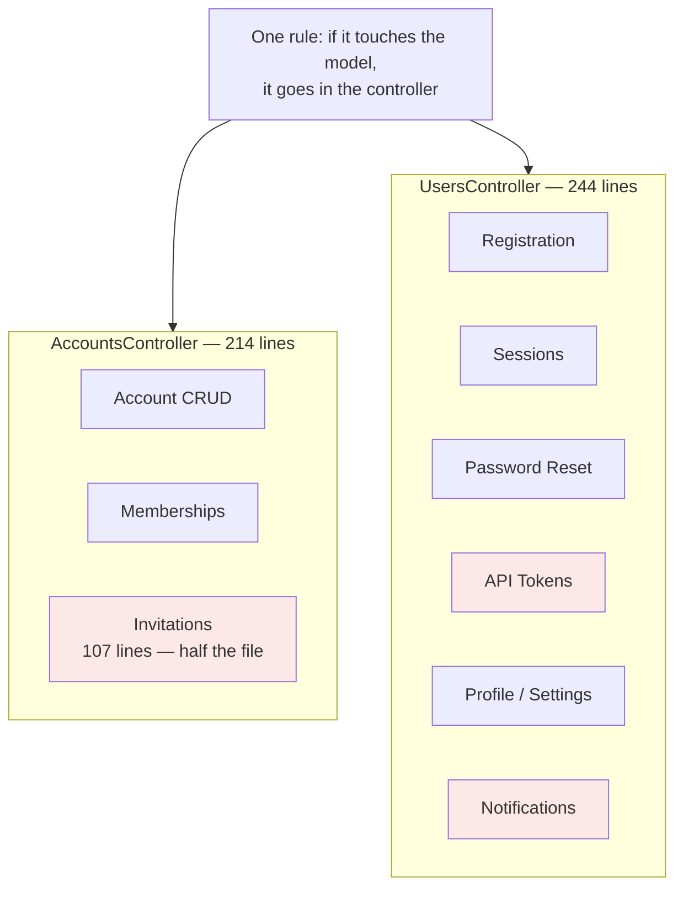
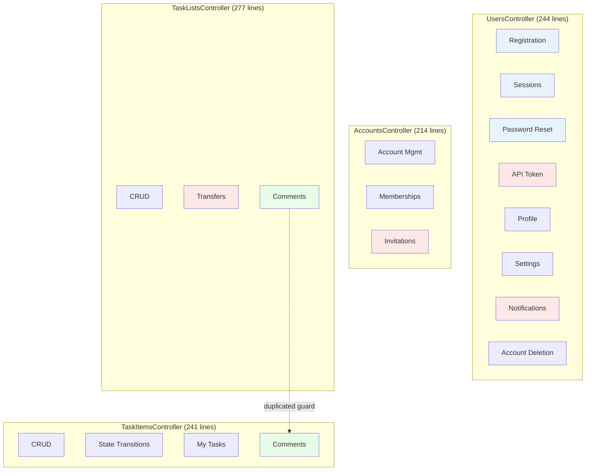
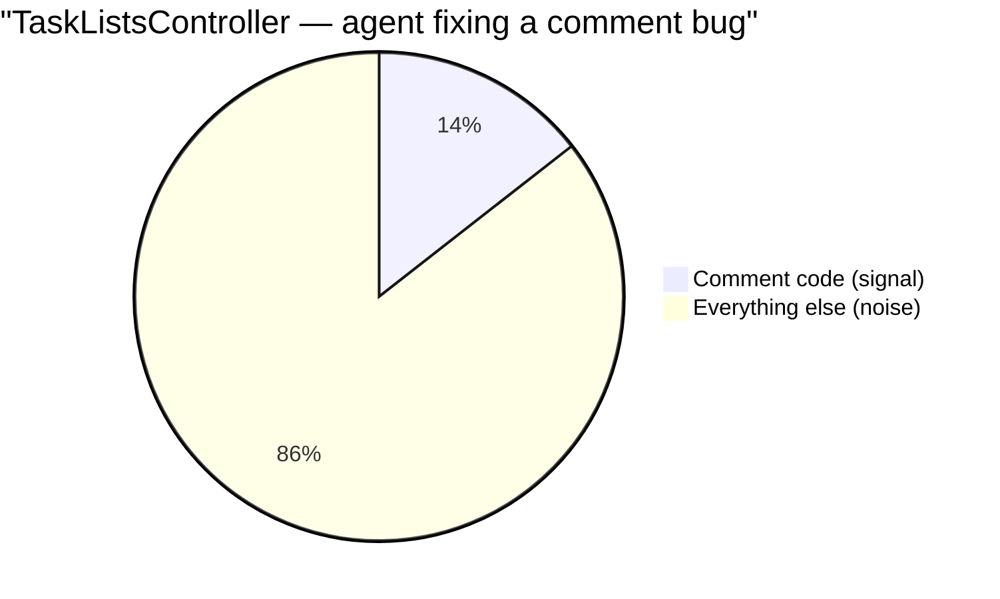

<p align="center">
<small>
<code>MENU:</code> <a href="https://github.com/railswhey/app/tree/MAP?tab=readme-ov-file">MAP</a> | <strong>README</strong> | <a href="/docs/00-INSTALLATION.md">Installation</a> | <a href="/docs/01-FEATURES.md">Features &amp; Screenshots</a> | <a href="/docs/02-TESTING.md">Testing</a> | <a href="/docs/governance/MANIFESTO.md">Manifesto</a>
</small>
</p>

<h1 align="center" style="border-bottom: none;">
  
  Rails Whey App
  
</h1>

<p align="center">
  
</p>

A full-stack task management app built with Ruby on Rails. This branch is the starting point — what you get when you apply "one controller per entity" to a real app with collaboration features and never look back.

| | |
|---|---|
| **Branch** | `1A-fat-controller` |
| **Ruby** | 4.0 |
| **Rails** | 8.1 |
| **Rubycritic** | 79.48 |
| **LOC** | 1310 |

**Table of contents:**

- [🎯 The concept](#-the-concept)
- [📊 The numbers](#-the-numbers)
- [🌀 The gravity well](#-the-gravity-well)
  - [The correctness trap](#the-correctness-trap)
- [🔬 The evidence](#-the-evidence)
- [🤖 The agent's cost](#-the-agents-cost)
- [➡️ What comes next](#️-what-comes-next)
- [🏛️ Thesis checkpoint](#️-thesis-checkpoint)
- [🚀 Quick start](#-quick-start)
- [🧪 Testing](#-testing)
- [🗺️ The map](#️-the-map)

---

## 🎯 The concept

> **One rule:** if it touches the model, it goes in the controller.

Four models, four controllers. `UsersController` owns registration, sessions, password reset, API tokens, profile, notifications, settings. `AccountsController` owns viewing, editing, memberships, invitations. The model is the organizing axis. The controller is the catch-all.

It ships. Tests pass. This is the default shape of a Rails app that grew without anyone questioning the filing system.

---

## 📊 The numbers

```sh
277 app/controllers/task_lists_controller.rb
244 app/controllers/users_controller.rb
241 app/controllers/task_items_controller.rb
214 app/controllers/accounts_controller.rb
122 app/controllers/application_controller.rb
 40 app/controllers/errors_controller.rb
 39 app/controllers/search_controller.rb
 30 app/controllers/api_docs_controller.rb
───
1207 total
```

Four domain controllers averaging 244 lines each. The supporting cast — `ErrorsController`, `SearchController`, `ApiDocsController` — stays under 40. The contrast tells the story: controllers with a single concern stay small; controllers acting as entity-wide catch-alls don't.

---

## 🌀 The gravity well

`rails generate scaffold` creates one controller per model. For a fresh CRUD app it's clean — seven actions, one filter, under 50 lines. The convention earns its keep.

The problem isn't the convention. It's that the convention has no pressure relief valve.

When the product grows, features attach to the nearest model. Invitations relate to accounts → `AccountsController`. Transfers relate to task lists → `TaskListsController`. Each addition is a reasonable local decision. The accumulation is what causes damage.



The organizing axis is the problem: the class groups code by what data it relates to, not by what job it does. The controller is serving as a namespace, not a cohesion unit.

The framework reinforces this. Routes map to controllers. Views follow controller directories. Helpers follow controller names. Moving a feature out means changing all three. The path of least resistance is always "add another action." **The framework makes staying easy and leaving expensive.**

The convention that kept your first 7 actions clean has no mechanism to tell you that your 15th doesn't belong here. It just keeps accepting code. And because it keeps working — tests pass, the app runs — nobody questions the organizing principle until the files are large and the damage is structural.

### The correctness trap

The accumulation doesn't just produce big files. It produces silent hazards.

`UsersController` declares two filters covering the same 10 actions with opposite semantics:

```ruby
before_action :require_guest_access!, except: %i[
  destroy destroy_session edit_token update_token
  edit_profile update_profile settings
  notifications update_notification mark_all_notifications_read
]
before_action :authenticate_user!, only: %i[
  destroy destroy_session edit_token update_token
  edit_profile update_profile settings
  notifications update_notification mark_all_notifications_read
]
```

Add a new authenticated action, update one list but miss the other — the access rule is silently wrong. No error. No exception. Just a wrong security boundary. This is not a readability problem. It's a correctness hazard baked into the structure.

---

## 🔬 The evidence

`AccountsController` alone uses three distinct authorization mechanisms in one file — a `before_action` filter, a `guard_owner_or_admin!` method, and inline `unless` checks — each protecting a different concern that landed here because it relates to the `Account` model.

Meanwhile, `TaskListsController` and `TaskItemsController` independently implemented identical `require_comment_author!` guards because comments have no home of their own — they live wherever their parent entity lives. If the authorization rule changes, two files need the same edit.

18 distinct concerns packed into 4 classes:



Blue: shared authentication context. Red: unrelated workflows crammed into the same class. Green: duplicated comment concern. The grouping axis — entity — has nothing to say about most of them.

---

## 🤖 The agent's cost

An agent fixing a comment bug in `TaskListsController` needs ~40 lines of comment code. It inherits 237 lines of CRUD, transfer guards, and inbox protection. That's a **7x token overhead** — and every token costs money, latency, and reasoning quality.



Across the four domain controllers, the average overhead for a single-concern edit is roughly **5x**. The filter chain is a correctness trap for agents too — an agent adding a new action must update two mirrored lists consistently, and if it misses one, the failure is silent.

**Every feature crammed into a fat controller permanently taxes every future session that touches that file.** The 7x overhead today becomes 8x after the next feature ships. The architecture imposes no ceiling.

But there is an upside: everything the agent needs is in one file — authorization, actions, helpers, side effects, all in a single buffer. In 1B, splitting the file will reduce tokens but spread the security contract across two locations — fewer tokens, harder reasoning. That trade-off — load cost versus reasoning complexity — becomes the defining tension for the next branch.

---

## ➡️ What comes next

Branch `1B-extract-concerns` reaches for `ActiveSupport::Concern`. Each non-CRUD workflow gets its own module — `AccountsInvitationsConcern`, `TaskListsTransfersConcern`, and so on — which the controllers `include`.

File-level readability improves. But at runtime, `include` copies every concern's methods into a single controller instance — same callback chain, same private namespace, same instance variables. The concern boundary is a file-system convenience that the runtime does not enforce.

That's the difference between buying storage bins for a messy factory floor and actually building a dedicated shipping department.

---

## 🏛️ Thesis checkpoint

This branch is the before picture. The framework's default conventions produced this result — but the thesis is that the framework's own tools can fix it (Principle 4). The Rubycritic score (79.48) is the floor — an honest floor, because nothing has been artificially split. Every metric reflects the true shape of the code, and that is the baseline every future branch must beat. Principle 1 starts here too: the behavioral test suite that validates this branch will validate every branch that follows without rewriting a single assertion.

---

## 🚀 Quick start

Prerequisites: [mise](https://mise.jdx.dev/) (manages Ruby, Node, Mailpit)

```sh
git clone git@github.com:railswhey/app.git -b 1A-fat-controller 1A-fat-controller
cd 1A-fat-controller
mise install                 # Ruby 4.0.1 + Node 22 + Mailpit 1.29.2
bin/setup                    # bundle install, db:prepare, starts dev server
```

> See [Installation guide](./docs/00-INSTALLATION.md) for detailed setup, demo accounts, and E2E test setup.

## 🧪 Testing

Full CI pipeline (run after changes):

```sh
bin/ci                       # setup + RuboCop + Brakeman + bundler-audit + tests
```

Individual commands for faster feedback during development:

```sh
bin/rails test               # integration tests (Minitest)
mise run e2e:web             # Playwright navigation smoke test (fast, ~15s)
mise run e2e:web:full        # all Playwright specs (~5min)
mise run e2e:api             # curl + jq smoke tests (requires running server)
mise run e2e:test            # all E2E (e2e:web fast + e2e:api)
```

> See [Testing guide](./docs/02-TESTING.md) for running subsets, CI pipeline details, and E2E deep dives.

## 🗺️ The map

This branch is one point on a 28-branch gradient — from a single fat controller (1A) to fully isolated engines (7D). Every point is a valid, defensible choice. The goal is not to reach the end, but to see that the path exists.

For the full gradient, the manifesto, and the project's governance, see the [MAP](https://github.com/railswhey/app/tree/MAP?tab=readme-ov-file).
