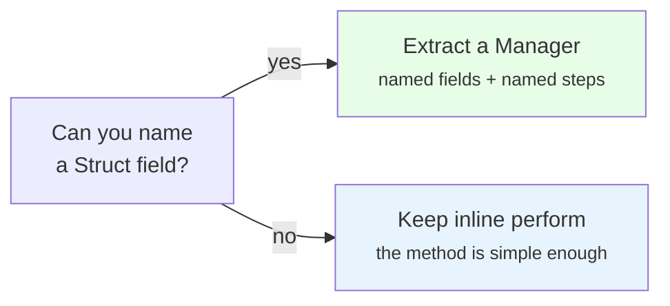
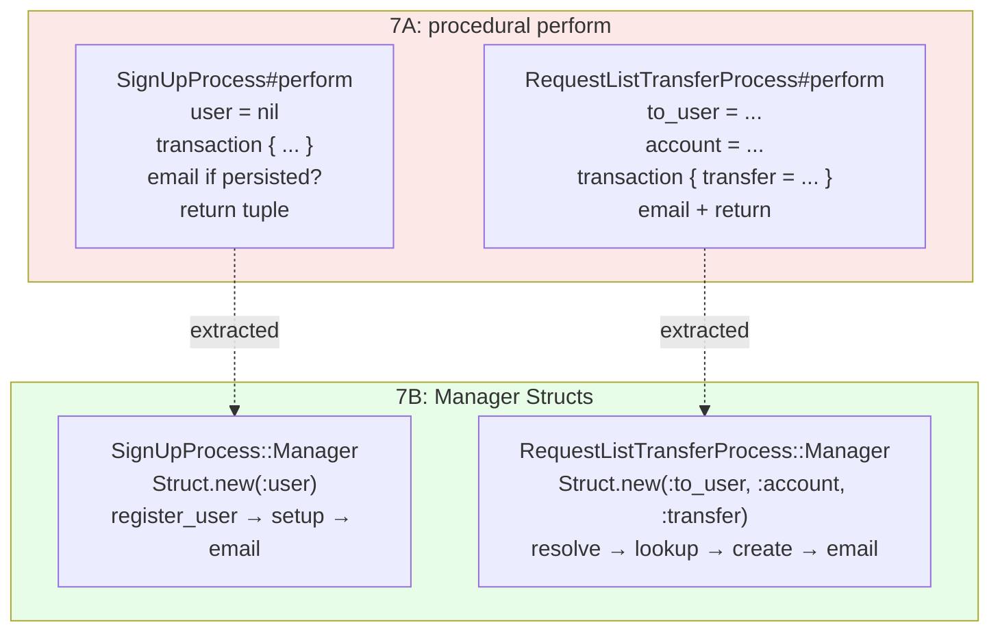

<p align="center">
<small>
<code>MENU:</code> <a href="https://github.com/railswhey/app/tree/MAP?tab=readme-ov-file">MAP</a> | <strong>README</strong> | <a href="/docs/00-INSTALLATION.md">Installation</a> | <a href="/docs/01-FEATURES.md">Features &amp; Screenshots</a> | <a href="/docs/02-TESTING.md">Testing</a> | <a href="/docs/governance/MANIFESTO.md">Manifesto</a>
</small>
</p>

<h1 align="center" style="border-bottom: none;">
  
  Rails Whey App
  
</h1>

<p align="center">
  
</p>

A full-stack task management app built with Ruby on Rails. This branch extracts the two most complex process jobs into nested `Manager` Structs — callable objects with named steps, intermediate state fields, and distinct lifecycle phases. Four simpler processes keep inline `perform`. 3 files change; no behavioral tests change.

| | |
|---|---|
| **Branch** | `7B-process-managers` |
| **Ruby** | 4.0 |
| **Rails** | 8.1 |
| **Rubycritic** | 93.67 |
| **LOC** | 1793 |

**Table of contents:**

- [🎯 The concept](#-the-concept)
- [📊 The numbers](#-the-numbers)
- [🤔 The problem](#-the-problem)
- [🔬 The evidence](#-the-evidence)
- [➡️ What comes next](#️-what-comes-next)
- [🏛️ Thesis checkpoint](#️-thesis-checkpoint)
- [🤖 The agent's view](#-the-agents-view)
- [🚀 Quick start](#-quick-start)
- [🧪 Testing](#-testing)
- [🗺️ The map](#️-the-map)

---

## 🎯 The concept

> **One rule:** when a method accumulates intermediate state across distinct lifecycle phases, give the orchestration its own object.

7A moved cross-domain coordination into process jobs. But the orchestrations inside were procedural scripts: local variables tracking state, inline conditionals, no separation between job infrastructure and business logic.

7B applies the Manager pattern *selectively*. Only two of six process jobs earn a Manager — the two with intermediate state accumulating across lifecycle phases (resolution → transaction → side effects). The Manager is a `Struct` nested inside the job. Fields declare state. Named methods turn the script into a recipe. `perform` becomes a one-liner.



| Process job | Lines (7A) | Lines (7B) | Manager? |
|---|---|---|---|
| `User::SignUpProcess` | 26 | 38 | yes |
| `User::RequestListTransferProcess` | 34 | 48 | yes |
| `Account::AcceptInvitationProcess` | 23 | 23 | no |
| `Account::DispatchInvitationProcess` | 25 | 25 | no |
| `Account::CloseProcess` | 17 | 17 | no |
| `User::RespondToTransferProcess` | 28 | 28 | no |

The criterion: **if you can't name a Struct field, you don't need a Manager.**

---

## 📊 The numbers

| | Before (7A) | After (7B) |
|---|---|---|
| Files changed | — | 3 |
| Net line change | — | +8 |
| Behavioral test changes | — | 0 |
| Rubycritic | 93.80 | 93.67 |

Rubycritic dips −0.13. The metric counts methods and nesting, not readability. An inline `perform` with three phases and three local variables scores better than a Struct with three named fields and three named methods — because the metric sees structure added, not complexity labeled. The tradeoff: +8 LOC for named steps, explicit state declarations, and reusability outside Active Job.

---

## 🤔 The problem

Two process jobs outgrew their `perform` method.

**`User::SignUpProcess#perform`** — `user = nil` initialized before a transaction so it's accessible after. Three phases compressed into one method body: registration, transactional setup, and post-transaction email.

```ruby
# 7A — procedural script
def perform(params)
  user = nil

  ActiveRecord::Base.transaction do
    user = User::Registration.call(params)

    if user.persisted?
      uuid, email, username = user.values_at(:uuid, :email, :username)
      Account::Setup.call(uuid:, email:, username:)
      Workspace::Setup.call(uuid:, email:, username:)
    end
  end

  if user.persisted?
    UserMailer.with(user:, token: user.generate_token_for(:email_confirmation))
              .email_confirmation.deliver_later
  end

  user.persisted? ? [:ok, user] : [:err, user]
end
```

**`User::RequestListTransferProcess#perform`** — three local variables (`to_user`, `account`, `transfer`) accumulating state across four phases: recipient resolution, account lookup, transfer creation with notification, and post-transaction email.

`user = nil` is manual state management. That's the kind of thing a Struct field handles naturally. And `perform` is doing two things: being a job entry point and being the orchestration. The orchestration can't be called outside `perform`, can't be tested without Active Job, can't be reused from seeds or console.

---

## 🔬 The evidence

**Pattern 1: Sign-up orchestration**

```ruby
class User::SignUpProcess < ApplicationJob
  Manager = Struct.new(:user) do
    def call(params)
      ActiveRecord::Base.transaction do
        register_user(params)

        setup_account_and_workspace if user.persisted?
      end

      send_email_confirmation if user.persisted?

      user.persisted? ? [:ok, user] : [:err, user]
    end

    private

    def register_user(params)
      self.user = User::Registration.call(params)
    end

    def setup_account_and_workspace
      uuid, email, username = user.values_at(:uuid, :email, :username)

      Account::Setup.call(uuid:, email:, username:)
      Workspace::Setup.call(uuid:, email:, username:)
    end

    def send_email_confirmation
      UserMailer.with(user:, token: user.generate_token_for(:email_confirmation))
                .email_confirmation.deliver_later
    end
  end

  def perform(...) = Manager.new.call(...)
end
```

`Struct.new(:user)` declares the state. Named methods turn three phases into a recipe. `call` reads: register, set up if persisted, email if persisted, return tuple. `Manager.new.call(params)` works without Active Job — seeds, console, tests.

**Pattern 2: Transfer request orchestration**

```ruby
class User::RequestListTransferProcess < ApplicationJob
  Manager = Struct.new(:to_user, :account, :transfer) do
    def call(list:, from_workspace:, initiated_by:, to_email:)
      self.to_user = User.find_by(email: to_email)
      return [:err, "No user found with that email."] unless to_user

      self.account = resolve_account
      return [:err, "Target user has no account."] unless account

      ActiveRecord::Base.transaction do
        self.transfer = create_transfer(list:, from_workspace:, initiated_by:)
        notify_recipient
      end

      send_transfer_email if transfer&.persisted?

      transfer ? [:ok, transfer] : [:err, "Failed to create transfer."]
    end

    private

    def resolve_account
      Account.joins(memberships: :person).find_by(account_people: { uuid: to_user.uuid })
    end

    def create_transfer(list:, from_workspace:, initiated_by:)
      to_workspace = ::Workspace.find_by(uuid: account.uuid)
      Workspace::List::Transfer.create!(list:, initiated_by:, from_workspace:, to_workspace:)
    end

    def notify_recipient
      User::Notification::Delivery.new(transfer).transfer_requested(to: to_user)
    end

    def send_transfer_email
      Workspace::ListTransferMailer.with(recipient_email: account.owner.email, to_account_name: account.name)
                                   .transfer_requested(transfer).deliver_later
    end
  end

  def perform(...) = Manager.new.call(...)
end
```

Three fields, each step building on the previous. `resolve_account` reads `to_user`. `create_transfer` reads `account`. `notify_recipient` reads `transfer`. The dependency chain is visible in `Struct.new(:to_user, :account, :transfer)`.



**Pattern 3: The selectivity boundary**

| Process | Why no Manager |
|---|---|
| `Account::CloseProcess` | Single transaction, no intermediate state. |
| `Account::AcceptInvitationProcess` | Straight-line: add person, add member, notify, email. No branching. |
| `Account::DispatchInvitationProcess` | One phase, not three. |
| `User::RespondToTransferProcess` | Branch on accept/reject, no accumulating state. |

Zero fields = no Manager. The Struct declaration is the diagnostic — if you can't name a field, the pattern doesn't apply.

---

## ➡️ What comes next

7A drew domain boundaries. 7B gave the complex orchestrations structured objects. But all three bounded contexts share one SQLite database. `ActiveRecord::Base.transaction` wraps cross-domain operations as if they were a single unit — a guarantee that depends on a storage topology that contradicts the domain architecture.

Branch `7C-domain-databases` enforces the boundary at the database level. Each domain gets its own database through `connects_to`. Process managers replace the single cross-domain transaction with per-domain local transactions and explicit compensation via an `Orchestrator` Struct factory with a `Revertible` mixin. The boundaries that existed in code finally exist in storage. ✌️

---

## 🏛️ Thesis checkpoint

Process managers for cross-domain coordination — Principle 4 applied to the most challenging problem in domain design. Standard Active Job, standard `Struct`. No external library. Principle 1 holds: the behavioral contract is unchanged across the extraction.

---

## 🤖 The agent's view

`Struct.new(:to_user, :account, :transfer)` — an agent reads this and knows the orchestration's state before reading any method body. In 7A, the same information was scattered as local variable declarations through the method. Named methods make insertion points obvious: adding a step means adding a line to a named method, not parsing implicit phase boundaries in whitespace — where a step inserted outside the transaction silently loses rollback protection.

`Manager.new.call(params)` decouples the orchestration from Active Job. An agent writing seeds, tests, or console scripts calls the Manager directly — no job invocation required. As domain boundaries harden through 7C and 7D, the Manager becomes the testable surface: `User::SignUpProcess::Manager.new.call(params)` returns a result tuple without constructing HTTP requests or job invocations.

---

## 🚀 Quick start

Prerequisites: [mise](https://mise.jdx.dev/) (manages Ruby, Node, Mailpit)

```sh
git clone git@github.com:railswhey/app.git -b 7B-process-managers 7B-process-managers
cd 7B-process-managers
mise install                 # Ruby 4.0.1 + Node 22 + Mailpit 1.29.2
bin/setup                    # bundle install, db:prepare, starts dev server
```

> See [Installation guide](./docs/00-INSTALLATION.md) for detailed setup, demo accounts, and E2E test setup.

## 🧪 Testing

Full CI pipeline (run after changes):

```sh
bin/ci                       # setup + RuboCop + Brakeman + bundler-audit + tests
```

Individual commands for faster feedback during development:

```sh
bin/rails test               # integration tests (Minitest)
mise run e2e:web             # Playwright navigation smoke test (fast, ~15s)
mise run e2e:web:full        # all Playwright specs (~5min)
mise run e2e:api             # curl + jq smoke tests (requires running server)
mise run e2e:test            # all E2E (e2e:web fast + e2e:api)
```

> See [Testing guide](./docs/02-TESTING.md) for running subsets, CI pipeline details, and E2E deep dives.

## 🗺️ The map

This branch is one point on a 28-branch gradient — from a single fat controller (1A) to fully isolated engines (7D). Every point is a valid, defensible choice. The goal is not to reach the end, but to see that the path exists.

For the full gradient, the manifesto, and the project's governance, see the [MAP](https://github.com/railswhey/app/tree/MAP?tab=readme-ov-file).
