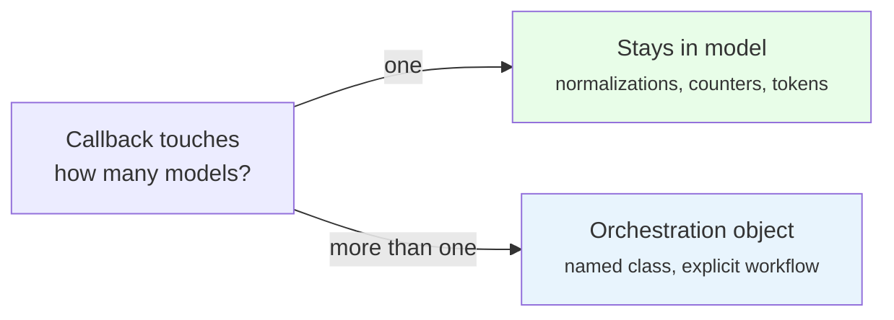
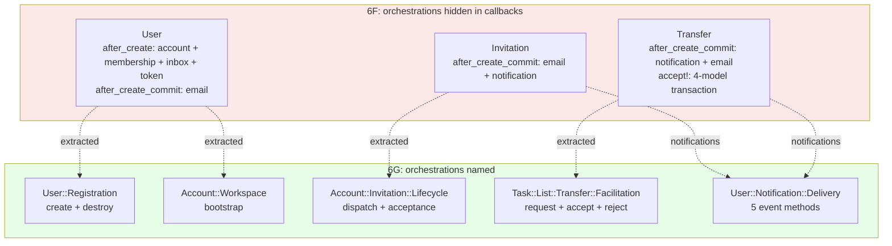

<p align="center">
<small>
<code>MENU:</code> <a href="https://github.com/railswhey/app/tree/MAP?tab=readme-ov-file">MAP</a> | <strong>README</strong> | <a href="/docs/00-INSTALLATION.md">Installation</a> | <a href="/docs/01-FEATURES.md">Features &amp; Screenshots</a> | <a href="/docs/02-TESTING.md">Testing</a> | <a href="/docs/governance/MANIFESTO.md">Manifesto</a>
</small>
</p>

<h1 align="center" style="border-bottom: none;">
  
  Rails Whey App
  
</h1>

<p align="center">
  
</p>

A full-stack task management app built with Ruby on Rails. This branch names the multi-model orchestrations hidden in model callbacks. Six orchestration objects are extracted: `User::Registration`, `User::PasswordReset`, `Account::Workspace`, `Account::Invitation::Lifecycle`, `Task::List::Transfer::Facilitation`, and `User::Notification::Delivery`. `Task::List::Stats` becomes `Task::List::Summary` (a stateless module). Models that fired side effects on save now declare only their own structure. 31 files change; no behavioral tests change; Rubycritic rises from 91.72 to 92.08.

| | |
|---|---|
| **Branch** | `6G-named-orchestrations` |
| **Ruby** | 4.0 |
| **Rails** | 8.1 |
| **Rubycritic** | 92.08 |
| **LOC** | 1799 |

**Table of contents:**

- [🎯 The concept](#-the-concept)
- [📊 The numbers](#-the-numbers)
- [🤔 The problem](#-the-problem)
- [🔬 The evidence](#-the-evidence)
- [➡️ What comes next](#️-what-comes-next)
- [🏛️ Thesis checkpoint](#️-thesis-checkpoint)
- [🤖 The agent's view](#-the-agents-view)
- [🚀 Quick start](#-quick-start)
- [🧪 Testing](#-testing)
- [🗺️ The map](#️-the-map)

---

## 🎯 The concept

> **One rule:** multi-model coordination gets its own name.

When `user.save` triggers account creation, membership assignment, inbox setup, and email dispatch, the call site reveals nothing. The controller writes `if @user.save` and four models change behind the scenes. It's like hitting save on a document and silently emailing your boss — you'd be terrified to click that button.

This branch gives each orchestration its own class:

| Orchestration | Responsibility |
|---|---|
| `User::Registration` | Creation + workspace + email |
| `User::PasswordReset` | Password reset workflow |
| `Account::Workspace` | Personal workspace setup |
| `Account::Invitation::Lifecycle` | Dispatch + acceptance |
| `Task::List::Transfer::Facilitation` | Request + accept + reject |
| `User::Notification::Delivery` | Five notification events |

Single-model effects stay in the model. Multi-model coordination moves out.



`Task::List::Stats` is also renamed to `Task::List::Summary` — a stateless module where `Summary.of(list)` reads as plain English.

---

## 📊 The numbers

| | Before (6F) | After (6G) |
|---|---|---|
| Files changed | — | 31 |
| Insertions / deletions | — | 267 / 154 |
| Net line change | — | +113 |
| New orchestration objects | — | 6 |
| Behavioral test changes | — | 0 |
| Rubycritic | 91.72 | 92.08 |

Adding +113 lines reduced complexity — named code replacing anonymous callbacks. Rubycritic rises only +0.36 because static analysis can't see that `User::Registration.new.create(params)` is categorically different from `@user.save` with four invisible side effects. From this point forward, the agent's view — not the linter — is the true measure.

---

## 🤔 The problem

Five places where a save hides a workflow.

**`user.save`** — six side effects behind one persistence call: account, workspace name, membership, inbox, token, confirmation email.

**`user.destroy!`** — one line hiding a cascade through accounts, memberships, task lists, and transfers.

**`invitation.save`** — two invisible callbacks: email dispatch and invitee notification.

**`transfer.save`** — notification and email, coupled through a `to_user` attr_accessor the caller must set but documented nowhere.

**`transfer.accept!`** — the method name says "accept"; the body moves a list to a new account, updates the transfer status, cancels all competing pending transfers, and delivers a notification.

Why does this happen? Callbacks are the path of least resistance. Four lines for a callback, twenty for an orchestration class. Each addition is small and harmless. But the model accumulates orchestration responsibility it was never meant to have. The cost shows up later — when a test needs to create a transfer without sending email, or when a new caller needs to save without triggering side effects.

---

## 🔬 The evidence

**Registration becomes a named workflow**

Before — two callbacks in User, four models touched on save:

```ruby
after_create do
  account = Account.create!(uuid: SecureRandom.uuid, name: "#{email.split('@').first}'s workspace", personal: true)
  account.add_member(self, role: :owner)
  account.task_lists.inbox.create!
  create_token!
end

after_create_commit do
  UserMailer.with(user: self, token: generate_token_for(:email_confirmation))
            .email_confirmation.deliver_later
end
```

After — the controller names the operation:

```ruby
# Controller
@user = User::Registration.new.create(user_registration_params)
if @user.persisted? ...
```

```ruby
# User::Registration
class User::Registration
  attr_reader :user

  def initialize(user = User.new)
    @user = user
  end

  def create(params)
    user.assign_attributes(params)
    return user unless user.valid?

    user.transaction do
      user
        .tap(&:save!)
        .tap(&:create_token!)
        .then { Account::Workspace.for!(it) }
    end

    UserMailer.with(user:, token: user.generate_token_for(:email_confirmation))
              .email_confirmation.deliver_later

    user
  rescue ActiveRecord::RecordInvalid
    user
  end

  def destroy
    return user if user.new_record?
    user.transaction do
      user.account.destroy!
      user.destroy!
    end
    user
  end
end
```

`Account::Workspace.for!` absorbs the personal workspace bootstrap — UUID generation, name derivation, owner membership, inbox creation. The registration orchestration sequences the steps; the workspace module owns the workspace details.

**Notifications centralized behind named methods**

Before — five call sites, each choosing a constant and a recipient. After — one class, five named methods:

```ruby
class User::Notification::Delivery
  attr_reader :notifiable

  def initialize(notifiable)
    @notifiable = notifiable
  end

  def transfer_requested(to:) = notify(to, TRANSFER_REQUESTED)
  def transfer_accepted       = notify(notifiable.transferred_by, TRANSFER_ACCEPTED)
  def transfer_rejected       = notify(notifiable.transferred_by, TRANSFER_REJECTED)

  def invitation_received(to:) = notify(to, INVITATION_RECEIVED)
  def invitation_accepted      = notify(notifiable.invited_by, INVITATION_ACCEPTED)

  private

  def notify(user, action)
    User::Notification.create!(user:, notifiable: notifiable, action:)
  end
end
```

The method name IS the event name. Derivable recipients take no argument; contextual recipients require `to:`.



---

## ➡️ What comes next

Family 6 is complete. Seven branches, one idea: architecture is naming what the code already says.

POROs for behavior (6A–6B). Constants for vocabulary (6C). Query objects for responsibility (6D). Declared authority (6E). Contextual names (6F). Orchestration objects for coordination (6G). Four tools, no gems — just plain Ruby giving names to what the code already knew.

The orchestration objects made the coupling visible. Three domains share foreign keys and call each other's classes directly. The names surfaced the dependencies — but the coupling is still there.

Branch `7A-domain-boundaries` draws the lines. Three bounded contexts, no cross-domain model references, `Task::*` becomes `Workspace::*`. 176 files change; Rubycritic rises from 92.08 to 93.80. ✌️

---

## 🏛️ Thesis checkpoint

Family 6: architecture is naming what the code already says. POROs for behavior, constants for vocabulary, query objects for responsibility, orchestration objects for coordination — four tools, seven branches, one thesis (Principle 4). Every extraction used plain Ruby classes, standard callbacks, and model conventions — no gems, no patterns imported from outside the framework. Principle 1 held across all seven branches: zero behavioral test changes despite extracting logic into 12 new files. Rubycritic rose +0.87 across the family. The metric measures structural complexity; the architecture delivers semantic clarity. When those diverge, trust the one that tracks how humans and agents navigate the code.

---

## 🤖 The agent's view

The `to_user` attr_accessor on Transfer is the sharpest case. An agent would write `Transfer.new(attributes).save` — correct by ActiveRecord convention, but silently skips the notification because `to_user` isn't set. After 6G, `facilitation.request(to: to_user)` requires naming the recipient. The correct API is visible. The wrong API doesn't exist.

`User::Notification::Delivery` shows the same principle: `delivery.transfer_accepted` — the method name IS the event. No constant selection, no recipient lookup. One method, one event.

The tradeoff: tracing registration now requires three files instead of one. Named steps across files are easier to reason about than anonymous callbacks in one — but the walk is longer. That friction is the price of named coordination.

---

## 🚀 Quick start

Prerequisites: [mise](https://mise.jdx.dev/) (manages Ruby, Node, Mailpit)

```sh
git clone git@github.com:railswhey/app.git -b 6G-named-orchestrations 6G-named-orchestrations
cd 6G-named-orchestrations
mise install                 # Ruby 4.0.1 + Node 22 + Mailpit 1.29.2
bin/setup                    # bundle install, db:prepare, starts dev server
```

> See [Installation guide](./docs/00-INSTALLATION.md) for detailed setup, demo accounts, and E2E test setup.

## 🧪 Testing

Full CI pipeline (run after changes):

```sh
bin/ci                       # setup + RuboCop + Brakeman + bundler-audit + tests
```

Individual commands for faster feedback during development:

```sh
bin/rails test               # integration tests (Minitest)
mise run e2e:web             # Playwright navigation smoke test (fast, ~15s)
mise run e2e:web:full        # all Playwright specs (~5min)
mise run e2e:api             # curl + jq smoke tests (requires running server)
mise run e2e:test            # all E2E (e2e:web fast + e2e:api)
```

> See [Testing guide](./docs/02-TESTING.md) for running subsets, CI pipeline details, and E2E deep dives.

## 🗺️ The map

This branch is one point on a 28-branch gradient — from a single fat controller (1A) to fully isolated engines (7D). Every point is a valid, defensible choice. The goal is not to reach the end, but to see that the path exists.

For the full gradient, the manifesto, and the project's governance, see the [MAP](https://github.com/railswhey/app/tree/MAP?tab=readme-ov-file).
