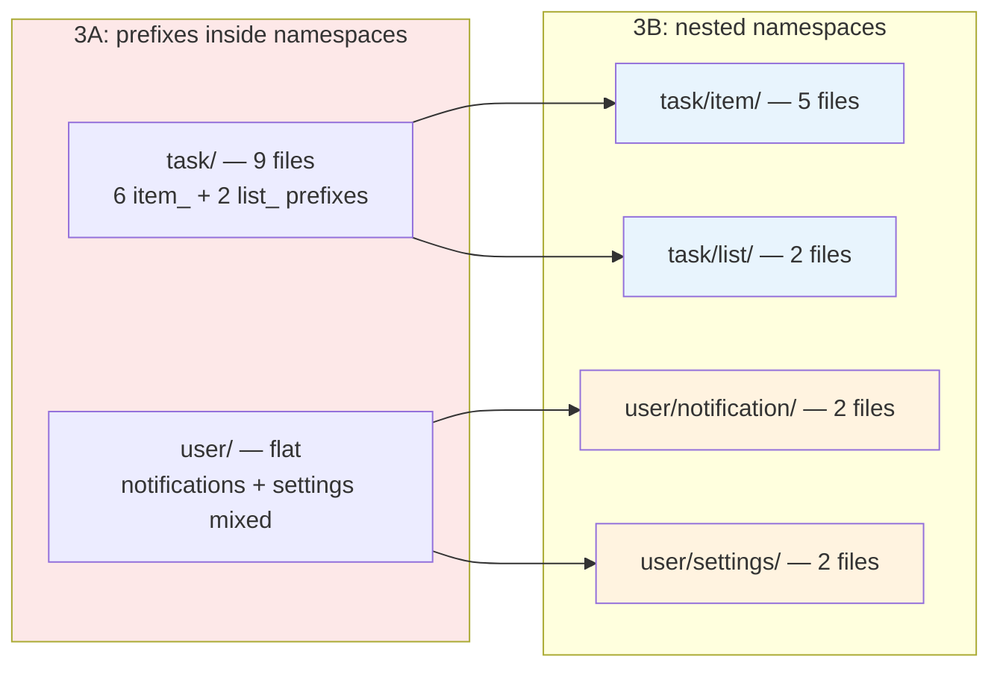
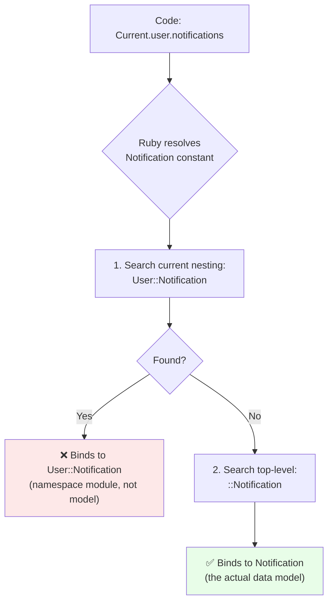
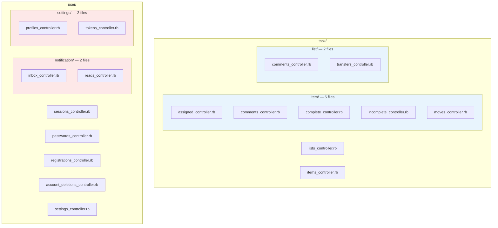

<p align="center">
<small>
<code>MENU:</code> <a href="https://github.com/railswhey/app/tree/MAP?tab=readme-ov-file">MAP</a> | <strong>README</strong> | <a href="/docs/00-INSTALLATION.md">Installation</a> | <a href="/docs/01-FEATURES.md">Features &amp; Screenshots</a> | <a href="/docs/02-TESTING.md">Testing</a> | <a href="/docs/governance/MANIFESTO.md">Manifesto</a>
</small>
</p>

<h1 align="center" style="border-bottom: none;">
  
  Rails Whey App
  
</h1>

<p align="center">
  
</p>

Eleven controllers that accumulated prefixes inside `task/` and `user/` move into four sub-namespaces (`Task::Item::`, `Task::List::`, `User::Notification::`, `User::Settings::`). Controller count stays at 26. Directory depth goes from 2 to 3. The first structural refactoring in the arc that introduces a runtime bug.

| | |
|---|---|
| **Branch** | `3B-nested-namespaces` |
| **Ruby** | 4.0 |
| **Rails** | 8.1 |
| **Rubycritic** | 84.71 |
| **LOC** | 1390 |

**Table of contents:**

- [🎯 The concept](#-the-concept)
- [📊 The numbers](#-the-numbers)
- [🤔 The problem](#-the-problem)
- [🔬 The evidence](#-the-evidence)
- [🤖 The agent's view](#-the-agents-view)
- [➡️ What comes next](#️-what-comes-next)
- [🏛️ Thesis checkpoint](#️-thesis-checkpoint)
- [🚀 Quick start](#-quick-start)
- [🧪 Testing](#-testing)
- [🗺️ The map](#️-the-map)

---

## 🎯 The concept

> **One rule:** if the prefix survived the namespace, the namespace isn't deep enough.

3A solved the flat directory. But inside the namespaces, prefixes reappeared — `task/` had six `item_` files and two `list_` files sharing a single folder. This branch applies the same principle one level deeper:

| Before (3A) | After (3B) |
|---|---|
| `Task::ItemCommentsController` | `Task::Item::CommentsController` |
| `Task::ListTransfersController` | `Task::List::TransfersController` |
| `User::NotificationsController` | `User::Notification::InboxController` |
| `User::ProfilesController` | `User::Settings::ProfilesController` |



The four sub-namespaces group different things. `Task::Item` and `Task::List` mirror entity hierarchies — genuine sub-domains with distinct models and lifecycles. `User::Notification` groups a feature hub. `User::Settings` groups a UI page. Same trigger (shared prefix), different meaning. Structure before behavior is the right first step — but only if you recognize it as a first step.

---

## 📊 The numbers

Rubycritic: 84.71 (unchanged). LOC: 1390 (unchanged). Static analysis measures what's inside files, not how files are organized. Structure that helps humans navigate is invisible to machines.

The cost that escapes metrics: a constant lookup bug. Creating the `User::Notification` namespace made Ruby's constant resolution silently bind to the wrong thing. Ruby searches inside-out — it finds the nearest match first, like yelling "Mom!" in a crowded store and having the closest stranger's kid respond:



The fix — one line in `user.rb`:

```ruby
has_many :notifications, class_name: "::Notification", dependent: :destroy
```

No error. No exception. The code compiled, ran, and loaded the wrong constant. The first time in the arc that a structural refactoring introduced a semantic bug.

Unlike the one-time route helper renaming at depth 1, constant lookup collisions are an ongoing cost — every future namespace that shares a name with a model risks the same silent failure.

---

## 🤔 The problem

Inside `task/` before this branch:

```
task/
  complete_items_controller.rb
  incomplete_items_controller.rb
  item_assigned_controller.rb
  item_comments_controller.rb
  item_moves_controller.rb
  items_controller.rb
  list_comments_controller.rb
  list_transfers_controller.rb
  lists_controller.rb
```

Six `item_` files, two `list_` — prefixes doing the work of directories inside a namespace. The exact problem namespaces were supposed to eliminate.

In `user/`, the pattern was subtler: `notifications_controller.rb` next to `notification_reads_controller.rb` shared a feature with no sub-directory. `profiles_controller.rb` and `tokens_controller.rb` belonged to a settings hub that existed in the UI but not in the file system.

---

## 🔬 The evidence

**`module:` vs `namespace:` — a routing position choice**

Comment routes nest inside `resources :items`, already inside `namespace :task`. Adding `namespace :item` would double the segment: `task_list_item_item_comments_path`. The routing DSL offers `module:` instead:

```ruby
namespace :task do
  resources :lists do
    resources :items do
      resources :comments, only: [:create, :edit, :update, :destroy], module: "item"
    end
    namespace :item do
      resources :complete,   only: [:update]
      resources :incomplete, only: [:update]
      resources :moves,      only: [:create]
    end
    resources :comments, only: [:create, :edit, :update, :destroy], module: "list"
  end
end
```

`module: "item"` routes to `Task::Item::CommentsController` without adding an `/item/` URL segment. `namespace :item` appears for routes not nested inside `resources :items` — no doubling risk there. The choice is driven by routing position, not preference.

**The directory after reorganization**



Blue = entity hierarchies (`Task::Item`, `Task::List`). Red = feature/UI groupings (`User::Notification`, `User::Settings`). Same principle, different semantics.

---

## 🤖 The agent's view

At depth 2, `task/` held 9 files. At depth 3, `task/item/` holds 5. A **44% reduction** in scan space for item-related searches.

The constant lookup risk is a direct correctness hazard. An agent writing `has_many :notifications` inside `User::Notification::InboxController` produces silently wrong code — no error, no exception, just the wrong constant loaded at runtime. Every namespace that shares a name with a model is a potential collision.

The tradeoff: every new controller requires a placement decision — `task/`, `task/item/`, or `task/list/`? What if a feature applies to both an item and a list? Classification is simple for entities with clear ownership, ambiguous for cross-cutting concerns. An LLM doesn't browse a file tree visually; it deduces grouping rules from serialized path strings. Every nesting layer multiplies inference cost. Smaller haystacks, but the needles are now invisible.

---

## ➡️ What comes next

Controller directories are organized. The view layer is not.

`shared/tasks/` predates the `task/` namespace. Partials carry `_task_list` prefixes that duplicate what the path already says. Dead files sit in `shared/`, consuming attention.

Branch `3C-context-views` catches the view layer up. Shared partials move into namespace directories. Domain prefixes drop. Dead files are deleted. `shared/` shrinks from 12 to 2 files. ✌️

---

## 🏛️ Thesis checkpoint

Deeper nesting is still vanilla Rails (Principle 4). The namespace depth reflects domain relationships, not just entity grouping. But the constant lookup collision is the arc's first warning that structure and behavior can diverge — the directory tree looks pristine; Ruby's runtime disagrees. Principle 1 holds through the collision: the behavioral tests don't care about constant resolution order, only HTTP contracts. Resolving that tension — ensuring class boundaries reflect responsibility boundaries, not just filing conventions — begins at 3F.

---

## 🚀 Quick start

Prerequisites: [mise](https://mise.jdx.dev/) (manages Ruby, Node, Mailpit)

```sh
git clone git@github.com:railswhey/app.git -b 3B-nested-namespaces 3B-nested-namespaces
cd 3B-nested-namespaces
mise install                 # Ruby 4.0.1 + Node 22 + Mailpit 1.29.2
bin/setup                    # bundle install, db:prepare, starts dev server
```

> See [Installation guide](./docs/00-INSTALLATION.md) for detailed setup, demo accounts, and E2E test setup.

## 🧪 Testing

Full CI pipeline (run after changes):

```sh
bin/ci                       # setup + RuboCop + Brakeman + bundler-audit + tests
```

Individual commands for faster feedback during development:

```sh
bin/rails test               # integration tests (Minitest)
mise run e2e:web             # Playwright navigation smoke test (fast, ~15s)
mise run e2e:web:full        # all Playwright specs (~5min)
mise run e2e:api             # curl + jq smoke tests (requires running server)
mise run e2e:test            # all E2E (e2e:web fast + e2e:api)
```

> See [Testing guide](./docs/02-TESTING.md) for running subsets, CI pipeline details, and E2E deep dives.

## 🗺️ The map

This branch is one point on a 28-branch gradient — from a single fat controller (1A) to fully isolated engines (7D). Every point is a valid, defensible choice. The goal is not to reach the end, but to see that the path exists.

For the full gradient, the manifesto, and the project's governance, see the [MAP](https://github.com/railswhey/app/tree/MAP?tab=readme-ov-file).
