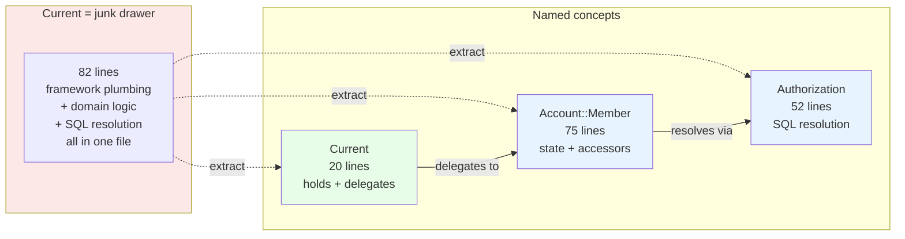
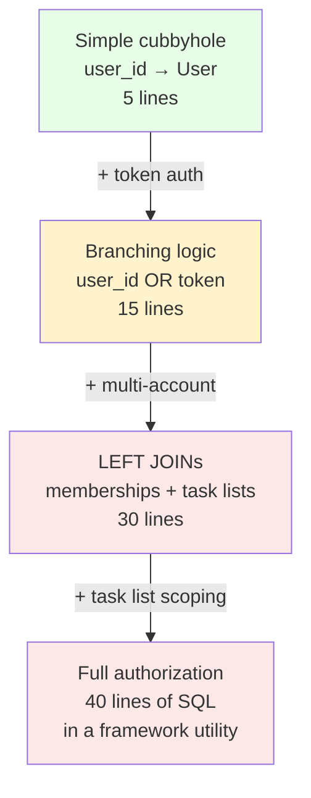

<p align="center">
<small>
<code>MENU:</code> <a href="https://github.com/railswhey/app/tree/MAP?tab=readme-ov-file">MAP</a> | <strong>README</strong> | <a href="/docs/00-INSTALLATION.md">Installation</a> | <a href="/docs/01-FEATURES.md">Features &amp; Screenshots</a> | <a href="/docs/02-TESTING.md">Testing</a> | <a href="/docs/governance/MANIFESTO.md">Manifesto</a>
</small>
</p>

<h1 align="center" style="border-bottom: none;">
  
  Rails Whey App
  
</h1>

<p align="center">
  
</p>

A full-stack task management app built with Ruby on Rails. This branch introduces the first PORO (Plain Old Ruby Object). `Current` was a junk drawer — 82 lines mixing thread-safe state with 40 lines of SQL authorization. `Account::Member` gives the hidden concept a name. Current shrinks to 20 lines of pure delegation.

| | |
|---|---|
| **Branch** | `6A-member-object` |
| **Ruby** | 4.0 |
| **Rails** | 8.1 |
| **Rubycritic** | 91.36 |
| **LOC** | 1696 |

**Table of contents:**

- [🎯 The concept](#-the-concept)
- [📊 The numbers](#-the-numbers)
- [🤔 The problem](#-the-problem)
- [🔬 The evidence](#-the-evidence)
- [➡️ What comes next](#️-what-comes-next)
- [🏛️ Thesis checkpoint](#️-thesis-checkpoint)
- [🤖 The agent's view](#-the-agents-view)
- [🚀 Quick start](#-quick-start)
- [🧪 Testing](#-testing)
- [🗺️ The map](#️-the-map)

---

## 🎯 The concept

> **One rule:** when a concept outgrows its infrastructure home, give it a class and a name.

This branch opens Family 6 — a seven-branch arc where every extraction follows one thesis: **architecture is naming what the code already says.** 6A extracts the first PORO. By 6G, nothing implicit remains — every concept has a class, a constant, or a named method.

`Current` held 82 lines. Twenty were framework plumbing. The other 62 were domain logic — LEFT JOINs, SQL conditions, token checksums — resolving a user into a scoped member. That is a domain concept. It had no name.

`Account::Member` names it. A non-persisted class using `ActiveModel::Model` that answers: "who is this user, in which account, looking at which task list?" `Account::Member::Authorization` holds the SQL. Current becomes a thin delegate.



The natural-language distinction with `Account::Membership` (the AR model): a **membership** is a persisted record of a user's role in an account. A **member** is a user actively acting within an account — resolved from a session or token, scoped to the current request.

---

## 📊 The numbers

| | Before (5D) | After (6A) |
|---|---|---|
| New files | — | 2 (`account/member.rb`, `account/member/authorization.rb`) |
| Lines in Current | 82 | 20 |
| Lines in Account::Member | — | 75 |
| Lines in Authorization | — | 52 |
| Behavioral test changes | — | 0 |
| Rubycritic | 91.21 | 91.36 |

Net change: +65 lines and two new files. 62 lines of tightly coupled code expanded into 127 lines of properly structured code. The Rubycritic bump confirms: splitting a dense multi-responsibility class into focused objects improves per-file complexity even when total LOC grows.

---

## 🤔 The problem

After 5D, models own their logic. But `Current` — meant to hold thread-safe per-request state — still does domain work. Its `member!` method had four private methods spanning 40 lines: input parsing, SHA256 checksums for API tokens, LEFT JOINs across memberships and task lists. None of this is "shared state." It is authorization resolution.

The bloat was sneaky. A developer adds `user_id` resolution — 5 lines. Then API token auth branches the logic. Then multi-account support adds LEFT JOINs. Then task list scoping. Each addition is small. The app still works. Nobody notices because `Current.member!` never changed its signature. But the cubbyhole became the security guard, the receptionist, and the file clerk — all at once.



The concept — a scoped member — existed in the code. It had no class and no name. It lived inside `ActiveSupport::CurrentAttributes` because that's where the first line was written, and every subsequent line stayed.

---

## 🔬 The evidence

**Pattern 1: Current becomes pure delegation**

Before — 82 lines mixing framework and domain:

```ruby
class Current < ActiveSupport::CurrentAttributes
  attribute :user, :user_id, :user_token, :account_id, :task_list_id, # ... etc

  def member!(**options)
    reset
    users_first(options)  # 40 lines of SQL resolution
  end

  # ... 4 private methods: users_first, users_relation, users_left_joins, sanitize_sql_for_assignment
end
```

After — 20 lines of delegation:

```ruby
class Current < ActiveSupport::CurrentAttributes
  attribute :member

  delegate :account, :account?, :account_id, :account_id?, :owner_or_admin?,
           :user, :user?, :user_id, :user_id?, :user_token, :user_token?,
           :task_list, :task_list?, :task_list_id, :task_list_id?,
           :task_lists, :task_items, to: :member, allow_nil: true

  def member!(**options)
    reset
    self.member = Account::Member.authorize(options)
  end

  def member?
    member&.authorized? || false
  end
end
```

Every caller of `Current.user`, `Current.account`, `Current.task_list` works unchanged.

**Pattern 2: The PORO holds domain state**

```ruby
class Account::Member
  include ActiveModel::Model
  include ActiveModel::Attributes

  attribute :user
  attribute :user_id, :integer
  attribute :user_token, :string
  attribute :account_id, :integer
  attribute :task_list_id, :integer

  validate :user_id_and_user_token_cannot_be_present_at_the_same_time

  def self.authorize(params)
    new(params).tap { Authorization.new(it).authorize! }
  end

  def authorized? = user? && account_id? && task_list_id?

  # Memoized derived accessors: account, task_lists, task_list, task_items
  # Role delegation: owner_or_admin? → account&.owner_or_admin?(user)
end
```

Not an ActiveRecord model. No database table. Just a class that makes an implicit concept explicit. The `ArgumentError` that Current used to raise becomes a proper `validate` — same protection, idiomatic mechanism.

**Pattern 3: SQL resolution moves to Authorization**

```ruby
class Account::Member::Authorization
  def initialize(member) = @member = member

  def authorize!
    return if member.invalid?

    find_user.then do |user|
      member.user = user
      member.user_id ||= user&.id
      member.account_id = user&.member_account_id
      member.task_list_id = user&.member_task_list_id
    end
  end

  # Private: find_user, users_relation (user_id vs token), users_left_joins
end
```

52 lines, one responsibility: resolve input parameters into an authorized member. The SQL is identical to what Current held — the only change is where input values come from.

---

## ➡️ What comes next

The member has a name. But it is not the only domain concept hiding inside infrastructure. `User::Token` is 55 lines doing two jobs: persisting the token record and implementing cryptography. Four of its eight methods never touch the database — pure functions sharing a file with ActiveRecord lifecycle code.

Branch `6B-token-secret` extracts the second PORO: `User::Token::Secret`. Same `ActiveModel::Model` pattern. `User::Token` slims from 55 to 32 lines. The pair completes Family 6's opening thesis — when a concept outgrows its home, give it a name and a class. ✌️

---

## 🏛️ Thesis checkpoint

A PORO that names what the code already knows — Principle 4 applied to plain Ruby objects. No gem, no framework pattern — just a class that makes an implicit concept explicit. Principle 8 applies: the design decision is traceable from the object definition back to the membership behavior it encapsulates.

---

## 🤖 The agent's view

Before 6A, an agent editing authorization must load `current.rb` — 82 lines mixing framework and domain. After 6A, authorization lives in `account/member/authorization.rb` — 52 lines doing one thing.

The file count went up by two, but the cognitive load per file went down. An agent working on authorization never touches infrastructure. An agent working on Current's interface never touches SQL. By optimizing for the machine's context window, we accidentally force cleaner code for humans too — a forcing function for good architecture.

---

## 🚀 Quick start

Prerequisites: [mise](https://mise.jdx.dev/) (manages Ruby, Node, Mailpit)

```sh
git clone git@github.com:railswhey/app.git -b 6A-member-object 6A-member-object
cd 6A-member-object
mise install                 # Ruby 4.0.1 + Node 22 + Mailpit 1.29.2
bin/setup                    # bundle install, db:prepare, starts dev server
```

> See [Installation guide](./docs/00-INSTALLATION.md) for detailed setup, demo accounts, and E2E test setup.

## 🧪 Testing

Full CI pipeline (run after changes):

```sh
bin/ci                       # setup + RuboCop + Brakeman + bundler-audit + tests
```

Individual commands for faster feedback during development:

```sh
bin/rails test               # integration tests (Minitest)
mise run e2e:web             # Playwright navigation smoke test (fast, ~15s)
mise run e2e:web:full        # all Playwright specs (~5min)
mise run e2e:api             # curl + jq smoke tests (requires running server)
mise run e2e:test            # all E2E (e2e:web fast + e2e:api)
```

> See [Testing guide](./docs/02-TESTING.md) for running subsets, CI pipeline details, and E2E deep dives.

## 🗺️ The map

This branch is one point on a 28-branch gradient — from a single fat controller (1A) to fully isolated engines (7D). Every point is a valid, defensible choice. The goal is not to reach the end, but to see that the path exists.

For the full gradient, the manifesto, and the project's governance, see the [MAP](https://github.com/railswhey/app/tree/MAP?tab=readme-ov-file).
