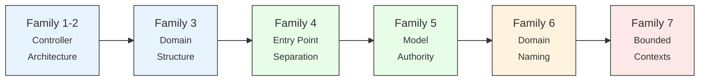
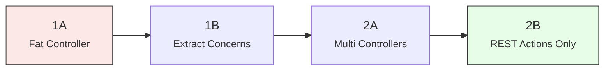
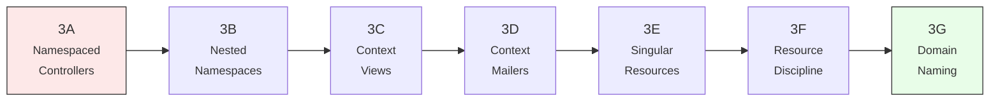
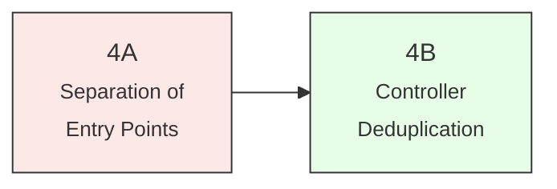
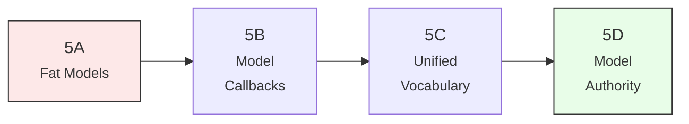
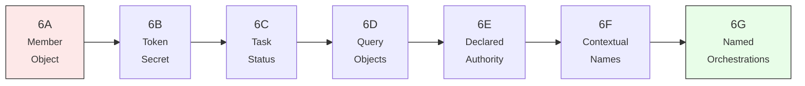
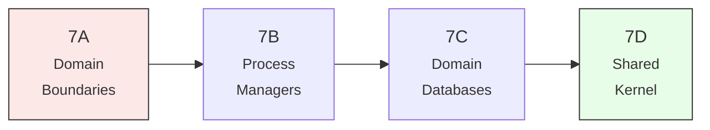

<small>
<code>MENU:</code> <a href="/README.md">README</a> | <strong>The Gradient</strong> | <a href="/docs/00-INSTALLATION.md">Installation</a> | <a href="/docs/01-FEATURES.md">Features &amp; Screenshots</a> | <a href="/docs/02-TESTING.md">Testing</a> | <a href="/docs/governance/MANIFESTO.md">Manifesto</a>
</small>

<h1 align="center" style="border-bottom: none;">
  
  The Gradient
  
</h1>

  

The same Rails application, **built 28 different ways**. Each git branch represents one architectural approach to the same feature set - a full-stack task management app with collaboration, notifications, and a REST API. The branches are ordered into seven families that trace a continuous path from a single fat controller to fully isolated engines with separate databases, **using only Rails' own tools**.

**Every branch applies a single rule.** Every rule removes one category of accidental complexity. The gradient doesn't prescribe an endpoint - it demonstrates that the path exists and **every point on it is a valid, defensible choice**.

> [!IMPORTANT]
> The gradient exists to prove one thing: **the Rails Way has more room in it than most people think.** 
> The question was never whether Rails can handle sophisticated architecture. It always was: **how much architecture does your codebase actually need?**

## Table of Contents <!-- omit in toc -->

- [Family 1 \& 2 - Controller Architecture](#family-1--2---controller-architecture)
- [Family 3 - Domain Structure](#family-3---domain-structure)
- [Family 4 - Entry Point Separation](#family-4---entry-point-separation)
- [Family 5 - Model Authority](#family-5---model-authority)
- [Family 6 - Domain Naming](#family-6---domain-naming)
- [Family 7 - Bounded Contexts \& Isolation](#family-7---bounded-contexts--isolation)
- [What's Next](#whats-next)

---

## Family 1 & 2 - Controller Architecture

From fat controllers to responsibility-based architecture. The default Rails scaffold creates **"gravity wells"** where unrelated workflows cluster by entity rather than function. **Concerns improve file-level readability but don't achieve structural separation** - promoting them to standalone controllers closes the gap between the file system and runtime reality.

| Branch | LOC | Score | Rule |
|---|---|---|---|
| [**1A**: fat-controller](/docs/branches/1A-fat-controller.md) | 1310 | 79.48 | If it touches the model, it goes in the controller. |
| [**1B**: extract-concerns](/docs/branches/1B-extract-concerns.md) | 1377 | 84.95 | Extract the file, keep the class. |
| [**2A**: multi-controllers](/docs/branches/2A-multi-controllers.md) | 1355 | 83.02 | One class per responsibility, not one class per entity. |
| [**2B**: rest-actions-only](/docs/branches/2B-rest-actions-only.md) | 1390 | 84.71 | If the action doesn't fit the 7 verbs, the resource model is wrong. |

---

## Family 3 - Domain Structure

Making the invisible visible through namespacing and alignment. Flat directories and implicit naming conventions transform into explicit domain hierarchies. Controllers, views, mailers, and routes synchronize to speak a unified language. The entire family maintains steady code quality while performing massive structural reorganization - proving that **architecture is about naming and clarity, not feature change**.

| Branch | LOC | Score | Rule |
|---|---|---|---|
| [**3A**: namespaced-controllers](/docs/branches/3A-namespaced-controllers.md) | 1390 | 84.71 | The prefix becomes the folder. |
| [**3B**: nested-namespaces](/docs/branches/3B-nested-namespaces.md) | 1390 | 84.71 | If the prefix survived the namespace, the namespace isn't deep enough. |
| [**3C**: context-views](/docs/branches/3C-context-views.md) | 1390 | 84.71 | Domain in the path, resource in the name. |
| [**3D**: context-mailers](/docs/branches/3D-context-mailers.md) | 1390 | 84.71 | Declare the path; don't let Rails guess it from the class name. |
| [**3E**: singular-resources](/docs/branches/3E-singular-resources.md) | 1389 | 84.41 | Express every route as a resource declaration. |
| [**3F**: resource-discipline](/docs/branches/3F-resource-discipline.md) | 1397 | 83.92 | Fix the name, not the route. |
| [**3G**: domain-naming](/docs/branches/3G-domain-naming.md) | 1417 | 83.22 | Name the operation, not the page. |

---

## Family 4 - Entry Point Separation

One product, one format, one controller family. The `respond_to` pattern tangled web and API concerns into every action. This family breaks them apart into distinct `Web::` and `API::` families with their own base classes, authentication, and error handling - then deduplicates using Rails fundamentals. The temporary quality regression during separation proves that **good architecture sometimes requires temporary pain**.

| Branch | LOC | Score | Rule |
|---|---|---|---|
| [**4A**: separation-of-entry-points](/docs/branches/4A-separation-of-entry-points.md) | 1741 | 78.55 | One controller, one format, one product. |
| [**4B**: controller-deduplication](/docs/branches/4B-controller-deduplication.md) | 1667 | 87.13 | Match the extraction tool to the relationship. |

---

## Family 5 - Model Authority

Fat models, skinny controllers - **moving logic to where data lives**. Business logic shifts from controllers to models using scopes, predicates, value objects, and callbacks. The "Tell Don't Ask" principle ensures callers never bypass rich model logic through association chains. **Controllers become thin HTTP adapters.**

| Branch | LOC | Score | Rule |
|---|---|---|---|
| [**5A**: fat-models](/docs/branches/5A-fat-models.md) | 1640 | 91.51 | If two controllers compute the same thing, the model should compute it once. |
| [**5B**: model-callbacks](/docs/branches/5B-model-callbacks.md) | 1638 | 91.23 | If every creation path should trigger the effect, the model owns the event. |
| [**5C**: unified-vocabulary](/docs/branches/5C-unified-vocabulary.md) | 1641 | 91.18 | The model's name should match the controller's namespace. |
| [**5D**: model-authority](/docs/branches/5D-model-authority.md) | 1646 | 91.21 | Ask the model that owns the data; don't reach through its associations. |

---

## Family 6 - Domain Naming

**Architecture is naming what the code already says.** Domain concepts hiding inside infrastructure - authorization logic in `CurrentAttributes`, cryptographic operations in ActiveRecord models, scattered string literals - get explicit names and dedicated classes. POROs, constants, query objects, and orchestration classes **make the implicit explicit**.

| Branch | LOC | Score | Rule |
|---|---|---|---|
| [**6A**: member-object](/docs/branches/6A-member-object.md) | 1696 | 91.36 | When a concept outgrows its infrastructure home, give it a class and a name. |
| [**6B**: token-secret](/docs/branches/6B-token-secret.md) | 1712 | 91.46 | When pure functions share a file with persistence logic, they need their own home. |
| [**6C**: task-status](/docs/branches/6C-task-status.md) | 1717 | 91.45 | If the code speaks a word in multiple places, give it one canonical home. |
| [**6D**: query-objects](/docs/branches/6D-query-objects.md) | 1735 | 91.58 | When a computation outgrows its host model, give it its own object. |
| [**6E**: declared-authority](/docs/branches/6E-declared-authority.md) | 1717 | 91.72 | If it's your data, it's your responsibility to answer questions about it. |
| [**6F**: contextual-names](/docs/branches/6F-contextual-names.md) | 1717 | 91.72 | If the namespace already says it, the name drops the prefix. |
| [**6G**: named-orchestrations](/docs/branches/6G-named-orchestrations.md) | 1799 | 92.08 | Multi-model coordination gets its own name. |

---

## Family 7 - Bounded Contexts & Isolation

**Microservices discipline within a monolith.** Strict domain boundaries, multi-database isolation, saga-based compensation, and mountable engines. The host app becomes a headless Shared Kernel while Web and API live in their own engines. The tools stay native - Active Record, Active Job, Rails engines - but **the boundaries are real**.

| Branch | LOC | Score | Rule |
|---|---|---|---|
| [**7A**: domain-boundaries](/docs/branches/7A-domain-boundaries.md) | 1785 | 93.80 | No model references another domain's classes. |
| [**7B**: process-managers](/docs/branches/7B-process-managers.md) | 1793 | 93.67 | When intermediate state accumulates across lifecycle phases, give the orchestration its own object. |
| [**7C**: domain-databases](/docs/branches/7C-domain-databases.md) | 1818 | 93.81 | Each bounded context owns its own database. |
| [**7D**: shared-kernel](/docs/branches/7D-shared-kernel.md) | 1832 | 94.55 | The host app keeps only what both interfaces share. Everything else moves to an engine. |

---

## What's Next

The gradient doesn't end at 7D. See [What's Next](/docs/branches/99-future.md) for two paths forward: incremental improvements to 7D and a complete rethinking as Self-Contained Systems.
