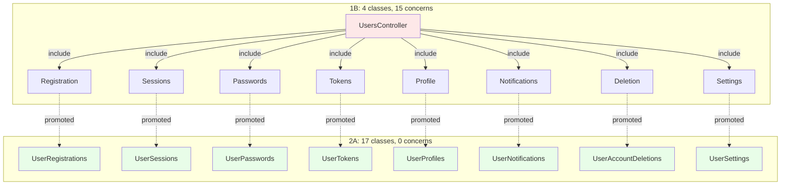
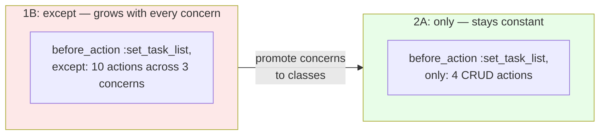
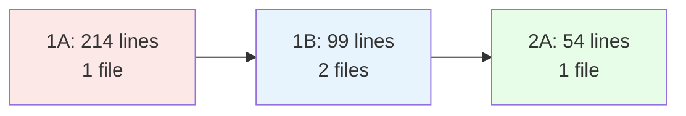

<p align="center">
<small>
◂ <a href="/docs/branches/1B-extract-concerns.md">1B</a> | <a href="/docs/03-THE-GRADIENT.md"><strong>The Gradient</strong></a> | <a href="/docs/branches/2B-rest-actions-only.md">2B</a> ▸
<br>
<a href="https://github.com/railswhey/app/tree/2A-multi-controllers?tab=readme-ov-file">(Branch)</a> | <a href="https://github.com/railswhey/app/compare/1B-extract-concerns..2A-multi-controllers">(Diff)</a>
</small>
</p>

<h1 align="center" style="border-bottom: none;">
  
  Rails Whey App
  
</h1>

<p align="center">
  
</p>

15 concerns from `1B-extract-concerns` — 14 become standalone controllers, 1 folds back. The class boundary and the responsibility boundary are now the same thing. `before_action` rules become local. Method names drop entity prefixes. The rule serves the code, not the other way around.

| | |
|---|---|
| **Branch** | `2A-multi-controllers` |
| **Ruby** | 4.0 |
| **Rails** | 8.1 |
| **Rubycritic** | 83.02 |
| **LOC** | 1355 |

**Table of contents:**

- [🎯 The concept](#-the-concept)
- [📊 The trade](#-the-trade)
- [🔬 The evidence](#-the-evidence)
  - [`except:` becomes `only:`](#except-becomes-only)
  - [Method names become conventional](#method-names-become-conventional)
- [🤔 The catch](#-the-catch)
- [🤖 The agent's view](#-the-agents-view)
- [➡️ What comes next](#️-what-comes-next)
- [🏛️ Thesis checkpoint](#️-thesis-checkpoint)
- [🚀 Quick start](#-quick-start)
- [🧪 Testing](#-testing)
- [🗺️ The map](#️-the-map)

---

## 🎯 The concept

> **One rule:** one class per responsibility, not one class per entity. This is resource discovery's first phase — naming the obvious nouns that 1B's concerns already identified but couldn't isolate at runtime.

Branch `1B-extract-concerns` separated the source files but kept the runtime unchanged — 15 concerns mixed into 4 controllers, sharing `before_action` chains and private namespaces. The file system showed 19 focused units; Rails saw 4 monolithic classes.

This branch closes that gap. Each concern becomes its own controller class. Each class inherits from `ApplicationController` and declares its own filters. No `include` statements. No shared filter lists. The file count goes from 19 (4 controllers + 15 concerns) to 17 domain controllers — plus 4 infrastructure controllers (ApplicationController, ErrorsController, SearchController, ApiDocsController) for 21 total. The concerns directory is empty.



The red node is the 1B orchestrator — one class dispatching to 8 concerns. The green nodes are 2A — 8 independent classes, each owning its filter chain. The orchestrator disappears because there is nothing left to orchestrate.

`UsersController` is gone. Its 8-concern manifest — 28 lines of `include` statements and shared filters — has no reason to exist when each concern owns its own class.

**One concern did not promote.** `TaskItemsStateTransitionsConcern` folded back into `TaskItemsController` because `complete`, `incomplete`, and `move` share the same `set_task_item` finder, the same `before_action` chain, and the same `rescue_from` block as CRUD. When actions share their entire infrastructure, they belong in the same class.

The boundary for this decision: does the action share the controller's infrastructure? `complete` shares `set_task_item`, `authenticate_user!`, and `rescue_from ActiveRecord::RecordNotFound`. Comments don't share any of those — they look up `@task_list` and `@comment` independently. That's why comments promote and state transitions fold back.

---

## 📊 The trade

Rubycritic dropped from 84.95 to 83.02. That -1.93 is the most instructive metric in this branch.

The tool evaluates per-file complexity. In 1B, concern files were modules — low overhead. In 2A, the same code wrapped in a full controller class carries more structural weight. `UserSettingsController` at 8 lines is 62% boilerplate. The score penalizes that ratio — and the score is right.

The boilerplate is an architectural tax paid once per controller to buy class-level isolation. The premium is fixed: a class declaration, a filter line, an `end`. The protection is absolute: no silent method collisions, no leaked instance variables, no fractured security contracts.

We trade per-file complexity for class-level isolation. The metric records the cost. The architecture holds the value.

---

## 🔬 The evidence

### `except:` becomes `only:`

This is the structural signal of the entire branch.

In 1B, `TaskListsController` governed access for CRUD, transfers, and comments from one filter list:

```ruby
# 1B — TaskListsController (governing 3 concerns)
before_action :authenticate_user!, except: %i[show_transfer update_transfer]
before_action :set_task_list, except: %i[index new create new_transfer create_transfer
  show_transfer update_transfer create_comment edit_comment update_comment destroy_comment]
```

Adding a comment action meant editing the CRUD controller's filter list. The `except:` lists span three different concerns.

In 2A, each controller owns its own filters:

```ruby
# 2A — TaskListsController (CRUD only)
before_action :authenticate_user!
before_action :set_task_list, only: %i[show edit update destroy]
```

```ruby
# 2A — TaskListCommentsController (comments only)
before_action :authenticate_user!
```



An `except:` list grows with every new action across every concern. An `only:` list stays constant unless the controller's own actions change.

### Method names become conventional

In 1B, concern methods carried entity prefixes because they shared a controller namespace:

```ruby
# 1B — AccountsMembershipsConcern (inside AccountsController)
def memberships ... end
def destroy_membership ... end
```

In 2A, the class name carries the context:

```ruby
# 2A — AccountMembershipsController
def index ... end
def destroy ... end
```

`memberships` → `index`. `destroy_membership` → `destroy`. `create_comment` → `create`. `new_transfer` → `new`. The prefixes were compensating for a missing class boundary. Once the class exists, names revert to standard Rails vocabulary.

---

## 🤔 The catch

17 domain controllers, one flat directory:

```
account_invitations_controller.rb
account_memberships_controller.rb
accounts_controller.rb
task_item_assigned_controller.rb
task_item_comments_controller.rb
task_items_controller.rb
task_list_comments_controller.rb
task_list_transfers_controller.rb
task_lists_controller.rb
user_account_deletions_controller.rb
user_notifications_controller.rb
user_passwords_controller.rb
user_profiles_controller.rb
user_registrations_controller.rb
user_sessions_controller.rb
user_settings_controller.rb
user_tokens_controller.rb
```

This is an organizational problem, not a modeling regression. The class-level improvement — local filter chains, per-class cohesion, eliminated `include` statements — holds regardless of where the files live. But a developer browsing the directory sees noise where there should be signal. It's like perfectly organizing every tool in a kitchen so they're isolated and clean — then throwing them all alphabetically into one giant box. The pizza cutter sits between the pastry brush and the potato peeler.

Rails namespaces (`User::NotificationsController` → `app/controllers/user/`) solve this — but they change URL paths by default, adding routing complexity to solve a file-organization problem.

This branch chose to fight one battle: class boundaries. The flat directory is the temporary cost of keeping the refactor focused. Namespaces arrive in `3A-namespaced-controllers`, where prefixes move from filenames into directory paths.

---

## 🤖 The agent's view

The amount of code an AI needs to read to fix a specific issue drops from 214 lines to 54.

`AccountMembershipsController` is 54 lines — all membership-related. In 1B, that same fix required `AccountsMembershipsConcern` (48 lines) plus `AccountsController` (51 lines) — 99 lines across 2 files. In 1A, it was `AccountsController` at 214 lines.



A 4x reduction in context for the same fix. And the authorization risk from 1B — where adding a concern action required updating a different file's `except:` list — is gone. Each controller declares its own `before_action`. The file is the class, and the class is the complete unit.

The remaining cost is the flat directory. An agent scanning 17 filenames, parsing prefixes character by character to distinguish `task_item_` from `task_list_` — that's string matching where directory traversal would suffice. This drives the namespace refactoring in 3A.

---

## ➡️ What comes next

The obvious nouns are named. Nine custom actions across five controllers still use custom verbs — `complete`, `incomplete`, `move` on `TaskItemsController`; `switch` on `AccountsController`; `mark_all_read` on `UserNotificationsController`; `my_tasks` on `TaskItemAssignedController` — and every custom verb is a resource that hasn't been named yet.

`TaskItemsController#complete` is really `TaskItemCompletionsController#update`. `AccountsController#switch` is `AccountSwitchesController#create`.

This is resource discovery's second phase. Where 2A named the nouns hiding behind concerns, `2B-rest-actions-only` names the nouns hiding behind custom verbs. The constraint is the forcing function: when you only have 7 verbs to work with, you're forced to mint a new noun when you run out of actions. The controller count grows from 21 to 26. The action vocabulary shrinks to 7. ✌️

---

## 🏛️ Thesis checkpoint

Principle 1 enabled this. Four controllers became 23. Every route helper name changed. But the behavioral tests passed without rewriting a single assertion — because the route abstraction layer (Principle 2) absorbed the structural change. The controller count tripled while the test suite stayed identical. That is what structural freedom looks like when tests couple to behavior, not implementation.

This is resource discovery's first phase — Principle 4 applied to the question of what deserves a class. The obvious nouns got their own controllers. The Rubycritic score dropped by 1.93 points, and the drop is honest: it is the fixed cost of class-level isolation, a tax we pay gladly. Nine custom verbs remain, each signaling a resource that hasn't been named yet.

---

## 🚀 Quick start

Prerequisites: [mise](https://mise.jdx.dev/) (manages Ruby, Node, Mailpit)

```sh
git clone git@github.com:railswhey/app.git -b 2A-multi-controllers 2A-multi-controllers
cd 2A-multi-controllers
mise install                 # Ruby 4.0.1 + Node 22 + Mailpit 1.29.2
bin/setup                    # bundle install, db:prepare, starts dev server
```

> See [Installation guide](./docs/00-INSTALLATION.md) for detailed setup, demo accounts, and E2E test setup.

## 🧪 Testing

Full CI pipeline (run after changes):

```sh
bin/ci                       # setup + RuboCop + Brakeman + bundler-audit + tests
```

Individual commands for faster feedback during development:

```sh
bin/rails test               # integration tests (Minitest)
mise run e2e:web             # Playwright navigation smoke test (fast, ~15s)
mise run e2e:web:full        # all Playwright specs (~5min)
mise run e2e:api             # curl + jq smoke tests (requires running server)
mise run e2e:test            # all E2E (e2e:web fast + e2e:api)
```

> See [Testing guide](./docs/02-TESTING.md) for running subsets, CI pipeline details, and E2E deep dives.

## 🗺️ The map

This branch is one point on a 28-branch gradient — from a single fat controller (1A) to fully isolated engines (7D). Every point is a valid, defensible choice. The goal is not to reach the end, but to see that the path exists.

For the full gradient, the manifesto, and the project's governance, see the [MAP](https://github.com/railswhey/app/tree/MAP?tab=readme-ov-file).
