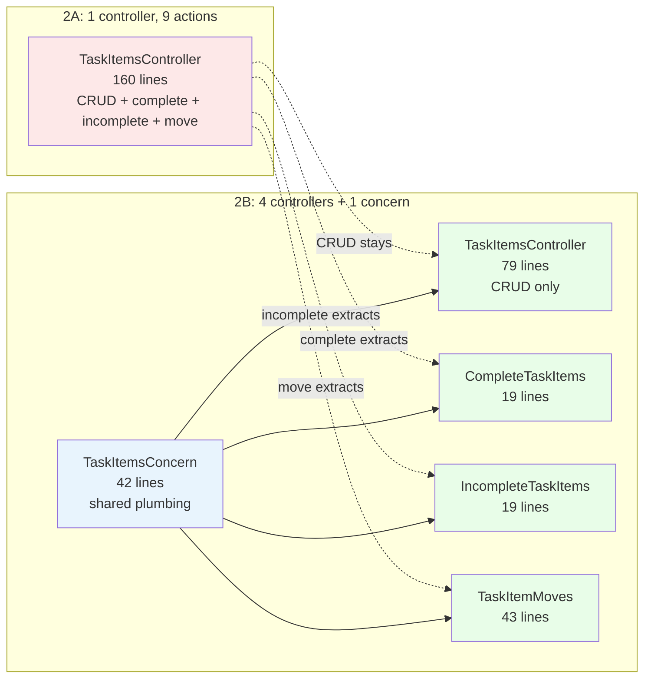
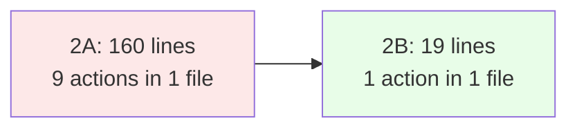

<p align="center">
<small>
◂ <a href="/docs/branches/2A-multi-controllers.md">2A</a> | <a href="/docs/03-THE-GRADIENT.md"><strong>The Gradient</strong></a> | <a href="/docs/branches/3A-namespaced-controllers.md">3A</a> ▸
<br>
<a href="https://github.com/railswhey/app/tree/2B-rest-actions-only?tab=readme-ov-file">(Branch)</a> | <a href="https://github.com/railswhey/app/compare/2A-multi-controllers..2B-rest-actions-only">(Diff)</a>
</small>
</p>

<h1 align="center" style="border-bottom: none;">
  
  Rails Whey App
  
</h1>

<p align="center">
  
</p>

Every controller action must be one of the 7 standard REST verbs — no exceptions. Nine custom actions from 2A are resolved through extraction, renaming, format negotiation, and consolidation. The verb constraint forces hidden nouns into the open: completion, switch, move, read — domain concepts that custom verbs had compressed into action names.

| | |
|---|---|
| **Branch** | `2B-rest-actions-only` |
| **Ruby** | 4.0 |
| **Rails** | 8.1 |
| **Rubycritic** | 84.71 |
| **LOC** | 1390 |

**Table of contents:**

- [🎯 The concept](#-the-concept)
- [📊 The numbers](#-the-numbers)
- [🔬 The evidence](#-the-evidence)
  - [Extraction reveals a named resource](#extraction-reveals-a-named-resource)
  - [Shared infrastructure stays infrastructure](#shared-infrastructure-stays-infrastructure)
- [🤔 The catch](#-the-catch)
- [🤖 The agent's view](#-the-agents-view)
- [➡️ What comes next](#️-what-comes-next)
- [🏛️ Thesis checkpoint](#️-thesis-checkpoint)
- [🚀 Quick start](#-quick-start)
- [🧪 Testing](#-testing)
- [🗺️ The map](#️-the-map)

---

## 🎯 The concept

> **One rule:** if the action doesn't fit the 7 verbs, the resource model is wrong.

Think of it as a seven-verb diet. If the factory machinery only knows how to stamp, cut, or weld, you can't invent a new motion called `complete`. You have to create a new part — a noun — that the existing machinery can work on.

Branch 2A completed resource discovery's first phase: extracting obvious nouns from concerns into standalone classes. But nine actions still used custom verbs. Each one signaled a resource that hadn't been named yet.

This branch names them. Four patterns handle all nine:

1. **Extract to a new controller** — `complete` → `CompleteTaskItemsController#update`; `switch` → `AccountSwitchesController#create`; `mark_all_read` → `UserNotificationReadsController#create`; `move` → `TaskItemMovesController#create`; `incomplete` → `IncompleteTaskItemsController#update`
2. **Rename to the natural REST verb** — `accept` was always an `update`; `my_tasks` was always an `index`
3. **Format negotiation** — `raw` merged into `show` via `respond_to` with a `.md` format
4. **Consolidate** — three named error handlers became one `ErrorsController#show` with a lookup table

`CompleteTaskItemsController#update` says "completion is a resource that gets updated." `TaskItemsController#complete` just said "this thing does something."

---

## 📊 The numbers

Rubycritic climbed from 83.02 to 84.71 — recovering nearly all ground lost to 2A's boilerplate tax. As the resource model sharpens, each file does less and the overhead-to-logic ratio improves.

The biggest single change: `TaskItemsController` dropped from 160 to 79 lines. Its three custom actions became 3 new controllers + 1 shared concern. More files, but each with a single job.

LOC grew from 1355 to 1390 (+35 lines of extraction overhead). File count went from 21 to 27 (26 controllers + 1 concern).

---

## 🔬 The evidence

### Extraction reveals a named resource

`AccountsController#switch` in 2A changed the session, not the account record — different semantics hiding behind the same class. The 7-verb constraint forced the question: *what is being created?*

Answer: an account switch. A session-level event.

```ruby
# 2B — AccountSwitchesController (17 lines)
class AccountSwitchesController < ApplicationController
  before_action :authenticate_user!

  def create
    account = Current.user.accounts.find(params[:account_id])
    session[:account_id] = account.id
    session.delete(:task_list_id)
    Current.member!(user_id: Current.user.id, account_id: account.id, task_list_id: nil)
    self.current_task_list_id = Current.task_list_id
    redirect_to home_path, notice: "Switched to #{account.name}."
  end
end
```

`AccountsController` shrank from 48 to 36 lines — only `show` and `update` remain.

### Shared infrastructure stays infrastructure

The `TaskItemsController` extraction is the largest — and it introduces the branch's one concern:



`TaskItemsConcern` holds only plumbing — finders, URL helpers, redirect logic. Zero business logic. This is different from 1B's god-concerns: those aggregated unrelated behavior into a single class. This concern shares infrastructure across controllers that all operate on the same entity.

---

## 🤔 The catch

27 files, one flat directory:

```
account_switches_controller.rb           ← new
complete_task_items_controller.rb        ← new
incomplete_task_items_controller.rb      ← new
task_item_moves_controller.rb            ← new
user_notification_reads_controller.rb    ← new
...plus 22 existing controllers
```

Every action is REST. The verb vocabulary is clean. But `complete_task_items_controller.rb` sits between `accounts_controller.rb` and `errors_controller.rb` alphabetically — three domains, zero separation. Filename prefixes (`task_`, `account_`, `user_`) carry all the structural signal.

---

## 🤖 The agent's view

Under the old setup, an AI hunting for task completion logic loaded 160 lines and parsed a custom action buried among 8 others. That's a literal token tax — it costs money, increases latency, and degrades reasoning quality.

In 2B, the same fix loads a 19-line file. Even with the shared concern (42 lines), that's 61 lines across 2 files versus 160 in 1.



The REST vocabulary eliminates naming ambiguity entirely. Every controller uses the same 7 verbs — an agent can predict action names before reading the file. No custom semantics to reason about.

But the flat directory is the new bottleneck. 27 files where an agent must parse every prefix to distinguish `task_item_` from `task_list_`. Per-file cost is at its lowest. Per-search cost is at its highest. That tension drives 3A.

---

## ➡️ What comes next

Branch `3A-namespaced-controllers` turns filename prefixes into directories. `task_items_controller.rb` becomes `task/items_controller.rb`. 22 of 26 controllers move into three namespaces — `User::`, `Account::`, `Task::`. The domain structure becomes visible in the file system for the first time — and for agents, directory scope replaces string matching as the search mechanism. ✌️

---

## 🏛️ Thesis checkpoint

The 7-verb constraint is Principle 4: reach for the framework's own patterns first. It's not a limitation — it's a forcing function that completes the resource discovery 2A began. Principles 1 and 2 made it safe: route helpers changed names, the test suite absorbed it through the abstraction layer, zero test files edited. Principle 3 anchors the API side: every new resource controller produces responses through the same explicit envelope, so the contract holds even as the controller count grows. Rubycritic recovered to 84.71 — confirming that as the resource model sharpens, the architectural tax diminishes.

---

## 🚀 Quick start

Prerequisites: [mise](https://mise.jdx.dev/) (manages Ruby, Node, Mailpit)

```sh
git clone git@github.com:railswhey/app.git -b 2B-rest-actions-only 2B-rest-actions-only
cd 2B-rest-actions-only
mise install                 # Ruby 4.0.1 + Node 22 + Mailpit 1.29.2
bin/setup                    # bundle install, db:prepare, starts dev server
```

> See [Installation guide](./docs/00-INSTALLATION.md) for detailed setup, demo accounts, and E2E test setup.

## 🧪 Testing

Full CI pipeline (run after changes):

```sh
bin/ci                       # setup + RuboCop + Brakeman + bundler-audit + tests
```

Individual commands for faster feedback during development:

```sh
bin/rails test               # integration tests (Minitest)
mise run e2e:web             # Playwright navigation smoke test (fast, ~15s)
mise run e2e:web:full        # all Playwright specs (~5min)
mise run e2e:api             # curl + jq smoke tests (requires running server)
mise run e2e:test            # all E2E (e2e:web fast + e2e:api)
```

> See [Testing guide](./docs/02-TESTING.md) for running subsets, CI pipeline details, and E2E deep dives.

## 🗺️ The map

This branch is one point on a 28-branch gradient — from a single fat controller (1A) to fully isolated engines (7D). Every point is a valid, defensible choice. The goal is not to reach the end, but to see that the path exists.

For the full gradient, the manifesto, and the project's governance, see the [MAP](https://github.com/railswhey/app/tree/MAP?tab=readme-ov-file).
