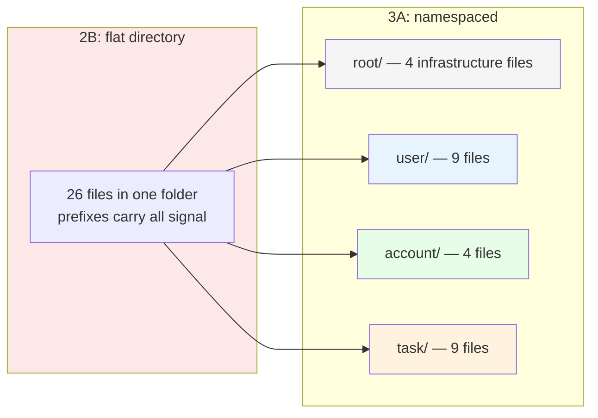
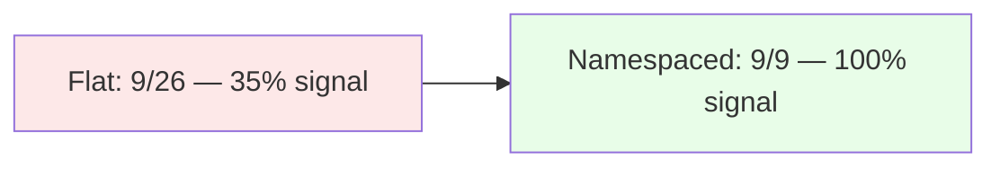

<p align="center">
<small>
◂ <a href="/docs/branches/2B-rest-actions-only.md">2B</a> | <a href="/docs/03-THE-GRADIENT.md"><strong>The Gradient</strong></a> | <a href="/docs/branches/3B-nested-namespaces.md">3B</a> ▸
<br>
<a href="https://github.com/railswhey/app/tree/3A-namespaced-controllers?tab=readme-ov-file">(Branch)</a> | <a href="https://github.com/railswhey/app/compare/2B-rest-actions-only..3A-namespaced-controllers">(Diff)</a>
</small>
</p>

<h1 align="center" style="border-bottom: none;">
  
  Rails Whey App
  
</h1>

<p align="center">
  
</p>

Twenty-two controllers move from a flat directory into three domain namespaces (`User::`, `Account::`, `Task::`). The controller count stays at 26. The flat directory becomes three subdirectories. No logic changes — the same code, reorganized so the file system reflects domain groupings that were previously encoded only in names.

| | |
|---|---|
| **Branch** | `3A-namespaced-controllers` |
| **Ruby** | 4.0 |
| **Rails** | 8.1 |
| **Rubycritic** | 84.71 |
| **LOC** | 1390 |

**Table of contents:**

- [🎯 The concept](#-the-concept)
- [📊 The numbers](#-the-numbers)
- [🤔 The problem](#-the-problem)
- [🔬 The evidence](#-the-evidence)
- [🤖 The agent's view](#-the-agents-view)
- [➡️ What comes next](#️-what-comes-next)
- [🏛️ Thesis checkpoint](#️-thesis-checkpoint)
- [🚀 Quick start](#-quick-start)
- [🧪 Testing](#-testing)
- [🗺️ The map](#️-the-map)

---

## 🎯 The concept

> **One rule:** the prefix becomes the folder.

Branch `2B-rest-actions-only` left 26 controllers in a flat directory — a junk drawer where the only domain signal was a naming convention. Nine `user_` controllers, nine `task_`, four `account_`, and four standalone infrastructure files shared a single folder with no structural grouping.

This branch turns those prefixes into directories. `user_sessions_controller.rb` moves to `user/sessions_controller.rb`. `TaskItemsController` becomes `Task::ItemsController`. Twenty-two controllers move into three namespace directories. Four stay at the root (`ApplicationController`, `ErrorsController`, `SearchController`, `APIDocsController`) because they serve cross-cutting concerns.



That is both the strength and the limitation. The move is safe precisely because no behavior changed — but the underlying responsibilities inside each controller remain untouched. A namespaced file that still mixes two authorization lifecycles is a well-filed mess.

---

## 📊 The numbers

Rubycritic: 84.71 (unchanged). LOC: 1390 (unchanged). A pure structural reorganization — the quality score measures code, not organization, and the code didn't change.

The migration cost is the real number. Every `namespace` block renames its route helpers. `task_list_task_items_path` becomes `task_list_items_path`. Over 40 `_path` and `_url` references change across controllers, views, and mailers. The route abstraction layer in `test/test_helper.rb` absorbs test-side changes, but application-side references are manual. One-time cost, zero behavioral change.

One rename isn't a pure move: `AccountsController` became `Account::ManagementController`. The original name collided with the `Account` namespace module — Ruby's constant lookup found `Account` the model instead of `Account` the namespace. Renaming to `Management` avoids the ambiguity and better describes its job: showing and updating the current account. This is the first signal that deep namespacing interacts with Ruby's runtime in ways directory reorganization alone cannot predict. Branch 3B will encounter a worse version of this same mechanism.

---

## 🤔 The problem

The `task/` directory inherited the flat pattern one level deeper:

```
task/
  complete_items_controller.rb
  incomplete_items_controller.rb
  item_assigned_controller.rb
  item_comments_controller.rb
  item_moves_controller.rb
  items_controller.rb
  list_comments_controller.rb
  list_transfers_controller.rb
  lists_controller.rb
```

Nine files. Six with `item_` prefixes. Two with `list_`. Prefixes doing the work of directories — the exact problem namespaces were supposed to solve.

`user/` is cleaner — most controllers map to distinct concepts — but `notification_reads_controller.rb` sitting next to `notifications_controller.rb` signals a sub-domain relationship the flat namespace doesn't express.

Namespaces group files without enforcing anything about the files inside. The controllers in `task/` share a directory but have no shared base class, no shared concern, no common interface. The directory is a filing convention, not a behavioral boundary. That evolution starts at 3F, where controllers split by authorization lifecycle rather than by entity name.

---

## 🔬 The evidence

**Routes gain structure without changing behavior**

```ruby
# 2B (flat)
get  "users/session", to: "user_sessions#new"
post "users/session", to: "user_sessions#create"
resources :account_switches, only: [:create]
resource  :account, only: [:show, :update]

# 3A (namespaced)
namespace :user do
  resource :session, only: [:new, :create, :destroy]
  resources :passwords, only: [:new, :create, :edit, :update]
  # ...
end

namespace :account do
  resources :switches, only: [:create]
  resource :management, only: [:show, :update], path: ""
  # ...
end
```

The route file went from a flat list to a three-section document. Opening `config/routes.rb` shows the domain structure at a glance. The `account/management` route uses `path: ""` to keep the URL at `/account` while routing to `Account::ManagementController`.

**A boundary decision reveals a domain judgment**

`User::AccountDeletionsController` deletes account data but lives in `user/` — because the action is initiated by the user, requires user authentication, and the primary record destroyed is the `User`. The placement is a judgment about who owns the action, not about which tables it touches.

In the flat directory, the file was `user_account_deletions_controller.rb` — the prefix hinted at the same placement, but no one had to defend it. Namespaces force these calls to be explicit.

---

## 🤖 The agent's view

In the flat directory, finding user-related controllers meant scanning 26 entries and filtering by `user_` — 9 matches among 17 non-matches. Signal-to-noise: **35%**.

After namespacing, `ls user/` returns exactly 9 files. Signal-to-noise: **100%**.



Same math for every domain. Task: 9/26 → 9/9. Account: 4/26 → 4/4. The file path itself acts as a filter before the search even begins.

The migration is the most expensive one-time agent task — renaming 40+ route helpers across the codebase with no behavioral difference. But every future controller addition to a namespace is cheaper to locate and requires no helper migration.

---

## ➡️ What comes next

The namespace solved top-level grouping, but `task/` recreated the prefix problem internally — six `item_` files, two `list_` files.

Branch `3B-nested-namespaces` recurses the pattern deeper. `Task::ItemCommentsController` becomes `Task::Item::CommentsController`. `Task::ListTransfersController` becomes `Task::List::TransfersController`. Eleven controllers reorganize into four sub-namespaces: `Task::Item::`, `Task::List::`, `User::Notification::`, `User::Settings::`. The file count stays at 26. The directory depth goes from 2 to 3.

Deeper nesting brings smaller directories but also new costs: Ruby constant lookup collisions and a placement decision for every new controller. ✌️

---

## 🏛️ Thesis checkpoint

Structure alone is not architecture. The namespaces are a filing convention — necessary for navigability, insufficient for isolation. When controllers gained namespaces, views gained matching directories (Principle 6). The massive renaming changed zero test assertions because the tests never referenced controller class names or view template paths (Principle 1). Behavioral decoupling — splitting controllers by authorization lifecycle, by domain actor, by operation — begins at 3F. The structural foundation laid here makes that work possible.

---

## 🚀 Quick start

Prerequisites: [mise](https://mise.jdx.dev/) (manages Ruby, Node, Mailpit)

```sh
git clone git@github.com:railswhey/app.git -b 3A-namespaced-controllers 3A-namespaced-controllers
cd 3A-namespaced-controllers
mise install                 # Ruby 4.0.1 + Node 22 + Mailpit 1.29.2
bin/setup                    # bundle install, db:prepare, starts dev server
```

> See [Installation guide](./docs/00-INSTALLATION.md) for detailed setup, demo accounts, and E2E test setup.

## 🧪 Testing

Full CI pipeline (run after changes):

```sh
bin/ci                       # setup + RuboCop + Brakeman + bundler-audit + tests
```

Individual commands for faster feedback during development:

```sh
bin/rails test               # integration tests (Minitest)
mise run e2e:web             # Playwright navigation smoke test (fast, ~15s)
mise run e2e:web:full        # all Playwright specs (~5min)
mise run e2e:api             # curl + jq smoke tests (requires running server)
mise run e2e:test            # all E2E (e2e:web fast + e2e:api)
```

> See [Testing guide](./docs/02-TESTING.md) for running subsets, CI pipeline details, and E2E deep dives.

## 🗺️ The map

This branch is one point on a 28-branch gradient — from a single fat controller (1A) to fully isolated engines (7D). Every point is a valid, defensible choice. The goal is not to reach the end, but to see that the path exists.

For the full gradient, the manifesto, and the project's governance, see the [MAP](https://github.com/railswhey/app/tree/MAP?tab=readme-ov-file).
