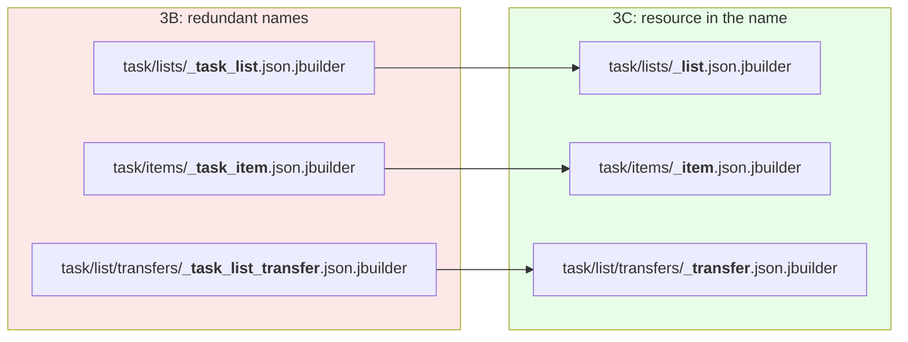
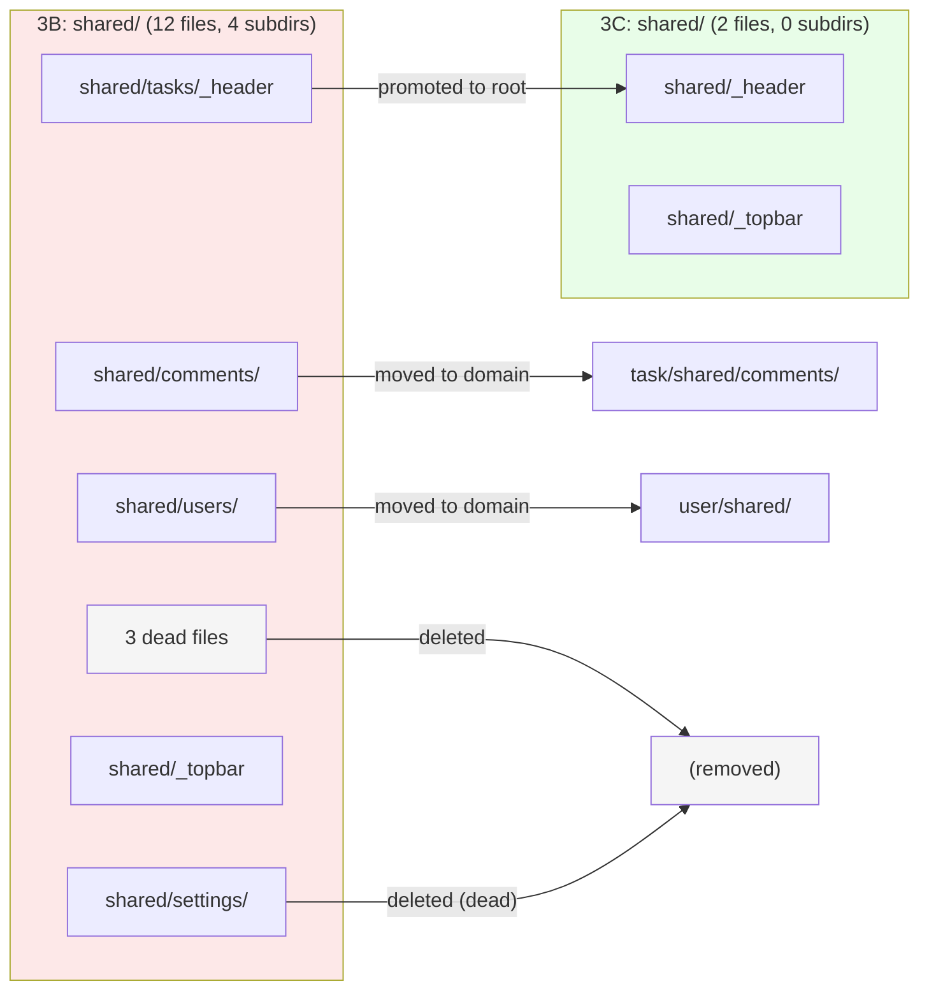

<p align="center">
<small>
◂ <a href="/docs/branches/3B-nested-namespaces.md">3B</a> | <a href="/docs/03-THE-GRADIENT.md"><strong>The Gradient</strong></a> | <a href="/docs/branches/3D-context-mailers.md">3D</a> ▸
<br>
<a href="https://github.com/railswhey/app/tree/3C-context-views?tab=readme-ov-file">(Branch)</a> | <a href="https://github.com/railswhey/app/compare/3B-nested-namespaces..3C-context-views">(Diff)</a>
</small>
</p>

<h1 align="center" style="border-bottom: none;">
  
  Rails Whey App
  
</h1>

<p align="center">
  
</p>

The view layer catches up to the controller layer. Eight shared partials move into namespace directories that mirror their controllers, 3 jbuilder partials shed redundant domain prefixes, 3 dead files are deleted, and 41 render strings update. `shared/` shrinks from 12 files in 4 subdirectories to 2 files with no subdirectories.

| | |
|---|---|
| **Branch** | `3C-context-views` |
| **Ruby** | 4.0 |
| **Rails** | 8.1 |
| **Rubycritic** | 84.71 |
| **LOC** | 1390 |

**Table of contents:**

- [🎯 The concept](#-the-concept)
- [📊 The numbers](#-the-numbers)
- [🤔 The problem](#-the-problem)
- [🔬 The evidence](#-the-evidence)
- [🤖 The agent's view](#-the-agents-view)
- [➡️ What comes next](#️-what-comes-next)
- [🏛️ Thesis checkpoint](#️-thesis-checkpoint)
- [🚀 Quick start](#-quick-start)
- [🧪 Testing](#-testing)
- [🗺️ The map](#️-the-map)

---

## 🎯 The concept

> **One rule:** domain in the path, resource in the name.

`task/lists/_task_list.json.jbuilder` — the directory already says "task list." The file should just say what it is: `_list.json.jbuilder`. Similarly, `shared/tasks/_header.html.erb` sits in a project with a `task/` namespace and a `task/shared/` destination waiting for it. `shared/tasks/` was its home before the namespace existed; now it's a historical artifact.

3B organized controllers into nested domain directories (e.g., `Task::Item::CommentsController` at `task/item/comments_controller.rb`). The view layer was left behind — controller refactoring doesn't touch `render` strings unless the controller's own template path changes, so view files are a side effect that structural refactors leave behind. This branch catches it up: shared partials move into the namespaces that own them, jbuilder partials shed prefixes their directory already carries, and three dead files are removed.

Two files stay in `shared/`: `_header.html.erb` (sidebar) and `_topbar.html.erb` (top navigation). Both render the app-wide chrome used by every authenticated namespace. No single domain owns the frame.

---

## 📊 The numbers

| | Before (3B) | After (3C) |
|---|---|---|
| `shared/` files | 12 | 2 |
| `shared/` subdirectories | 4 | 0 |
| Files moved | — | 8 |
| Files renamed | — | 3 |
| Files deleted | — | 3 |
| Render strings updated | — | 41 |

Rubycritic: 84.71 (unchanged). LOC: 1390 (unchanged). Fourth consecutive branch where both hold flat. Static analysis measures complexity per file — it has nothing to say about where files live.

The real cost: 41 render string updates — roughly 3 per file operation. Mechanical, one-time, scattered across every namespace.

---

## 🤔 The problem

Before namespaces existed, `shared/` was the only home for cross-controller partials. By 3B it had become the junk drawer of the app:

```
shared/
  _pending_invitations.html.erb     ← dead
  _topbar.html.erb
  comments/
    _comment.html.erb
    _form.html.erb
    edit.html.erb
  settings/
    _settings_header.html.erb       ← dead
  tasks/
    _add_new.html.erb               ← dead
    _header.html.erb
  users/
    _header.html.erb
    _reset_password_link.html.erb
    _sign_in_link.html.erb
    _sign_up_link.html.erb
```

Three of those 12 files had zero callers. They survived because `shared/` has no ownership signal — every file is an orphan by design. Dead files blend in.

The living files had clear owners. `shared/comments/` was rendered exclusively by two `task/` controllers. `shared/users/` was rendered exclusively by user-domain views. They belonged to domains that now had directories waiting for them.

The jbuilder partials told the same story from a different angle. `task/lists/_task_list.json.jbuilder` encoded `task_list` in both the path and the filename. The directory changed when namespaces arrived in 3A; the name didn't follow.

---

## 🔬 The evidence

**Pattern 1: Jbuilder partials shed redundant prefixes**



The local variable inside each file dropped the prefix too:

```ruby
# Before — task/lists/_task_list.json.jbuilder
json.extract!(task_list, :id, :inbox, :name, ...)

# After — task/lists/_list.json.jbuilder
json.extract!(list, :id, :inbox, :name, ...)
```

Safe because all jbuilder render calls use explicit `json.partial!` — no implicit model-name-to-partial lookup applies.

**Pattern 2: Domain partials move to domain directories**

`shared/comments/` moved to `task/shared/comments/` — both comment controllers live in the `task/` namespace. `shared/users/` moved to `user/shared/` — all callers are user-domain views. `shared/tasks/_header.html.erb` (rendered by 21 views across all namespaces) was the genuinely cross-domain partial — it moved up to `shared/_header.html.erb`, dropping the now-empty `tasks/` subdirectory.



**Pattern 3: Dead files surfaced by the move**

Moving files into domain directories forces the question: "who renders this?" Dead files answer: nobody.

- `shared/_pending_invitations.html.erb` — v1 artifact; no view renders it
- `shared/tasks/_add_new.html.erb` — lost its caller during earlier restructuring
- `shared/settings/_settings_header.html.erb` — superseded when settings moved to `user/settings/`

In `shared/`, dead files persist indefinitely. No ownership means nobody asks "does this still belong here?"

---

## 🤖 The agent's view

Think of the codebase as a warehouse. The AI agent is the forklift driver. If the aisle labeled "Task Lists" contains a box also labeled "Task List" — that's a redundant label. The driver pauses to reconcile the signal. Strip the redundancy: domain once in the path, resource once in the name. The aisles are clearly labeled. The driver navigates straight to the right box.

**Path as context.** Before: `render "shared/comments/form"` → the path suggests a global partial. Only two `task/` controllers use it. After: `render "task/shared/comments/form"` → the path tells the agent the domain (`task/`) and the scope (`shared` within task) before reading the file.

**Dead files as token cost.** Three files an agent would read, find no callers for, and spend tokens confirming were dead. After this branch, `shared/` has 2 files — both actively rendered by every authenticated namespace. Nothing dead to evaluate.

**Jbuilder token distance.** `json.partial! "task/lists/task_list"` with local `task_list` — the domain processed three times. After: `json.partial! "task/lists/list"` with local `list`. Domain once. Resource once. Fewer redundant signals to reconcile.

---

## ➡️ What comes next

Controllers are namespaced (3A-3B). Views mirror their controllers (3C). One layer still speaks the flat language: mailers.

`InvitationMailer` is called exclusively from `Account::InvitationsController`. `TransferMailer` from `Task::List::TransfersController`. Neither name reflects its domain. Their view templates sit at the root of `app/views/` alongside namespaced directories.

Branch `3D-context-mailers` applies the same namespace discipline. The two mailer classes gain domain prefixes. Their view templates move into namespace-aligned directories. The mailer layer catches up to the rest of the stack. ✌️

---

## 🏛️ Thesis checkpoint

Controllers and views now share the same directory structure — Principle 6 fulfilled. The structural alignment eliminates an entire category of navigation friction. Principle 1 enabled the move: tests assert on rendered content, not template paths, so every view file relocated without editing a single test. But the alignment is still structural — view files moved, not render logic. The `render` strings remain implicit framework contracts. Branch 3D makes the first of those contracts explicit with `default template_path:` declarations on mailers.

---

## 🚀 Quick start

Prerequisites: [mise](https://mise.jdx.dev/) (manages Ruby, Node, Mailpit)

```sh
git clone git@github.com:railswhey/app.git -b 3C-context-views 3C-context-views
cd 3C-context-views
mise install                 # Ruby 4.0.1 + Node 22 + Mailpit 1.29.2
bin/setup                    # bundle install, db:prepare, starts dev server
```

> See [Installation guide](./docs/00-INSTALLATION.md) for detailed setup, demo accounts, and E2E test setup.

## 🧪 Testing

Full CI pipeline (run after changes):

```sh
bin/ci                       # setup + RuboCop + Brakeman + bundler-audit + tests
```

Individual commands for faster feedback during development:

```sh
bin/rails test               # integration tests (Minitest)
mise run e2e:web             # Playwright navigation smoke test (fast, ~15s)
mise run e2e:web:full        # all Playwright specs (~5min)
mise run e2e:api             # curl + jq smoke tests (requires running server)
mise run e2e:test            # all E2E (e2e:web fast + e2e:api)
```

> See [Testing guide](./docs/02-TESTING.md) for running subsets, CI pipeline details, and E2E deep dives.

## 🗺️ The map

This branch is one point on a 28-branch gradient — from a single fat controller (1A) to fully isolated engines (7D). Every point is a valid, defensible choice. The goal is not to reach the end, but to see that the path exists.

For the full gradient, the manifesto, and the project's governance, see the [MAP](https://github.com/railswhey/app/tree/MAP?tab=readme-ov-file).
