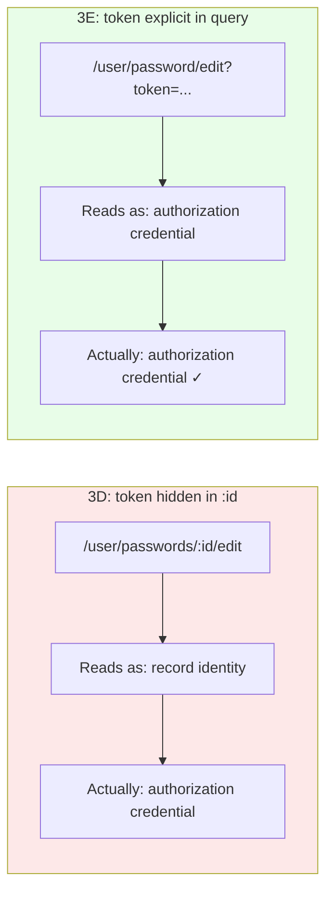
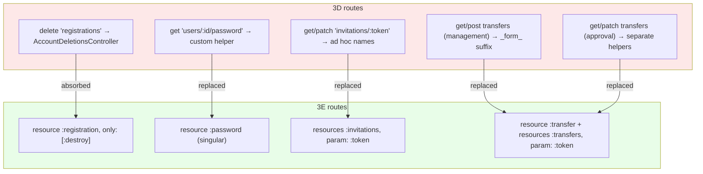

<p align="center">
<small>
◂ <a href="/docs/branches/3D-context-mailers.md">3D</a> | <a href="/docs/03-THE-GRADIENT.md"><strong>The Gradient</strong></a> | <a href="/docs/branches/3F-resource-discipline.md">3F</a> ▸
<br>
<a href="https://github.com/railswhey/app/tree/3E-singular-resources?tab=readme-ov-file">(Branch)</a> | <a href="https://github.com/railswhey/app/compare/3D-context-mailers..3E-singular-resources">(Diff)</a>
</small>
</p>

<h1 align="center" style="border-bottom: none;">
  
  Rails Whey App
  
</h1>

<p align="center">
  
</p>

A full-stack task management app built with Ruby on Rails. This branch replaces every raw HTTP verb route with proper `resource`/`resources` DSL calls, deleting a controller that existed only as a routing artifact and correcting a misplaced token parameter.

| | |
|---|---|
| **Branch** | `3E-singular-resources` |
| **Ruby** | 4.0 |
| **Rails** | 8.1 |
| **Rubycritic** | 84.41 |
| **LOC** | 1389 |

**Table of contents:**

- [🎯 The concept](#-the-concept)
- [📊 The numbers](#-the-numbers)
- [🤔 The problem](#-the-problem)
- [🔬 The evidence](#-the-evidence)
- [🤖 The agent's view](#-the-agents-view)
- [➡️ What comes next](#️-what-comes-next)
- [🏛️ Thesis checkpoint](#️-thesis-checkpoint)
- [🚀 Quick start](#-quick-start)
- [🧪 Testing](#-testing)
- [🗺️ The map](#️-the-map)

---

## 🎯 The concept

> **One rule:** express every route as a resource declaration; if it won't fit, the domain model is wrong.

`resource :password` says what `get "users/:id/password"` does not: a user has one password, the lookup needs no ID, and the helpers follow a naming convention any Rails developer can predict. Raw HTTP verb routes do the same routing but encode nothing about the domain — no cardinality, no helper convention, no declaration of what the resource is. Each raw route is a piece of domain information discarded.

This branch recovers that information. Nine raw route declarations become four DSL calls. One controller that existed only as a routing artifact is deleted. A signed token misrepresented as an `:id` parameter moves to `?token=`, where its nature as a credential is visible.

---

## 📊 The numbers

| | Before (3D) | After (3E) |
|---|---|---|
| Raw HTTP verb route lines | 9 | 0 |
| DSL replacements | — | 4 |
| `resources :passwords` (plural) | yes | `resource :password` (singular) |
| `AccountDeletionsController` | 18-line class | deleted |
| Password token location | path param (`:id`) | query param (`?token=`) |
| Controller files | 26 + 1 concern | 25 + 1 concern |

Rubycritic: 84.71 → 84.41. LOC: 1390 → 1389. The 18-line controller deletion is partially offset by `destroy` moving into `RegistrationsController`. Sixth structural branch; metrics hold flat.

---

## 🤔 The problem

After 3D, `routes.rb` held nine standalone HTTP verb declarations outside any `resource` context:

```ruby
# Registration deletion — lone delete line, own controller
delete "registrations", to: "account_deletions#destroy"

# Password reset — :id misrepresenting a signed token
get "users/:id/password", to: "user/passwords#edit", as: :user_password_reset_link

# Invitations — ad hoc named helpers
get   "invitations/:token", to: "account/invitations#show",   as: :show_invitation
patch "invitations/:token", to: "account/invitations#update", as: :accept_invitation

# Transfers — management routes with _form_ suffix to dodge helper collision
get  "task/lists/:list_id/transfer/new", to: "task/list/transfers#new",    as: :new_task_list_transfer
post "task/lists/:list_id/transfer",     to: "task/list/transfers#create", as: :task_list_transfer_form

# Transfers — approval routes (public, token-keyed)
get   "transfers/:token", to: "task/list/transfers#show",   as: :show_task_list_transfer
patch "transfers/:token", to: "task/list/transfers#update", as: :task_list_transfer
```

Each workaround was the path of least resistance. `delete "registrations"` routed to an 18-line controller that survived three refactoring branches solely to receive one HTTP verb. `get "users/:id/password"` used `:id` for a signed token — misrepresenting authority as identity. The transfer helpers carried a `_form_` suffix purely to dodge a name collision — a helper name that tells you about a routing constraint, not about the domain.

---

## 🔬 The evidence

**Pattern 1: Singular resource recovers cardinality and token identity**

Before:

```ruby
# 3D — plural resources, :id stands in for a token
resources :passwords, only: [:new, :create, :edit, :update]
# Generated: /user/passwords/:id/edit
```

After:

```ruby
# 3E — singular resource, token travels as query param
resource :password, only: [:new, :create, :edit, :update]
# Generated: /user/password/edit?token=...
```

The controller reflects this — `params[:id]` disappears; `params[:token]` takes its place. The standard helper `edit_user_password_url(token: ...)` replaces the custom `user_password_reset_link_url`.



**Pattern 2: Singular resource absorbs a routing artifact**

Before:

```ruby
# 3D — two declarations, two controllers
resources :registrations, only: [:new, :create]
delete "registrations", to: "account_deletions#destroy"
```

After:

```ruby
# 3E — two declarations, one controller
resources :registrations, only: [:new, :create]
resource :registration, only: [:destroy]
```

Both point to `User::RegistrationsController`. Plural handles collection actions (`new`, `create`). Singular handles a member action with no `:id` (`destroy`). `User::AccountDeletionsController` — 18 lines, one action, three branches of survival — is deleted entirely. Rails supports this plural/singular split in 8.1, though it is better understood as a framework accommodation than a documented pattern.



Five workaround groups collapse into four DSL calls. Red: raw routes with no domain semantics. Green: DSL declarations that encode cardinality, lookup key type, and helper naming.

---

## 🤖 The agent's view

Agents navigate code by name. Before this branch, the route file produced non-standard helpers: `show_invitation_url`, `accept_invitation_url`, `task_list_transfer_form_url`, `user_password_reset_link_url`. None follow the naming pattern an agent trained on Rails convention would predict — the agent had to search the whole project or guess. After: `invitation_url(token)`, `transfer_url(token)`, `edit_user_password_url(token: ...)`. Standard names, derivable from the declaration. The agent can predict the route without reading the controller.

`param: :token` is explicit metadata. An agent reading `resources :invitations, param: :token` knows the lookup key before reading the controller. In 3D, the raw routes used `:token` as a path segment but nothing in the route declaration said "this is a token, not an ID." After 3E, the route declaration carries the information.

The plural/singular registration split is the one pattern that remains non-obvious. `resources :registrations, only: [:new, :create]` alongside `resource :registration, only: [:destroy]` — both pointing to one controller. The two declarations generate different URL shapes (`/user/registrations` for collection actions, `/user/registration` for the member action). Narrow surface — one controller, three actions — but less predictable than any other route in the file.

---

## ➡️ What comes next

The raw routes are gone. But DSL overrides remain:

```ruby
resources :invitations, only: [:show, :update],
          controller: "account/invitations", param: :token

resources :transfers, only: [:show, :update],
          controller: "task/list/transfers", param: :token

resource :transfer, only: [:new, :create], module: "list"
```

`controller:`, `param:`, `module:` — each says "the resource name doesn't match the controller that handles it." The raw verbs are gone; the naming mismatches that produced them are not.

Branch `3F-resource-discipline` treats each override as a diagnostic: what naming or placement mismatch made it necessary? 3F resolves them — a `routes.rb` where every line is derivable from the resource name alone. ✌️

---

## 🏛️ Thesis checkpoint

Routes now express whether a resource is a singleton or a collection — Principle 4 applied to route semantics. No test files were edited despite every singleton route changing its helper name — the abstraction layer absorbed the migration (Principle 2). This continues the shift from implicit to explicit that 3D began with `default template_path:` — raw verbs were implicit contracts (string-matched routing encoding no domain knowledge); DSL declarations are explicit contracts (cardinality, lookup key type, and helper naming in the route itself). But the `controller:` and `param:` overrides that remain are symptoms of deeper naming mismatches. 3F will trace each to its root cause.

---

## 🚀 Quick start

Prerequisites: [mise](https://mise.jdx.dev/) (manages Ruby, Node, Mailpit)

```sh
git clone git@github.com:railswhey/app.git -b 3E-singular-resources 3E-singular-resources
cd 3E-singular-resources
mise install                 # Ruby 4.0.1 + Node 22 + Mailpit 1.29.2
bin/setup                    # bundle install, db:prepare, starts dev server
```

> See [Installation guide](./docs/00-INSTALLATION.md) for detailed setup, demo accounts, and E2E test setup.

## 🧪 Testing

Full CI pipeline (run after changes):

```sh
bin/ci                       # setup + RuboCop + Brakeman + bundler-audit + tests
```

Individual commands for faster feedback during development:

```sh
bin/rails test               # integration tests (Minitest)
mise run e2e:web             # Playwright navigation smoke test (fast, ~15s)
mise run e2e:web:full        # all Playwright specs (~5min)
mise run e2e:api             # curl + jq smoke tests (requires running server)
mise run e2e:test            # all E2E (e2e:web fast + e2e:api)
```

> See [Testing guide](./docs/02-TESTING.md) for running subsets, CI pipeline details, and E2E deep dives.

## 🗺️ The map

This branch is one point on a 28-branch gradient — from a single fat controller (1A) to fully isolated engines (7D). Every point is a valid, defensible choice. The goal is not to reach the end, but to see that the path exists.

For the full gradient, the manifesto, and the project's governance, see the [MAP](https://github.com/railswhey/app/tree/MAP?tab=readme-ov-file).
