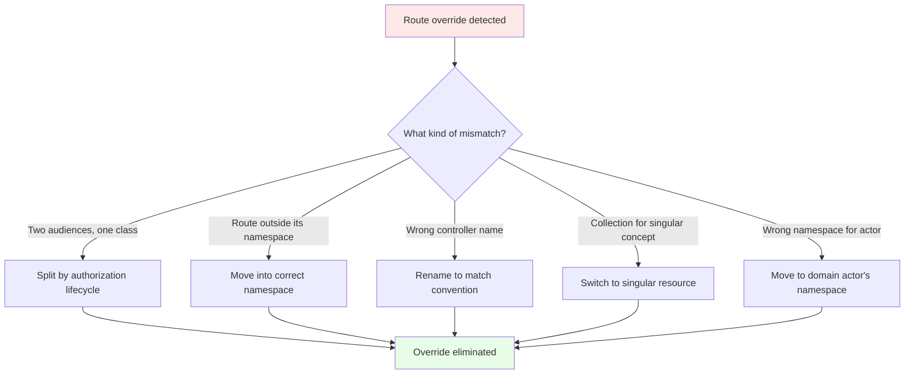
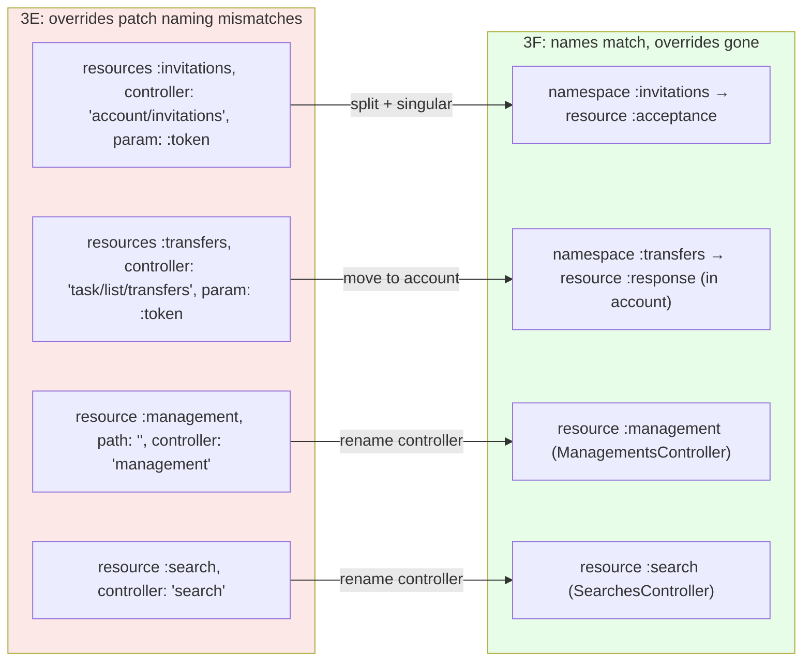
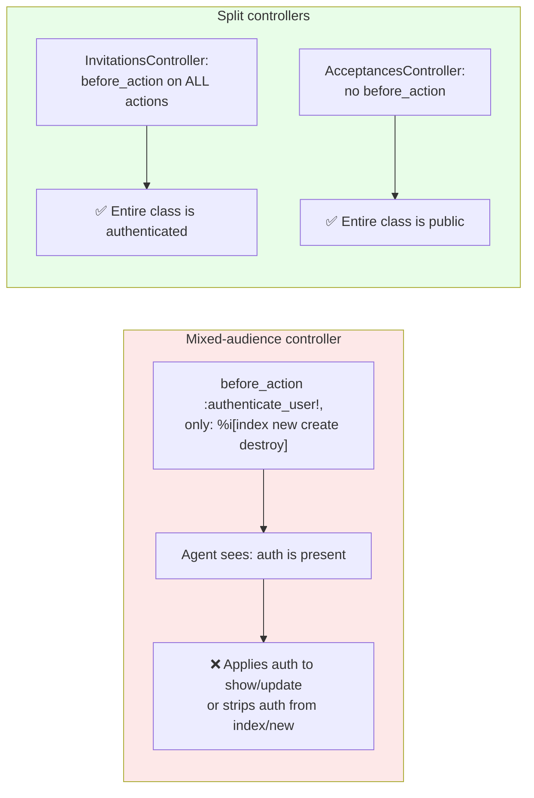

<p align="center">
<small>
◂ <a href="/docs/branches/3E-singular-resources.md">3E</a> | <a href="/docs/03-THE-GRADIENT.md"><strong>The Gradient</strong></a> | <a href="/docs/branches/3G-domain-naming.md">3G</a> ▸
<br>
<a href="https://github.com/railswhey/app/tree/3F-resource-discipline?tab=readme-ov-file">(Branch)</a> | <a href="https://github.com/railswhey/app/compare/3E-singular-resources..3F-resource-discipline">(Diff)</a>
</small>
</p>

<h1 align="center" style="border-bottom: none;">
  
  Rails Whey App
  
</h1>

<p align="center">
  
</p>

A full-stack task management app built with Ruby on Rails. This branch eliminates every `controller:`, `path:`, `param:`, and inline `module:` override from the route file by fixing the underlying domain naming and placement that made each override necessary.

| | |
|---|---|
| **Branch** | `3F-resource-discipline` |
| **Ruby** | 4.0 |
| **Rails** | 8.1 |
| **Rubycritic** | 83.92 |
| **LOC** | 1397 |

**Table of contents:**

- [🎯 The concept](#-the-concept)
- [📊 The numbers](#-the-numbers)
- [🤔 The problem](#-the-problem)
- [🔬 The evidence](#-the-evidence)
- [🤖 The agent's view](#-the-agents-view)
- [➡️ What comes next](#️-what-comes-next)
- [🏛️ Thesis checkpoint](#️-thesis-checkpoint)
- [🚀 Quick start](#-quick-start)
- [🧪 Testing](#-testing)
- [🗺️ The map](#️-the-map)

---

## 🎯 The concept

> **One rule:** fix the name, not the route.

3E replaced raw HTTP verb routes with DSL declarations. But the DSL calls still carry overrides — `controller:`, `param:`, `path:`, `module:`. Each override is a diagnostic alarm: the framework telling you something is named or placed wrong. This branch traces each alarm to its root cause.

Five patterns. Three mechanical, two requiring domain reasoning:

1. **Mixed-audience controllers.** `Account::InvitationsController` served authenticated owners and unauthenticated invitees from one class — two authorization lifecycles crammed into one file. Split by audience → override gone, security model honest.

2. **Misplaced routes.** Root-level routes pointing into namespaced controllers via `to:` strings. Move the route into the namespace that owns it.

3. **Singular controller names.** `resource :search` expects `SearchesController` (plural). The controller was `SearchController`. Rename the file.

4. **Collection route for a singular concept.** `resources :invitations, param: :token` used a collection for a one-time acceptance. `param:` renames `:id` in a collection, but there's no collection here. A singular `resource :acceptance` with the token as a query param matches the domain.

5. **Namespace driven by code proximity, not domain actor.** Transfer responses lived under `task/list/` because transfers involve task lists. But the actor who accepts or rejects is the receiving account. The code compiled, the tests passed, and the feature worked — in the wrong namespace. The wrongness was only visible when you asked: who is the actor?



No model changes. Every fix targets controllers, routes, and views.

---

## 📊 The numbers

| | Before (3E) | After (3F) |
|---|---|---|
| `controller:` overrides | 4 | 0 |
| `path:` overrides | 1 | 0 |
| `param: :token` on singular concepts | 2 | 0 |
| Inline `module:` on individual resources | 3 | 0 (replaced with `scope module:` blocks) |
| Root-level routes outside their namespace | 5 | 0 |
| New controllers (audience splits) | — | 2 |
| Controllers renamed (convention) | — | 3 |
| Controllers moved (domain actor) | — | 1 |

Rubycritic dropped from 84.41 to 83.92. Same pattern as 2A: splitting single-responsibility files increases boilerplate-to-logic ratio. The structural improvement is real; the metric penalizes file count. LOC rose from 1389 to 1397 — the +8 lines are class declarations on the new controllers.

---

## 🤔 The problem

After 3E, the route file still carried overrides on every token-based and management route:

```ruby
# Token flows — controller: points elsewhere, param: renames :id
resources :invitations, only: [:show, :update],
          controller: "account/invitations", param: :token

resources :transfers, only: [:show, :update],
          controller: "task/list/transfers", param: :token

# Management — path: and controller: compensate for naming
resource :management, only: [:show, :update], path: "", controller: "management"

# Search — singular controller name violates convention
resource :search, only: [:show], controller: "search"

# Repeated module: on each resource
resources :comments, only: [...], module: "item"
resources :comments, only: [...], module: "list"
resource  :transfer, only: [...], module: "list"
```

When you write `controller: "account/invitations"` on a route, the DSL is telling you the resource resolves to the wrong controller. Either the controller is in the wrong namespace, or the resource needs a different name.

---

## 🔬 The evidence

**Pattern 1: Audience split makes the file structure a security boundary**

In 3E, one controller served two authorization lifecycles:

```ruby
# 3E — mixed audience
class Account::InvitationsController < ApplicationController
  before_action :authenticate_user!, only: %i[index new create destroy]
  # show and update: no auth — public email link (visible only by absence)
end
```

After the split, the acceptance controller's stance is the entire class — no `before_action`, no ambiguity:

```ruby
# 3F — token acceptance only
class Account::Invitations::AcceptancesController < ApplicationController
  def show
    @invitation = Invitation.find_by!(token: params[:token])
  end

  def update
    @invitation = Invitation.find_by!(token: params[:token])
    # ...
  end
end
```

The route resolves without overrides:

```ruby
namespace :account do
  resources :invitations, only: [:index, :new, :create, :destroy]
  namespace :invitations do
    resource :acceptance, only: [:show, :update]
  end
end
```

No `controller:`. No `param: :token`. The token travels as `?token=` in the query string.

**Pattern 2: Domain actor determines namespace**

Transfer responses moved from `task/list/` to `account/`:

```ruby
namespace :account do
  namespace :transfers do
    resource :response, only: [:show, :update]
  end
end
```

The name is "responses" (not "acceptances") because `update` handles both accept and reject via `params[:action_type]`. Controller placement follows the actor; model placement follows the data.



**Pattern 3: `scope module:` replaces repeated inline `module:`**

```ruby
# 3E — repeated                          # 3F — grouped
resources :comments, module: "list"       scope module: :list do
resource  :transfer, module: "list"         resources :comments, only: [...]
                                            resource  :transfer, only: [...]
                                          end
```

Same routes. The `scope` form declares the module once. `module:` remains necessary — `comments` exists in both `item` and `list` contexts — but the block form makes the justification visible.

---

## 🤖 The agent's view

Before this branch, four `controller:` overrides meant an agent couldn't derive the controller path from the route declaration. `resources :invitations, controller: "account/invitations"` required the agent to read the override string, translate it, and then discover that the same controller served both authenticated management and public token acceptance — 80 lines of management code and 65 lines of acceptance code in one file. After the split, `Account::Invitations::AcceptancesController` is 65 lines, all acceptance.

The mixed-audience pattern was a reasoning trap. `before_action :authenticate_user!, only: %i[index new create destroy]` documents what *gets* authentication. What *doesn't* — `show` and `update` — is visible only by absence. An agent might apply authentication to all actions, or worse — strip it from a private one. After the split, `AcceptancesController` has no `before_action :authenticate_user!`. The absence is the class's entire stance, not a silent omission from an `only:` list.



The namespace move changes the search space. An agent modifying transfer acceptance would naturally search `task/`. In 3F, it lives in `account/transfers/`. This is more accurate but requires domain knowledge the agent may not have. The route file resolves the ambiguity — the namespace path tells the agent where to look.

---

## ➡️ What comes next

The route file is clean. Every resource matches its controller, every namespace reflects its domain actor. But one assumption remains: API endpoints inherit their names from the UI.

`PATCH /user/settings/profile` changes a password — because the settings page has a "Profile" tab. An API consumer must know the UI layout to find the password operation.

Branch `3G-domain-naming` gives the password change its own controller and endpoint (`PATCH /user/settings/password`). The profile page still renders both forms. UI organization and API naming become independent. ✌️

---

## 🏛️ Thesis checkpoint

This is where structural reorganization gives way to behavioral decoupling — Principle 4 applied to responsibility boundaries, not just file boundaries. 3A through 3D moved files and aligned directories — but class responsibilities inside those files remained unchanged. 3F splits controllers by authorization lifecycle and by domain actor. These are responsibility decisions, not filing decisions. Principle 1 validates the split: the behavioral tests don't care how many controllers exist or which class handles which action. The overrides disappear not because the routes changed, but because the domain model became accurate enough that routes could be derived from names alone.

---

## 🚀 Quick start

Prerequisites: [mise](https://mise.jdx.dev/) (manages Ruby, Node, Mailpit)

```sh
git clone git@github.com:railswhey/app.git -b 3F-resource-discipline 3F-resource-discipline
cd 3F-resource-discipline
mise install                 # Ruby 4.0.1 + Node 22 + Mailpit 1.29.2
bin/setup                    # bundle install, db:prepare, starts dev server
```

> See [Installation guide](./docs/00-INSTALLATION.md) for detailed setup, demo accounts, and E2E test setup.

## 🧪 Testing

Full CI pipeline (run after changes):

```sh
bin/ci                       # setup + RuboCop + Brakeman + bundler-audit + tests
```

Individual commands for faster feedback during development:

```sh
bin/rails test               # integration tests (Minitest)
mise run e2e:web             # Playwright navigation smoke test (fast, ~15s)
mise run e2e:web:full        # all Playwright specs (~5min)
mise run e2e:api             # curl + jq smoke tests (requires running server)
mise run e2e:test            # all E2E (e2e:web fast + e2e:api)
```

> See [Testing guide](./docs/02-TESTING.md) for running subsets, CI pipeline details, and E2E deep dives.

## 🗺️ The map

This branch is one point on a 28-branch gradient — from a single fat controller (1A) to fully isolated engines (7D). Every point is a valid, defensible choice. The goal is not to reach the end, but to see that the path exists.

For the full gradient, the manifesto, and the project's governance, see the [MAP](https://github.com/railswhey/app/tree/MAP?tab=readme-ov-file).
