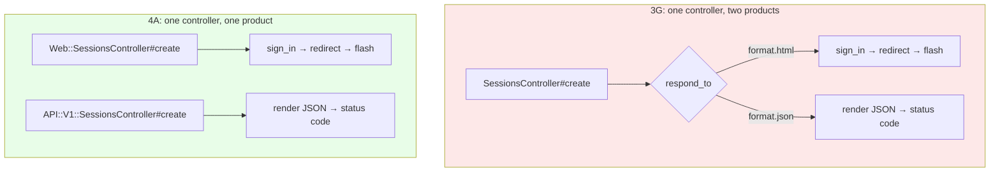
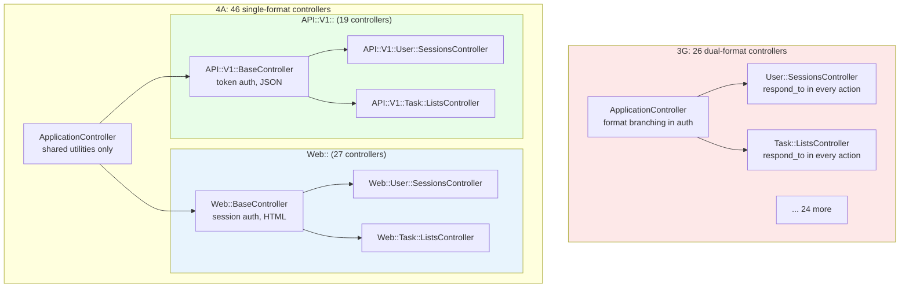

<p align="center">
<small>
◂ <a href="/docs/branches/3G-domain-naming.md">3G</a> | <a href="/docs/03-THE-GRADIENT.md"><strong>The Gradient</strong></a> | <a href="/docs/branches/4B-controller-deduplication.md">4B</a> ▸
<br>
<a href="https://github.com/railswhey/app/tree/4A-separation-of-entry-points?tab=readme-ov-file">(Branch)</a> | <a href="https://github.com/railswhey/app/compare/3G-domain-naming..4A-separation-of-entry-points">(Diff)</a>
</small>
</p>

<h1 align="center" style="border-bottom: none;">
  
  Rails Whey App
  
</h1>

<p align="center">
  
</p>

A full-stack task management app built with Ruby on Rails. This branch separates the web interface and the REST API into independent controller families — `Web::` speaks HTML, `API::V1::` speaks JSON — so that each controller serves a single product with a single authentication mechanism and a single response format.

| | |
|---|---|
| **Branch** | `4A-separation-of-entry-points` |
| **Ruby** | 4.0 |
| **Rails** | 8.1 |
| **Rubycritic** | 78.55 |
| **LOC** | 1741 |

**Table of contents:**

- [🎯 The concept](#-the-concept)
- [📊 The numbers](#-the-numbers)
- [🤔 The problem](#-the-problem)
- [🔬 The evidence](#-the-evidence)
- [🤖 The agent's view](#-the-agents-view)
- [➡️ What comes next](#️-what-comes-next)
- [🏛️ Thesis checkpoint](#️-thesis-checkpoint)
- [🚀 Quick start](#-quick-start)
- [🧪 Testing](#-testing)
- [🗺️ The map](#️-the-map)

---

## 🎯 The concept

> **One rule:** one controller, one format, one product.

The web interface and the REST API are different products sharing a domain. They authenticate differently (session cookies vs bearer tokens), respond differently (HTML redirects vs JSON envelopes), and handle errors differently. Before this branch, every controller served both through `respond_to` blocks — 26 controllers, 46 blocks, two products tangled in every action.

This branch splits them into two controller families:

- `Web::BaseController` — session auth, HTML only, preserves existing web URLs
- `API::V1::BaseController` — token auth, JSON only, prefixes all API URLs with `/api/v1/`

Each controller speaks one language. The `respond_to` blocks disappear.

---

## 📊 The numbers

| | Before (3G) | After (4A) |
|---|---|---|
| Dual-format controllers | 26 | 0 |
| Web-only controllers (`Web::`) | 0 | 27 |
| API-only controllers (`API::V1::`) | 0 | 19 |
| Base controllers | 0 | 2 |
| `respond_to` blocks | 46 | 0 |
| Test files edited | — | 0 |

Rubycritic dropped from 83.22 to 78.55 — the steepest single-branch drop in the arc. LOC jumped from 1417 to 1741. The cause: structural duplication. Web and API controllers now share identical private methods (`user_session_params`, authorization queries) copied in two places.

The duplication is the tax. Architectural isolation is the asset. The 78.55 score is honest about the cost. It should be.

---

## 🤔 The problem

After 3G, every controller action played traffic cop — constantly evaluating the incoming request to decide which product to serve:

```ruby
# 3G — User::SessionsController#create (52 lines total)
def create
  @user = User.authenticate_by(user_session_params)
  respond_to do |format|
    if @user
      format.html { sign_in(@user); redirect_to(..., notice: "Signed in!") }
      format.json { render "tokens/show", status: :ok }
    else
      format.html { flash.now[:alert] = "Invalid..."; render :new, status: :unprocessable_entity }
      format.json { render "errors/unauthorized", status: :unauthorized }
    end
  end
end
```

Two response formats in one method. Changing the JSON error means reading past `flash.now` and `sign_in`. Adding an HTML notice means reading past the JSON rendering. The coupling ran deeper than action bodies — `ApplicationController` branched on `request.format.json?` in `authenticate_user!`, `current_member!`, and `rescue_from`. The base class itself didn't know what product it served.



`respond_to` makes dual-format easy to start — one block, two handlers. But it's additive: each new feature contributes both format branches to every action. Rails provides no signal when the branching has grown beyond its usefulness. No warning at 10 controllers, no friction at 20. At 26 controllers with 46 blocks, the approach that was correct for a handful had become a liability.

---

## 🔬 The evidence

**Session controller: before and after**

The web controller (HTML only):

```ruby
class Web::User::SessionsController < Web::BaseController
  def create
    @user = User.authenticate_by(user_session_params)

    if @user
      sign_in(@user)
      redirect_to task_list_items_path(Current.task_list_id), notice: "You have successfully signed in!"
    else
      flash.now[:alert] = "Invalid email or password. Please try again."
      @user = User.new(email: user_session_params[:email])
      render :new, status: :unprocessable_entity
    end
  end

  private

  def user_session_params
    params.require(:user).permit(:email, :password)
  end
end
```

The API controller (JSON only):

```ruby
class API::V1::User::SessionsController < API::V1::BaseController
  def create
    @user = User.authenticate_by(user_session_params)

    if @user
      render "api/v1/user/settings/tokens/show", status: :ok
    else
      render("errors/unauthorized", status: :unauthorized, locals: {
        message: "Invalid email or password. Please try again."
      })
    end
  end

  private

  def user_session_params
    params.require(:user).permit(:email, :password)
  end
end
```

`user_session_params` is duplicated — both controllers permit `:email` and `:password`. That duplication is the cost of the boundary. Two identical methods that cannot be merged without violating the separation that makes both files readable.

**Base controllers split authentication**

Each base controller knows its product. No `request.format.json?` branching — the decision is made once in the class hierarchy:

```ruby
# Web: session cookies → redirect on failure
class Web::BaseController < ApplicationController
  private

  def authenticate_user!
    current_member!
    return if Current.user?
    redirect_to next_path, alert: alert_message
  end

  def current_member!
    Current.member!(user_id: current_user_id, account_id: session[:account_id], task_list_id:)
    # ...
  end
end

# API: bearer tokens → JSON error on failure
class API::V1::BaseController < ApplicationController
  skip_forgery_protection

  private

  def authenticate_user!
    current_member!
    return if Current.user?
    render_json_with_failure(status: :unauthorized, message: "Invalid API token")
  end

  def current_member!
    authenticate_with_http_token do |user_token|
      Current.member!(user_token:, task_list_id: params[:list_id])
    end
  end
end
```

**Routes declare format constraints**

```ruby
# Web: preserves existing URLs, format locked to HTML
scope module: :web, defaults: { format: "html" }, constraints: { format: "html" } do
  namespace :user do
    resource :session, only: [:new, :create, :destroy]
  end
end

# API: prefixes /api/v1/, format locked to JSON — only the actions the API needs
namespace :api, defaults: { format: "json" }, constraints: { format: "json" } do
  namespace :v1 do
    namespace :user do
      resource :session, only: [:create]
    end
  end
end
```



---

## 🤖 The agent's view

**Reading gets faster.** Before, an agent asked to fix an API error loaded a 52-line controller — half HTML logic. After, it loads `API::V1::User::SessionsController` — 21 lines, all JSON. The directory structure becomes an index: `app/controllers/api/v1/task/` contains only JSON controllers. The right file is found by listing, not by reading.

**Writing gets dangerous.** An agent prompted "update session params to include remember_me" finds `user_session_params` in `Web::User::SessionsController`, adds `:remember_me`, and declares success. It has no reason to search for a second copy. But `API::V1::User::SessionsController` has an identical method that still permits only `:email` and `:password`. The web login accepts `remember_me`. The API silently drops it. Tests pass because the API suite doesn't exercise `remember_me`. A human reviewer scanning a single-file diff has no signal that a sibling exists.

The duplication weaponizes the agent's pattern-matching confidence: the more cleanly it edits one controller, the more invisible the divergence becomes. The cost is not in tokens spent reading. It is in silent feature gaps that survive code review.

---

## ➡️ What comes next

The boundary is drawn. The duplication is visible — identical private methods, authorization queries, and parameter handling copied across both families.

We bought architectural isolation and paid with duplication — the necessary price of a system that can now evolve its web and API products independently. That is not a mistake to be quickly hidden. The messy intermediate state is where the architectural lesson lives.

Branch `4B-controller-deduplication` applies controller-layer tools to reduce the tax. ✌️

---

## 🏛️ Thesis checkpoint

The first *architectural* change — not reorganization, but separation of concerns at the product level. Twenty-six dual-format controllers became 46 single-format controllers, and zero test files changed (Principle 1). The route abstraction layer (Principle 2) absorbed every URL change. Views split into `web/` and `api/` directories matching the new controller families (Principle 6). The Rubycritic drop is the steepest in the arc, and it is honest. The duplication is the price of isolation, and every real architectural boundary exacts it. Decoupled systems start messy — the mess is evidence that the boundary is real.

---

## 🚀 Quick start

Prerequisites: [mise](https://mise.jdx.dev/) (manages Ruby, Node, Mailpit)

```sh
git clone git@github.com:railswhey/app.git -b 4A-separation-of-entry-points 4A-separation-of-entry-points
cd 4A-separation-of-entry-points
mise install                 # Ruby 4.0.1 + Node 22 + Mailpit 1.29.2
bin/setup                    # bundle install, db:prepare, starts dev server
```

> See [Installation guide](./docs/00-INSTALLATION.md) for detailed setup, demo accounts, and E2E test setup.

## 🧪 Testing

Full CI pipeline (run after changes):

```sh
bin/ci                       # setup + RuboCop + Brakeman + bundler-audit + tests
```

Individual commands for faster feedback during development:

```sh
bin/rails test               # integration tests (Minitest)
mise run e2e:web             # Playwright navigation smoke test (fast, ~15s)
mise run e2e:web:full        # all Playwright specs (~5min)
mise run e2e:api             # curl + jq smoke tests (requires running server)
mise run e2e:test            # all E2E (e2e:web fast + e2e:api)
```

> See [Testing guide](./docs/02-TESTING.md) for running subsets, CI pipeline details, and E2E deep dives.

## 🗺️ The map

This branch is one point on a 28-branch gradient — from a single fat controller (1A) to fully isolated engines (7D). Every point is a valid, defensible choice. The goal is not to reach the end, but to see that the path exists.

For the full gradient, the manifesto, and the project's governance, see the [MAP](https://github.com/railswhey/app/tree/MAP?tab=readme-ov-file).
