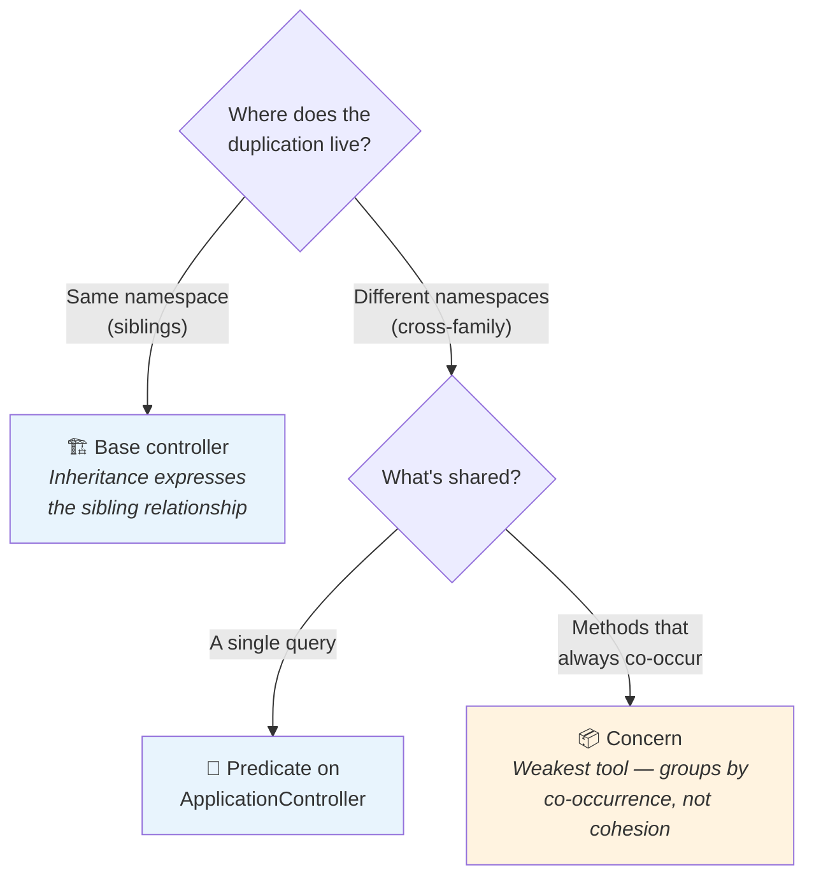
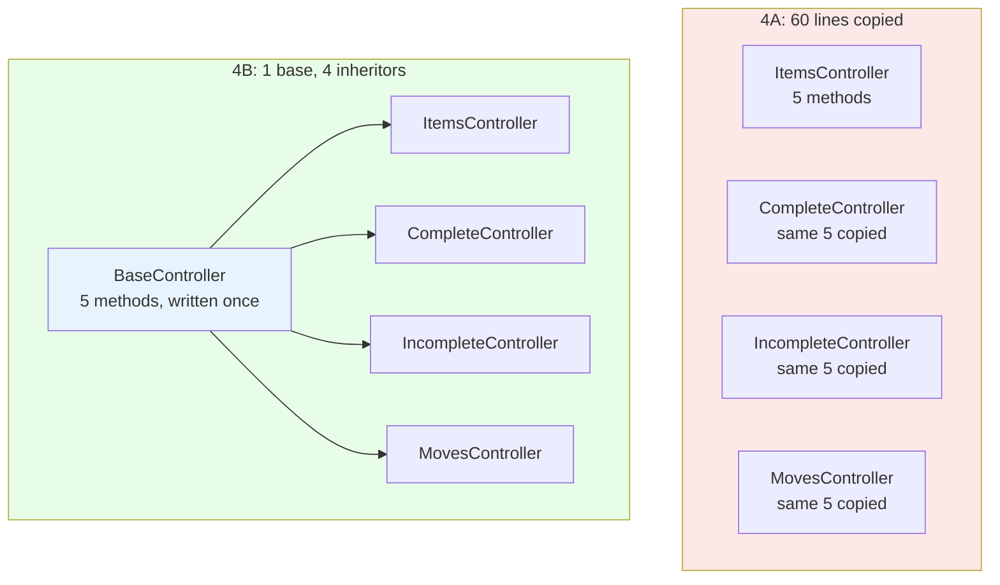

<p align="center">
<small>
◂ <a href="/docs/branches/4A-separation-of-entry-points.md">4A</a> | <a href="/docs/03-THE-GRADIENT.md"><strong>The Gradient</strong></a> | <a href="/docs/branches/5A-fat-models.md">5A</a> ▸
<br>
<a href="https://github.com/railswhey/app/tree/4B-controller-deduplication?tab=readme-ov-file">(Branch)</a> | <a href="https://github.com/railswhey/app/compare/4A-separation-of-entry-points..4B-controller-deduplication">(Diff)</a>
</small>
</p>

<h1 align="center" style="border-bottom: none;">
  
  Rails Whey App
  
</h1>

<p align="center">
  
</p>

Base controllers absorb sibling infrastructure, a shared predicate centralizes authorization, and a concern corrals co-occurring helpers — three tools matched to three kinds of duplication. Net: −89 lines, Rubycritic jumps to 87.13.

| | |
|---|---|
| **Branch** | `4B-controller-deduplication` |
| **Ruby** | 4.0 |
| **Rails** | 8.1 |
| **Rubycritic** | 87.13 |
| **LOC** | 1667 |

**Table of contents:**

- [🎯 The concept](#-the-concept)
- [📊 The numbers](#-the-numbers)
- [🤔 The problem](#-the-problem)
- [🏭 Why it happens](#-why-it-happens)
- [🔬 The evidence](#-the-evidence)
- [🤖 The agent's view](#-the-agents-view)
- [➡️ What comes next](#️-what-comes-next)
- [🏛️ Thesis checkpoint](#️-thesis-checkpoint)
- [🚀 Quick start](#-quick-start)
- [🧪 Testing](#-testing)
- [🗺️ The map](#️-the-map)

---

## 🎯 The concept

> **One rule:** match the extraction tool to the relationship.

4A separated web and API into independent families. The boundary was correct, but the separation created three kinds of duplication:



Siblings inherit. Strangers share via concerns. The concern is deliberately weak — `CommentAuthorization` bundles authorization and strong params in one container. Flawed, but it corrals scattered pieces so 5A can cleanly extract them to the model. Isolating a problem in an imperfect container beats leaving it scattered across four files where nobody can see its shape.

The fix is incomplete. Business logic in action bodies — stats, filtering — belongs on the model. No controller-layer tool reaches it.

---

## 📊 The numbers

| | Before (4A) | After (4B) |
|---|---|---|
| Duplicated private methods (Task::Item) | 15 (5 × 3) | 0 |
| Copies of `owner_or_admin` query | 6 | 1 (predicate) |
| Copies of comment helpers | 4 (2 × 2) | 0 (concern) |
| Inner base controllers | 0 | 2 |
| Shared concerns | 0 | 1 |
| Net line delta | — | −89 |
| Rubycritic | 78.55 | 87.13 |

Largest single-branch jump (+8.58) in the arc. Removing duplication with standard Rails tools moved quality more than any structural reorganization.

---

## 🤔 The problem

The Task::Item family had the worst duplication. Four controllers — `ItemsController`, `CompleteController`, `IncompleteController`, `MovesController` — each carried five identical private methods:

```ruby
# In EACH of four Web::Task::Item controllers:
def set_task_item
  @task_item = Current.task_items.find(params[:id])
  @task_list = Current.task_list
end

def next_location
  return task_item_assignments_url if params[:return_to] == "task_item_assignments"
  case params[:filter]
  when "completed" then task_items_url(filter: "completed")
  when "incomplete" then task_items_url(filter: "incomplete")
  when "show" then task_item_url(@task_item)
  else task_items_url
  end
end

# plus: require_task_list!, task_items_url, task_item_url
```

Twenty lines, copied three times — 60 lines of identical code in the Web family alone. The API family had the same five methods plus a `rescue_from` block.

Separately, `Current.account.memberships.owner_or_admin.exists?(user: Current.user)` appeared verbatim in six controllers across both families — `InvitationsController`, `TransfersController`, and `MembershipsController` in both Web and API. Six files, one query, zero shared abstraction.

---

## 🏭 Why it happens

4A separated controllers by format, not by shared infrastructure. Siblings like `CompleteController` and `MovesController` inherited from `Web::BaseController`, which provides auth and format handling — not task-item plumbing. Without a common parent below the family base, they copied.

A learner's instinct would be a concern. But these controllers share a domain entity, not just methods. Inheritance expresses the sibling relationship in the type hierarchy; a concern would obscure it.

The authorization query has a different root. The six controllers span `Account::Invitations`, `Task::List::Transfers`, and `Account::Memberships` — no shared namespace parent. Only the query is common; the HTTP response differs per family. The nearest common ancestor is `ApplicationController`.

---

## 🔬 The evidence

**Pattern 1: Base controller absorbs sibling infrastructure**

`CompleteController` dropped from 41 lines to 12:

```ruby
class Web::Task::Item::CompleteController < Web::Task::Item::BaseController
  before_action :authenticate_user!
  before_action :set_task_item

  def update
    @task_item.complete!
    redirect_to(next_location, notice: "Task item was successfully marked as completed.")
  end
end
```

One action. `set_task_item` and `next_location` come from `BaseController` — written once, inherited by four controllers.



**Pattern 2: Predicate centralizes a cross-family query**

```ruby
# ApplicationController — one source of truth
def owner_or_admin?
  Current.account.memberships.owner_or_admin.exists?(user: Current.user)
end
```

Guard methods stay in each controller — HTTP responses differ per family — but the query has one home. Changing authorization means editing one line, not six.

**Pattern 3: What 4B cannot fix**

Both `ListsController#show` actions compute identical stats:

```ruby
# In BOTH Web and API ListsController#show — identical:
items          = @task_list.task_items
@items_total   = items.count
@items_done    = items.completed.count
@items_pending = @items_total - @items_done
@items_pct     = @items_total > 0 ? (@items_done * 100.0 / @items_total).round : 0
@preview_items = items.incomplete.order(created_at: :desc).limit(5).includes(:assigned_user)
@list_comments = @task_list.comments.chronological.includes(:user)
```

Seven lines, character-for-character identical, in two files. Inline action logic — not private helpers. A base controller can't extract it. The computation belongs on `TaskList` as model methods. That's 5A's territory.

---

## 🤖 The agent's view

Before 4B, editing `next_location` meant changing four files. An agent that found one left three inconsistent. After: one file, one edit. The class hierarchy guides the agent to where shared behavior lives.

The `owner_or_admin?` predicate has the same benefit — six queries become one. But guard methods (`guard_owner_or_admin!` with per-family responses) remain duplicated. The predicate is shared; the HTTP response is not.

The remaining duplication costs agents most. The stats block sits inside action bodies — no named method for `grep` to surface. An agent adding "overdue count" to task list stats finds the Web version, misses the API copy. Until 5A moves this to the model, every agent mutation on task list stats is a silent divergence.

---

## ➡️ What comes next

The controller-level gradient is complete. Families 1–4: 79.48 → 87.13 using only controllers, concerns, base controllers, and standard routing.

What remains is business logic in action bodies — the 7-line stats block, the 5-line item filter, the invitation orchestration with mailer and notification dispatch. Branch `5A-fat-models` moves it into model methods — a single source of truth for both families. The controllers did their job. Now the models take over. ✌️

---

## 🏛️ Thesis checkpoint

Standard Rails tools absorbed the duplication 4A created — Principle 4 at the consolidation layer. The framework's own patterns, used with discipline, cleaned up the mess the framework's own patterns created. Rubycritic 87.13 — highest score in the arc. Principle 1 holds: the deduplication reshuffled controller hierarchies without touching a single test assertion.

The deeper lesson: `CommentAuthorization` is structurally flawed and correct for this moment. Gathering scattered pieces in one imperfect container makes the next extraction visible. Intermediate abstractions exist not to be permanent, but to make the next step obvious.

---

## 🚀 Quick start

Prerequisites: [mise](https://mise.jdx.dev/) (manages Ruby, Node, Mailpit)

```sh
git clone git@github.com:railswhey/app.git -b 4B-controller-deduplication 4B-controller-deduplication
cd 4B-controller-deduplication
mise install                 # Ruby 4.0.1 + Node 22 + Mailpit 1.29.2
bin/setup                    # bundle install, db:prepare, starts dev server
```

> See [Installation guide](./docs/00-INSTALLATION.md) for detailed setup, demo accounts, and E2E test setup.

## 🧪 Testing

Full CI pipeline (run after changes):

```sh
bin/ci                       # setup + RuboCop + Brakeman + bundler-audit + tests
```

Individual commands for faster feedback during development:

```sh
bin/rails test               # integration tests (Minitest)
mise run e2e:web             # Playwright navigation smoke test (fast, ~15s)
mise run e2e:web:full        # all Playwright specs (~5min)
mise run e2e:api             # curl + jq smoke tests (requires running server)
mise run e2e:test            # all E2E (e2e:web fast + e2e:api)
```

> See [Testing guide](./docs/02-TESTING.md) for running subsets, CI pipeline details, and E2E deep dives.

## 🗺️ The map

This branch is one point on a 28-branch gradient — from a single fat controller (1A) to fully isolated engines (7D). Every point is a valid, defensible choice. The goal is not to reach the end, but to see that the path exists.

For the full gradient, the manifesto, and the project's governance, see the [MAP](https://github.com/railswhey/app/tree/MAP?tab=readme-ov-file).
