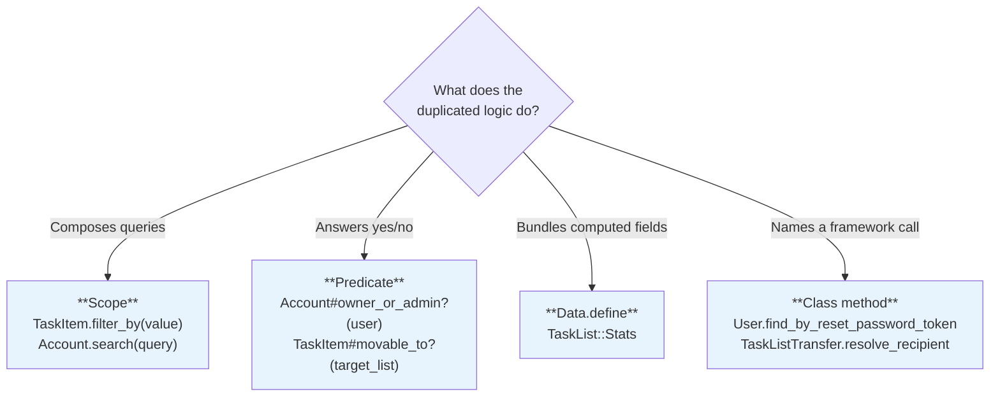
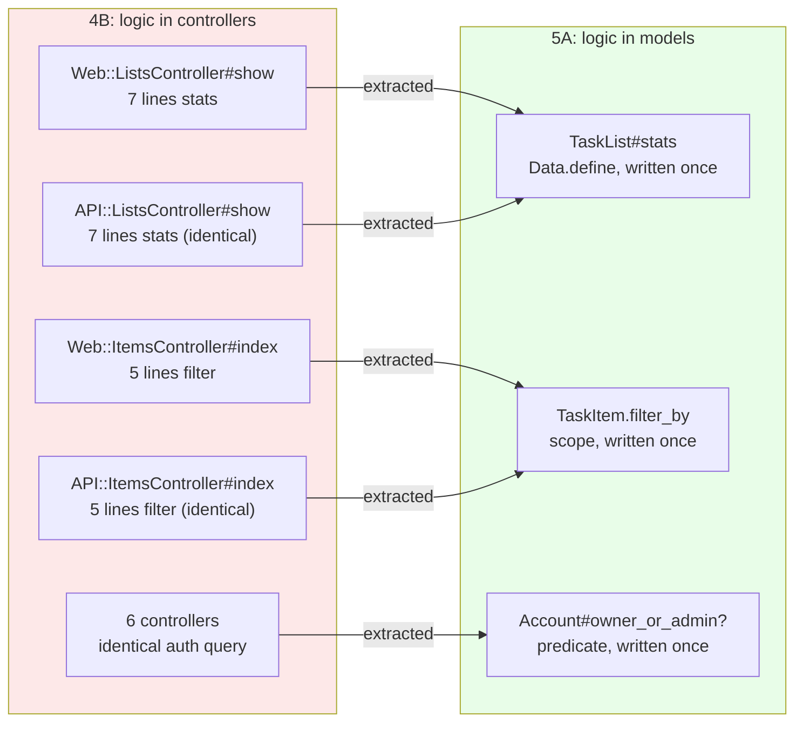

<p align="center">
<small>
◂ <a href="/docs/branches/4B-controller-deduplication.md">4B</a> | <a href="/docs/03-THE-GRADIENT.md"><strong>The Gradient</strong></a> | <a href="/docs/branches/5B-model-callbacks.md">5B</a> ▸
<br>
<a href="https://github.com/railswhey/app/tree/5A-fat-models?tab=readme-ov-file">(Branch)</a> | <a href="https://github.com/railswhey/app/compare/4B-controller-deduplication..5A-fat-models">(Diff)</a>
</small>
</p>

<h1 align="center" style="border-bottom: none;">
  
  Rails Whey App
  
</h1>

<p align="center">
  
</p>

A full-stack task management app built with Ruby on Rails. This branch moves query and mutation logic from controllers to models — the classic "fat models, skinny controllers" pattern. Business logic that was duplicated between Web and API controllers now lives in model methods, scopes, and `Data.define` value objects. Controllers keep only HTTP concerns.

| | |
|---|---|
| **Branch** | `5A-fat-models` |
| **Ruby** | 4.0 |
| **Rails** | 8.1 |
| **Rubycritic** | 91.51 |
| **LOC** | 1640 |

**Table of contents:**

- [🎯 The concept](#-the-concept)
- [📊 The numbers](#-the-numbers)
- [🤔 The problem](#-the-problem)
- [🔬 The evidence](#-the-evidence)
- [➡️ What comes next](#️-what-comes-next)
- [🏛️ Thesis checkpoint](#️-thesis-checkpoint)
- [🤖 The agent's view](#-the-agents-view)
- [🚀 Quick start](#-quick-start)
- [🧪 Testing](#-testing)
- [🗺️ The map](#️-the-map)

---

## 🎯 The concept

> **One rule:** if two controllers compute the same thing, the model should compute it once.

4B applied controller-layer tools — base controllers, shared predicates, a concern — and eliminated duplication in private methods. But identical business logic remained in action bodies. Controller tools can extract private helpers. They cannot extract inline action logic.

Families 1–4 optimized controller *structure* — file organization, inheritance, namespaces. None changed *where business logic lives*. Structural optimization reduces the cost of having logic in controllers; behavioral placement removes the duplication that structural tools cannot reach.

Each extraction follows one of four patterns, chosen by what the logic does:



The `CommentAuthorization` concern from 4B was deleted. Its authorization became `Comment#authored_by?(user)` on the model; `comment_params` was inlined as HTTP plumbing.

---

## 📊 The numbers

| | Before (4B) | After (5A) |
|---|---|---|
| Models with business logic methods | 0 | 9 |
| `Data.define` value objects | 0 | 2 |
| Model scopes added | 0 | 5 |
| Model predicates added | 0 | 5 |
| Controller concerns | 1 | 0 (deleted) |
| Controllers simplified | — | 21 |
| Net line delta | — | −41 |
| Rubycritic | 87.13 | 91.51 |

Rubycritic jumped +4.38 points — the highest score in the arc. Controllers shrank more than models grew because model methods are written once where they were previously written twice (or six times, for authorization). −41 net lines: duplication eliminated, not relocated. Business logic in the right layer produces better quality metrics than any structural reorganization.

---

## 🤔 The problem

After 4B, action-body duplication was the last category remaining. The worst case — `ListsController#show`, 7 identical lines in both Web and API:

```ruby
# In BOTH Web::Task::ListsController#show AND API::V1::Task::ListsController#show:
items               = @task_list.task_items
@items_total        = items.count
@items_done         = items.completed.count
@items_pending      = @items_total - @items_done
@items_pct          = @items_total > 0 ? (@items_done * 100.0 / @items_total).round : 0
@preview_items      = items.incomplete.order(created_at: :desc).limit(5).includes(:assigned_user)
@list_comments      = @task_list.comments.chronological.includes(:user)
```

The view compounded the problem — running additional queries (`assigned_count`, `last_activity`, `comments_count`) that the controller hadn't provided. Two sources of truth for the same data.

The pattern repeated: a 5-line filter in both `ItemsController#index`, a 20-line search in both `SearchesController#show`, identical auth checks in six controllers, identical `acceptable_by?` guards in two acceptance controllers.

---

## 🔬 The evidence

**Stats computation becomes a value object**

Before — 7 lines in each controller. After — one call:

```ruby
# Web::Task::ListsController
def show
  @stats = @task_list.stats
  @can_transfer = owner_or_admin?
end

# API::V1::Task::ListsController
def show
  @stats = @task_list.stats
end
```

The computation lives in `TaskList#stats`, returning a `Data.define` value object:

```ruby
Stats = Data.define(:total, :done, :pending, :pct, :assigned, :comments_count,
                    :last_activity, :preview_items, :list_comments)

def stats
  items = task_items
  total = items.count
  done  = items.completed.count

  Stats.new(
    total:, done:,
    pending:        total - done,
    pct:            total > 0 ? (done * 100.0 / total).round : 0,
    assigned:       items.where.not(assigned_user_id: nil).count,
    comments_count: comments.count,
    last_activity:  items.order(updated_at: :desc).pick(:updated_at) || created_at,
    preview_items:  items.incomplete.order(created_at: :desc).limit(5).includes(:assigned_user),
    list_comments:  comments.chronological.includes(:user)
  )
end
```

One method, one call site, one source of truth. The same convergence applies to all four patterns:



Multiple controllers converge on the same model method. Written once, called everywhere.

---

## ➡️ What comes next

5A moved queries, predicates, and computed results to models. But controllers still duplicate side effects — the code that runs after a record is saved:

- Both `InvitationsController#create` actions send the same email and notification after save.
- Both `TaskListTransfer` creation actions send acceptance emails after save.
- Both `RegistrationsController#create` actions trigger the same post-registration setup.

These are lifecycle events, not queries or predicates. A model method cannot own them because they are triggered by a specific moment in a record's lifecycle, not by a question about state. Rails has a native tool: model callbacks — `after_create_commit`, `after_destroy_commit`.

Branch `5B-model-callbacks` moves side-effect duplication into the model lifecycle. ✌️

---

## 🏛️ Thesis checkpoint

This is the paradigm shift the [Manifesto](/docs/governance/MANIFESTO.md) argues for. "Fat models, skinny controllers" is not a slogan — it is Principle 4 applied to where business logic lives. The codebase shrank by 41 lines while gaining 9 model methods — duplication eliminated, not relocated. Principle 1 made the migration safe.

Nine methods across nine models is clean. But as the app scales, strict "put it on the model that owns the data" risks god objects — 2000-line query clearinghouses. The boundary between direct model responsibility and delegated query object responsibility is 5D's territory.

---

## 🤖 The agent's view

Before 5A, an agent asked to "change how completion percentage is calculated" had to find and update two controllers and one view template — three files with the same formula, none referencing each other. After 5A, it edits `TaskList#stats` once. The model method is the single source of truth, and both controllers call it by name.

The `Data.define` pattern gives agents structural confidence. `@stats = @task_list.stats` — a named struct with defined fields, not seven implicit instance variables plus hidden view queries. The agent knows the exact shape of what the view receives.

The remaining duplication is side effects: mailer and notification dispatch still copied between controller families. That duplication is different in kind — not a computation, but a lifecycle event. 5B addresses it with model callbacks.

---

## 🚀 Quick start

Prerequisites: [mise](https://mise.jdx.dev/) (manages Ruby, Node, Mailpit)

```sh
git clone git@github.com:railswhey/app.git -b 5A-fat-models 5A-fat-models
cd 5A-fat-models
mise install                 # Ruby 4.0.1 + Node 22 + Mailpit 1.29.2
bin/setup                    # bundle install, db:prepare, starts dev server
```

> See [Installation guide](./docs/00-INSTALLATION.md) for detailed setup, demo accounts, and E2E test setup.

## 🧪 Testing

Full CI pipeline (run after changes):

```sh
bin/ci                       # setup + RuboCop + Brakeman + bundler-audit + tests
```

Individual commands for faster feedback during development:

```sh
bin/rails test               # integration tests (Minitest)
mise run e2e:web             # Playwright navigation smoke test (fast, ~15s)
mise run e2e:web:full        # all Playwright specs (~5min)
mise run e2e:api             # curl + jq smoke tests (requires running server)
mise run e2e:test            # all E2E (e2e:web fast + e2e:api)
```

> See [Testing guide](./docs/02-TESTING.md) for running subsets, CI pipeline details, and E2E deep dives.

## 🗺️ The map

This branch is one point on a 28-branch gradient — from a single fat controller (1A) to fully isolated engines (7D). Every point is a valid, defensible choice. The goal is not to reach the end, but to see that the path exists.

For the full gradient, the manifesto, and the project's governance, see the [MAP](https://github.com/railswhey/app/tree/MAP?tab=readme-ov-file).
