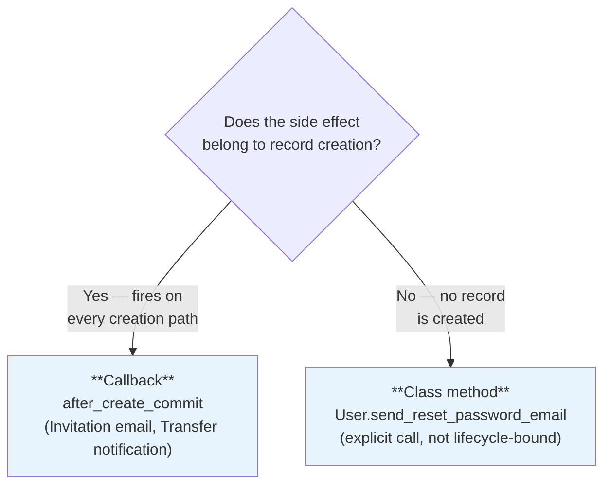
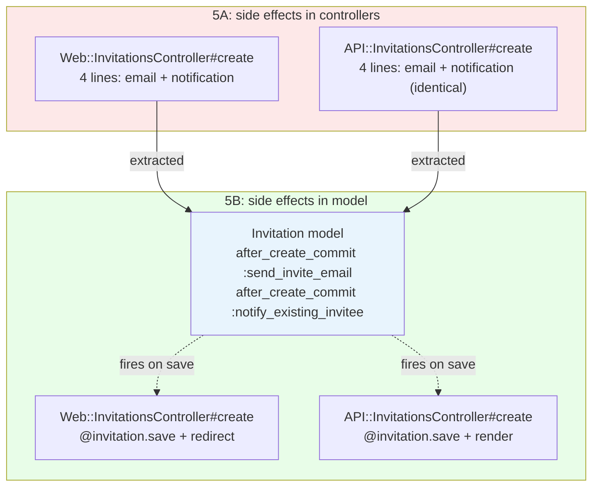
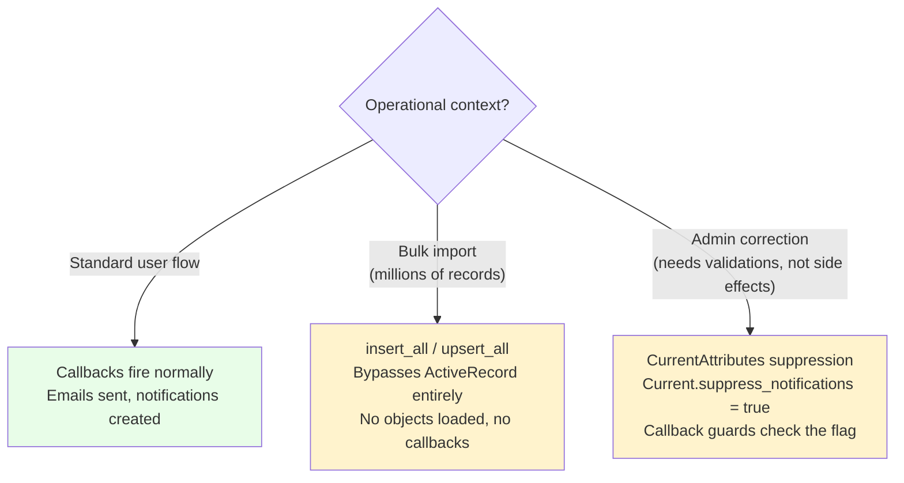

<p align="center">
<small>
◂ <a href="/docs/branches/5A-fat-models.md">5A</a> | <a href="/docs/03-THE-GRADIENT.md"><strong>The Gradient</strong></a> | <a href="/docs/branches/5C-unified-vocabulary.md">5C</a> ▸
<br>
<a href="https://github.com/railswhey/app/tree/5B-model-callbacks?tab=readme-ov-file">(Branch)</a> | <a href="https://github.com/railswhey/app/compare/5A-fat-models..5B-model-callbacks">(Diff)</a>
</small>
</p>

<h1 align="center" style="border-bottom: none;">
  
  Rails Whey App
  
</h1>

<p align="center">
  
</p>

A full-stack task management app built with Ruby on Rails. This branch moves side effects — emails and notifications — from controllers to model callbacks. After 5A put queries and predicates in models, the only duplication left between Web and API controllers was side-effect orchestration. `after_create_commit` callbacks eliminate it. Controllers no longer contain side-effect logic.

| | |
|---|---|
| **Branch** | `5B-model-callbacks` |
| **Ruby** | 4.0 |
| **Rails** | 8.1 |
| **Rubycritic** | 91.23 |
| **LOC** | 1638 |

**Table of contents:**

- [🎯 The concept](#-the-concept)
- [📊 The numbers](#-the-numbers)
- [🤔 The problem](#-the-problem)
- [🔬 The evidence](#-the-evidence)
- [🔪 The sharp knife](#-the-sharp-knife)
- [➡️ What comes next](#️-what-comes-next)
- [🏛️ Thesis checkpoint](#️-thesis-checkpoint)
- [🤖 The agent's view](#-the-agents-view)
- [🚀 Quick start](#-quick-start)
- [🧪 Testing](#-testing)
- [🗺️ The map](#️-the-map)

---

## 🎯 The concept

> **One rule:** if every creation path should trigger the effect, the model owns the event.

5A moved queries and predicates to models. But both Web and API controllers still duplicated side-effect orchestration — email dispatch and notification creation after a record is saved. Three pairs of controllers carried the same post-save code, character-for-character. 5A's tools (scopes, predicates, value objects) cannot extract these. They are not queries or computations. They are events tied to a lifecycle moment.

A side effect differs from a query in a fundamental way: a query can live on any object that has the data. A side effect is tied to the moment after persistence — "after this record is created, do X." Rails has a native mechanism: `after_create_commit`. The `_commit` variant ensures the side effect only fires after the database transaction succeeds — a rolled-back save never sends an email. And it fires for every creation path — controllers, seeds, console, scripts.

The developer must decide: is this side effect truly an invariant of the lifecycle event? The answer determines which tool to use:



---

## 📊 The numbers

| | Before (5A) | After (5B) |
|---|---|---|
| Models with `after_create_commit` callbacks | 1 (`User`) | 3 (`User`, `Invitation`, `TaskListTransfer`) |
| Controller side-effect lines (duplicated) | 9 (across 3 pairs) | 0 |
| Controllers simplified | — | 6 |
| Model class methods added | — | 1 (`send_reset_password_email`) |
| Rubycritic | 91.51 | 91.23 |

The score dipped −0.28 points. Callbacks add model complexity — more methods, more implicit behavior — without reducing the kind of duplication Rubycritic measures. The value is in the controller layer: six controllers lost their side-effect orchestration, and that logic now exists in exactly one place per event. LOC dropped from 1640 to 1638.

---

## 🤔 The problem

After 5A, both Web and API controllers shared identical side-effect blocks in three places:

```ruby
# In BOTH Web and API InvitationsController#create:
Account::InvitationMailer.invite(@invitation).deliver_later

if (invitee = User.find_by(email: @invitation.email))
  @invitation.notify_invitee!(invitee)
end
```

```ruby
# In BOTH Web and API TransfersController#create:
Notification.create!(user: to_user, notifiable: @transfer, action: "transfer_requested")
Task::ListTransferMailer.transfer_requested(@transfer).deliver_later
```

```ruby
# In BOTH Web and API PasswordsController#create:
user = User.find_by(email: params.require(:user).require(:email))
if user
  UserMailer.with(user: user, token: user.generate_token_for(:reset_password))
    .reset_password.deliver_later
end
```

A different tool is needed.

---

## 🔬 The evidence

**Callbacks replace controller-side orchestration.** Before (5A), both invitation controllers had 4 side-effect lines after save. After (5B), the controller just calls `.save`:

```ruby
# Web::Account::InvitationsController#create (after 5B)
def create
  guard_owner_or_admin! or return
  @account = Current.account
  @invitation = @account.invitations.new(invitation_params.merge(invited_by: Current.user))
  if @invitation.save
    redirect_to account_management_path, notice: "Invitation sent to #{@invitation.email}."
  else
    render :new, status: :unprocessable_entity
  end
end
```

The email and notification live in the model:

```ruby
class Invitation < ApplicationRecord
  after_create_commit :send_invite_email
  after_create_commit :notify_existing_invitee

  private

  def send_invite_email
    Account::InvitationMailer.invite(self).deliver_later
  end

  def notify_existing_invitee
    invitee = User.find_by(email: email)
    return unless invitee

    Notification.create!(user: invitee, notifiable: self, action: "invitation_received")
  end
end
```

`after_create_commit` handles creation invariants (always send the email). Explicit methods handle conditional operations (accept or reject).

**Virtual attributes as a seam.** `TaskListTransfer` stores `to_account` but the notification goes to a specific user. The model uses a virtual attribute to receive controller-provided context:

```ruby
class TaskListTransfer < ApplicationRecord
  attr_accessor :to_user

  after_create_commit :notify_recipient
  after_create_commit :send_transfer_email

  private

  def notify_recipient
    return unless to_user
    Notification.create!(user: to_user, notifiable: self, action: "transfer_requested")
  end

  def send_transfer_email
    Task::ListTransferMailer.transfer_requested(self).deliver_later
  end
end
```

The `return unless to_user` guard makes this a conditional callback, not a universal invariant — an exception to the "one rule." Transfers created without `to_user` (seeds, console, data migrations) skip the notification because they are not user-initiated. The coupling is visible and named — `attr_accessor :to_user` — not hidden.

**Password reset stays explicit.** No record is created, so a callback is wrong:

```ruby
# User model
def self.send_reset_password_email(email)
  user = find_by(email: email)
  return unless user

  UserMailer.with(user: user, token: user.generate_token_for(:reset_password))
    .reset_password.deliver_later
end
```

Both controllers replace three lines with one call: `User.send_reset_password_email(email)`.



---

## 🔪 The sharp knife

Callbacks are a sharp knife. They cut duplication cleanly — but they cut in directions you might not expect.

**What you gain:** Side effects can never be forgotten. If `Invitation` has an `after_create_commit` that sends an email, every creation path sends the email. The guarantee is total.

**What you pay:** Side effects are invisible to the caller. A developer reading `@invitation.save` sees a save. The email, the notification — all hidden behind the model. It's like wiring a light switch that secretly also opens the garage door.

Seeds are the concrete proof. Before 5B, seeds created invitations with explicit `Notification.create!` calls and no emails. After 5B, seeds call `create!` and callbacks handle everything — notifications created automatically, emails delivered to Mailpit in development. No creation path escapes.

This is the design for the standard domain lifecycle. But production applications have operational contexts outside it — and the framework provides the escape hatches:



**Bulk imports** cannot instantiate a million AR objects and fire a million welcome emails. `insert_all` operates at the database level, bypassing AR instantiation entirely.

**Administrative operations** need validations but not downstream notifications — `insert_all` doesn't help because you lose the validation layer. `CurrentAttributes` provides a thread-safe lever: set a context flag, guard the callback, reset in `ensure`. The application pauses side effects for one thread while the default behavior remains intact for all others.

The callback enforces the domain invariant for organic flows. The bypass patterns handle the operational reality that not every `INSERT` is an organic user action.

---

## ➡️ What comes next

Controllers say `Task::List::TransfersController`. Models say `TaskListTransfer`. After 5A and 5B, models carry real weight — stats, scopes, callbacks, predicates — but still use the flat names that `rails generate` gave them. The controller layer speaks domain vocabulary. The model layer speaks scaffold vocabulary.

Branch `5C-unified-vocabulary` aligns model names with the domain vocabulary that controllers already established. `TaskList` becomes `Task::List`. `TaskItem` becomes `Task::Item`. `TaskListTransfer` becomes `Task::List::Transfer`. The stack speaks one language from routes to models. ✌️

---

## 🏛️ Thesis checkpoint

`after_create_commit` is a native Rails tool — Principle 4, no architectural additives needed. Side effects that were duplicated across Web and API controllers now fire once from the model lifecycle. The model owns the event, not the HTTP layer. Principle 1 validates the extraction: tests assert on the behavioral outcome (email sent, notification created), not on which layer triggered it. But callbacks are not binary — "always fire" is the default, not the only mode. `insert_all` for bulk operations and `CurrentAttributes` suppression for admin tasks are the framework's own escape hatches. The domain invariant holds for organic flows. The breaker box exists for everything else.

---

## 🤖 The agent's view

Before 5B, an agent asked to "add a notification when an invitation is created" would update both Web and API controllers. After 5B, it adds one callback to `Invitation`. One file, one edit, every creation path gets the new behavior.

The trade-off mirrors the human one. An agent reading `InvitationsController#create` sees `@invitation.save` followed by a redirect — it does not see the email or the notification. The answer requires loading the model file. The bypass patterns matter too: an agent writing a data migration must know to use `insert_all` instead of `Invitation.create!` — otherwise a million invitation emails fire.

---

## 🚀 Quick start

Prerequisites: [mise](https://mise.jdx.dev/) (manages Ruby, Node, Mailpit)

```sh
git clone git@github.com:railswhey/app.git -b 5B-model-callbacks 5B-model-callbacks
cd 5B-model-callbacks
mise install                 # Ruby 4.0.1 + Node 22 + Mailpit 1.29.2
bin/setup                    # bundle install, db:prepare, starts dev server
```

> See [Installation guide](./docs/00-INSTALLATION.md) for detailed setup, demo accounts, and E2E test setup.

## 🧪 Testing

Full CI pipeline (run after changes):

```sh
bin/ci                       # setup + RuboCop + Brakeman + bundler-audit + tests
```

Individual commands for faster feedback during development:

```sh
bin/rails test               # integration tests (Minitest)
mise run e2e:web             # Playwright navigation smoke test (fast, ~15s)
mise run e2e:web:full        # all Playwright specs (~5min)
mise run e2e:api             # curl + jq smoke tests (requires running server)
mise run e2e:test            # all E2E (e2e:web fast + e2e:api)
```

> See [Testing guide](./docs/02-TESTING.md) for running subsets, CI pipeline details, and E2E deep dives.

## 🗺️ The map

This branch is one point on a 28-branch gradient — from a single fat controller (1A) to fully isolated engines (7D). Every point is a valid, defensible choice. The goal is not to reach the end, but to see that the path exists.

For the full gradient, the manifesto, and the project's governance, see the [MAP](https://github.com/railswhey/app/tree/MAP?tab=readme-ov-file).
