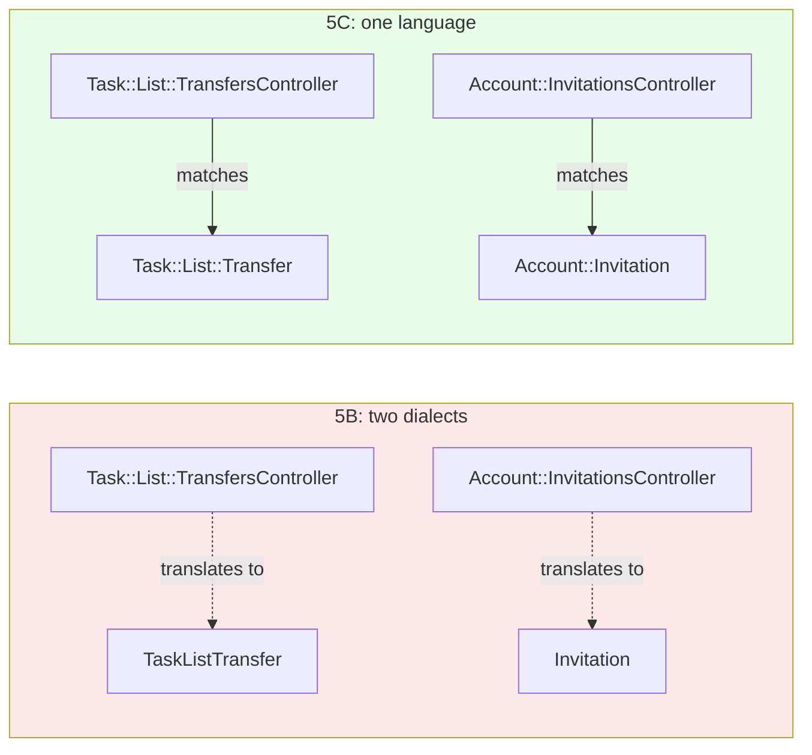
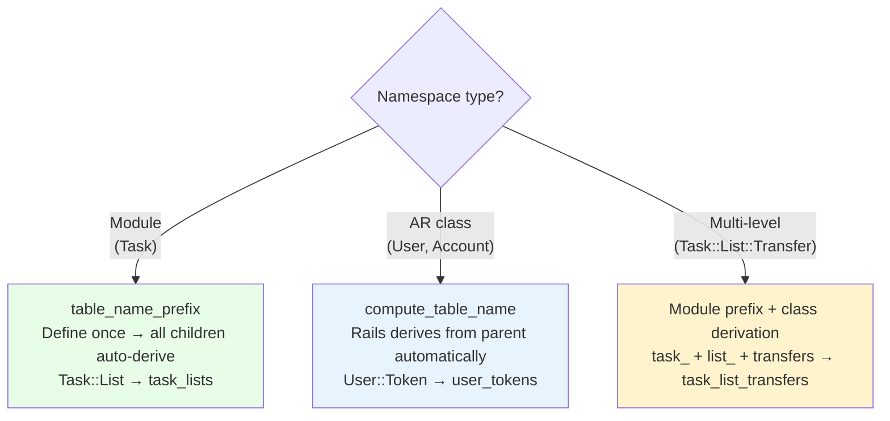

<p align="center">
<small>
◂ <a href="/docs/branches/5B-model-callbacks.md">5B</a> | <a href="/docs/03-THE-GRADIENT.md"><strong>The Gradient</strong></a> | <a href="/docs/branches/5D-model-authority.md">5D</a> ▸
<br>
<a href="https://github.com/railswhey/app/tree/5C-unified-vocabulary?tab=readme-ov-file">(Branch)</a> | <a href="https://github.com/railswhey/app/compare/5B-model-callbacks..5C-unified-vocabulary">(Diff)</a>
</small>
</p>

<h1 align="center" style="border-bottom: none;">
  
  Rails Whey App
  
</h1>

<p align="center">
  
</p>

A full-stack task management app built with Ruby on Rails. This branch unifies the vocabulary between controllers and models. After 5A and 5B pushed business logic into models, those models still used flat scaffold names — `TaskList`, `Invitation`, `TaskListTransfer`. Controllers already spoke `Task::List::`, `Account::`, `Task::List::Transfer`. 5C closes the gap: 8 models renamed, 4 tables migrated, the stack speaks one language from routes to models.

| | |
|---|---|
| **Branch** | `5C-unified-vocabulary` |
| **Ruby** | 4.0 |
| **Rails** | 8.1 |
| **Rubycritic** | 91.18 |
| **LOC** | 1641 |

**Table of contents:**

- [🎯 The concept](#-the-concept)
- [📊 The numbers](#-the-numbers)
- [🤔 The problem](#-the-problem)
- [🔬 The evidence](#-the-evidence)
- [🔧 The table name strategy](#-the-table-name-strategy)
- [➡️ What comes next](#️-what-comes-next)
- [🏛️ Thesis checkpoint](#️-thesis-checkpoint)
- [🤖 The agent's view](#-the-agents-view)
- [🚀 Quick start](#-quick-start)
- [🧪 Testing](#-testing)
- [🗺️ The map](#️-the-map)

---

## 🎯 The concept

> **One rule:** the model's name should match the controller's namespace.

The stack speaks two dialects. Controllers say `Task::List::TransfersController`. Models say `TaskListTransfer`. A developer tracing a bug from controller to database must mentally translate every reference — invisible friction that compounds with every lookup.

This branch aligns the two. `TaskList` becomes `Task::List`. `Invitation` becomes `Account::Invitation`. `TaskListTransfer` becomes `Task::List::Transfer`. Eight models renamed, four tables migrated, zero behavioral changes.

Two models stay flat: `User` and `Account`. They are top-level domain roots — the namespaces themselves, not members of someone else's namespace.

---

## 📊 The numbers

| | Before (5B) | After (5C) |
|---|---|---|
| Models with flat names | 8 | 0 |
| Models namespaced | 0 | 8 |
| Table rename migrations | — | 4 |
| Files with updated references | — | ~60 |
| Behavioral test changes | — | 0 |
| Rubycritic | 91.23 | 91.18 |

~60 files touched for zero behavioral change. The score dipped −0.05 points — structural renames don't move quality needles. The value is elsewhere: a `grep` for `Task::List` now finds controllers, views, and models in the same search.

---

## 🤔 The problem

After 5A and 5B, models carry real weight. `Task::List` has a `Stats` value object, scopes, callbacks, and validations. `Account::Invitation` has lifecycle callbacks and a token-based accept flow. These are domain objects with behavior — living at the wrong address.

The gap exists because `rails generate model TaskList` creates `app/models/task_list.rb` with `class TaskList`. When controllers gained namespaces in Family 3, models stayed behind. Nobody goes back to rename a working model. A 10-line model with a flat name is a minor inconsistency. A 50-line model with stats, scopes, and callbacks — still named `TaskList` while its controller says `Task::List` — is a vocabulary failure.

Two common mistakes when deciding what to namespace:

- **Assuming namespace conflicts where none exist.** `User::Notification` (model) and `Web::User::Notification::InboxController` (controller) are different Ruby constants. No conflict.
- **Treating polymorphic models as cross-domain.** `Comment` is polymorphic, but both commentable types belong to `Task::`. Polymorphic means flexible association, not that the model belongs everywhere. `Task::Comment` is the honest name.

---

## 🔬 The evidence

**The move map:**

| Before | After | File |
|---|---|---|
| `TaskList` | `Task::List` | `app/models/task/list.rb` |
| `TaskItem` | `Task::Item` | `app/models/task/item.rb` |
| `Comment` | `Task::Comment` | `app/models/task/comment.rb` |
| `TaskListTransfer` | `Task::List::Transfer` | `app/models/task/list/transfer.rb` |
| `UserToken` | `User::Token` | `app/models/user/token.rb` |
| `Notification` | `User::Notification` | `app/models/user/notification.rb` |
| `Invitation` | `Account::Invitation` | `app/models/account/invitation.rb` |
| `Membership` | `Account::Membership` | `app/models/account/membership.rb` |

**Table renames:**

| Before | After |
|---|---|
| `comments` | `task_comments` |
| `notifications` | `user_notifications` |
| `invitations` | `account_invitations` |
| `memberships` | `account_memberships` |

Tables that already matched (`task_lists`, `task_items`, `user_tokens`, `task_list_transfers`) needed no migration. Polymorphic `commentable_type` columns required data migration to update stored class names (`"TaskItem"` → `"Task::Item"`).

**The namespace module pattern:**

```ruby
# app/models/task.rb — pure namespace module
module Task
  def self.table_name_prefix = "task_"
end

# app/models/task/list.rb — carries 5A's stats and 5B's callbacks
class Task::List < ApplicationRecord
  belongs_to :account
  has_many :task_items, class_name: "Task::Item", foreign_key: :task_list_id, dependent: :destroy
  has_many :comments, as: :commentable, class_name: "Task::Comment", dependent: :destroy

  Stats = Data.define(:total, :done, :pending, :pct, :assigned, :comments_count,
                      :last_activity, :preview_items, :list_comments)
end
```



Dashed arrows are lookups across naming conventions. Solid arrows are direct matches.

---

## 🔧 The table name strategy

Rails derives table names differently depending on the namespace type:



**`table_name_prefix` is the systemic cure.** Without it, every model inside `Task::` needs its own `self.table_name` declaration. A new `Task::Label` model would silently look for a `labels` table instead of `task_labels` — a cryptic failure, not a helpful error. The module-level prefix eliminates the human memory component: define it once, every nested model auto-derives.

The only explicit `foreign_key` needed is on `Task::List`'s `has_many :task_items` — Rails demodulizes `Task::List` to `List` and derives `list_id` instead of `task_list_id`.

---

## ➡️ What comes next

The stack speaks one language. But vocabulary alignment doesn't fix who owns the logic. Callers still reach through `Account`'s associations to check authorization and create memberships. `Task::List::Transfer#accept!` calls `to_account.memberships.owner_or_admin.exists?(user: user)` when `Account#owner_or_admin?` already answers that.

Branch `5D-model-authority` applies Tell Don't Ask: move logic to the model that owns the data. Six moves, three patterns — no new files, no new abstractions. Just code moving to where it belongs. ✌️

---

## 🏛️ Thesis checkpoint

Naming is design. One word for one concept — Principle 4 at the semantic level. The vocabulary unification uses nothing but standard Rails conventions: modules, `table_name_prefix`, namespaced models. The `table_name_prefix` on the `Task` module teaches the framework to read the new vocabulary instead of fighting its conventions. The `set_fixture_class` overrides for class-based namespaces (`Account::`, `User::`) are the compounding friction that remains — a trade-off that scales poorly as models accumulate.

---

## 🤖 The agent's view

5C eliminates the translation step. Before, an agent seeing `Task::List::TransfersController` had to know it maps to `TaskListTransfer` at `app/models/task_list_transfer.rb` — a lookup across two naming conventions. After, the namespace is the file path: `task/list/transfer.rb`. One language from routes to models.

Search precision improves too. Before 5C, `TaskList` found model code; `Task::List` found controller code. An agent building a mental map searched twice. After 5C, `Task::List` finds everything — model, controller, view, route. One search, complete results.

The `set_fixture_class` mapping in `test_helper.rb` remains a friction point for class-based namespaces (`Account::`, `User::`). Module namespaces (`Task::`) avoid it via `table_name_prefix`. A future model added to `Account::` needs a manual fixture entry — the agent won't know that unless it reads `test_helper.rb` proactively.

---

## 🚀 Quick start

Prerequisites: [mise](https://mise.jdx.dev/) (manages Ruby, Node, Mailpit)

```sh
git clone git@github.com:railswhey/app.git -b 5C-unified-vocabulary 5C-unified-vocabulary
cd 5C-unified-vocabulary
mise install                 # Ruby 4.0.1 + Node 22 + Mailpit 1.29.2
bin/setup                    # bundle install, db:prepare, starts dev server
```

> See [Installation guide](./docs/00-INSTALLATION.md) for detailed setup, demo accounts, and E2E test setup.

## 🧪 Testing

Full CI pipeline (run after changes):

```sh
bin/ci                       # setup + RuboCop + Brakeman + bundler-audit + tests
```

Individual commands for faster feedback during development:

```sh
bin/rails test               # integration tests (Minitest)
mise run e2e:web             # Playwright navigation smoke test (fast, ~15s)
mise run e2e:web:full        # all Playwright specs (~5min)
mise run e2e:api             # curl + jq smoke tests (requires running server)
mise run e2e:test            # all E2E (e2e:web fast + e2e:api)
```

> See [Testing guide](./docs/02-TESTING.md) for running subsets, CI pipeline details, and E2E deep dives.

## 🗺️ The map

This branch is one point on a 28-branch gradient — from a single fat controller (1A) to fully isolated engines (7D). Every point is a valid, defensible choice. The goal is not to reach the end, but to see that the path exists.

For the full gradient, the manifesto, and the project's governance, see the [MAP](https://github.com/railswhey/app/tree/MAP?tab=readme-ov-file).
