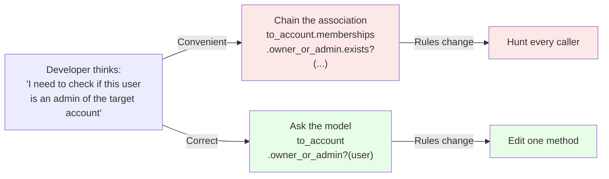
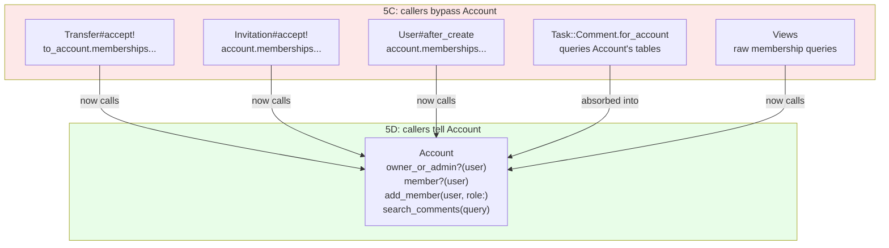

<p align="center">
<small>
◂ <a href="/docs/branches/5C-unified-vocabulary.md">5C</a> | <a href="/docs/03-THE-GRADIENT.md"><strong>The Gradient</strong></a> | <a href="/docs/branches/6A-member-object.md">6A</a> ▸
<br>
<a href="https://github.com/railswhey/app/tree/5D-model-authority?tab=readme-ov-file">(Branch)</a> | <a href="https://github.com/railswhey/app/compare/5C-unified-vocabulary..5D-model-authority">(Diff)</a>
</small>
</p>

<h1 align="center" style="border-bottom: none;">
  
  Rails Whey App
  
</h1>

<p align="center">
  
</p>

A full-stack task management app built with Ruby on Rails. This branch applies Tell Don't Ask — moving logic to the model that owns the data it touches. Callers still reached through Account's associations when the model already had the methods. Six moves fix this: three use existing methods, two consolidate duplicates, one relocates a misplaced query. Net change: +8 lines.

| | |
|---|---|
| **Branch** | `5D-model-authority` |
| **Ruby** | 4.0 |
| **Rails** | 8.1 |
| **Rubycritic** | 91.21 |
| **LOC** | 1646 |

**Table of contents:**

- [🎯 The concept](#-the-concept)
- [📊 The numbers](#-the-numbers)
- [🤔 The problem](#-the-problem)
- [🔬 The evidence](#-the-evidence)
- [➡️ What comes next](#️-what-comes-next)
- [🏛️ Thesis checkpoint](#️-thesis-checkpoint)
- [🤖 The agent's view](#-the-agents-view)
- [🚀 Quick start](#-quick-start)
- [🧪 Testing](#-testing)
- [🗺️ The map](#️-the-map)

---

## 🎯 The concept

> **One rule:** ask the model that owns the data; don't reach through its associations.

Imagine bypassing a department head to instruct their team directly. That's what callers were doing — chaining through Account's associations instead of asking Account. `Transfer#accept!` queried `to_account.memberships.owner_or_admin.exists?(...)` when `Account#owner_or_admin?` already answered that question. The code was already written. It was just in the wrong place.

Six moves, three diagnostic patterns. No new files, no new abstractions.

---

## 📊 The numbers

| | Before (5C) | After (5D) |
|---|---|---|
| New methods on Account | — | 3 (`member?`, `add_member`, `search_comments`) |
| Methods removed from other models | — | 1 (`Task::Comment.for_account`) |
| Existing methods used instead of bypass | — | 3 |
| Files changed | — | 10 |
| Behavioral test changes | — | 0 |
| Rubycritic | 91.18 | 91.21 |

Account grew by three methods and 20 lines. The rest lost 12. Net: +8 lines. The numbers are small because the code was already written — it was just sitting in the wrong place.

The growth direction matters. Account now carries five domain-query methods (`owner_or_admin?`, `search`, `member?`, `add_member`, `search_comments`). Five is manageable. But strict Tell Don't Ask creates gravitational pull: if every question about an account must pass through the Account class, it drifts toward a clearinghouse — 80 methods obscuring its identity as a tenant. The line between "owns this logic" and "should delegate this logic" is the next pressure point.

---

## 🤔 The problem

After 5C, models carry real weight — stats, scopes, predicates, callbacks. But callers still bypass them.

Rails makes this easy. `to_account.memberships.owner_or_admin.exists?(user: user)` reads like plain English. It works, tests pass, the feature ships. Nobody notices because the caller gets the right answer. But the logic lives in the caller instead of the model that owns the data. When membership rules change, every caller that reached through must be found and updated independently.

The locally convenient choice is the globally expensive one.



Five callers across four files bypassed Account's interface. Six moves fix all of them.

---

## 🔬 The evidence

**Pattern 1: Use the method that already exists**

Signal: a caller chains through an association to produce an answer a model method already provides.

```ruby
# Before — Transfer and views reach through the association
to_account.memberships.owner_or_admin.exists?(user: user)

# After — ask the model
to_account.owner_or_admin?(user)
```

Same fix in views — `Current.account.owner_or_admin?(Current.user)` replaces raw membership queries in ERB. Same fix in `Account#search` — `Task::Item.for_account(id)` replaces a manual join.

**Pattern 2: Consolidate duplicate operations on the owning model**

Signal: multiple callers perform the same mutation with different idioms.

```ruby
# Before — Invitation uses find_or_create_by!, User uses create!
account.memberships.find_or_create_by!(user: user) { |m| m.role = :collaborator }
account.memberships.create!(user: self, role: :owner)

# After — both tell Account
account.add_member(user, role: :collaborator)
account.add_member(self, role: :owner)
```

`Account#member?` absorbs the membership existence check the same way — `Invitation#acceptable_by?` asks `account.member?(user)` instead of reaching into `account.memberships.exists?`.

**Pattern 3: Relocate the query to the model that owns the data**

Signal: a method's name contains another model's name, or it queries tables it doesn't own.

```ruby
# Before — Task::Comment queries Account's tables
def self.for_account(account_id)
  task_item_ids = Task::Item.joins(:task_list).where(task_lists: { account_id: }).ids
  task_list_ids = Task::List.where(account_id:).ids
  where(...)
end

# After — Account queries its own tables
def search_comments(query)
  task_item_ids = Task::Item.for_account(id).ids
  task_list_ids = task_lists.ids
  Task::Comment.where(...).search(query).includes(:user, :commentable)
    .order(created_at: :desc).limit(10)
end
```

The method moved to Account because Account owns `task_lists`. The name lost the foreign prefix: `for_account` → `search_comments`.



---

## ➡️ What comes next

Models own their logic. But `Current` — a framework utility meant to hold request-scoped state — still does domain work. Its `member!` method spans 40+ lines of SQL: LEFT JOINs, dynamic conditions, token checksums. That's not shared state. It's authorization logic that resolves a user into a scoped member — a domain concept with no name and no class.

Branch `6A-member-object` introduces `Account::Member` — the first PORO in the arc. The SQL moves to `Account::Member::Authorization`. `Current` shrinks from 82 to ~20 lines. The public interface doesn't change — `Current.user`, `Current.account`, `Current.task_list` all continue to work. The concept hiding inside infrastructure gets a class, a name, and a home. ✌️

---

## 🏛️ Thesis checkpoint

This branch completes the behavioral migration. Controllers are thin HTTP translators. Models own business logic, authorization, and state transitions — the Rails Way answer to service objects, Principle 4 at its most demanding.

But Tell Don't Ask is about the conversation between objects, not physical location. As the application scales, `Account#search_comments` can become a one-line delegation to a `CommentQuery` — the model stays a semantic router, the query logic lives in a focused, testable class. Separating interface from implementation prevents Tell Don't Ask from creating the fat model problem it was meant to solve.

---

## 🤖 The agent's view

Before 5D, changing membership rules meant editing six locations across five files — and two search strategies to find them all (one `grep` for the method name, another for the raw association chain). After 5D: one file. Callers delegate, so they follow automatically.

The fat model risk matters for agents too. An LLM loading a 2000-line model to find one method burns context on noise. At five methods, Account is clean. At eighty, the signal drowns. Delegating queries to focused objects keeps the token cost of understanding any single operation low.

---

## 🚀 Quick start

Prerequisites: [mise](https://mise.jdx.dev/) (manages Ruby, Node, Mailpit)

```sh
git clone git@github.com:railswhey/app.git -b 5D-model-authority 5D-model-authority
cd 5D-model-authority
mise install                 # Ruby 4.0.1 + Node 22 + Mailpit 1.29.2
bin/setup                    # bundle install, db:prepare, starts dev server
```

> See [Installation guide](./docs/00-INSTALLATION.md) for detailed setup, demo accounts, and E2E test setup.

## 🧪 Testing

Full CI pipeline (run after changes):

```sh
bin/ci                       # setup + RuboCop + Brakeman + bundler-audit + tests
```

Individual commands for faster feedback during development:

```sh
bin/rails test               # integration tests (Minitest)
mise run e2e:web             # Playwright navigation smoke test (fast, ~15s)
mise run e2e:web:full        # all Playwright specs (~5min)
mise run e2e:api             # curl + jq smoke tests (requires running server)
mise run e2e:test            # all E2E (e2e:web fast + e2e:api)
```

> See [Testing guide](./docs/02-TESTING.md) for running subsets, CI pipeline details, and E2E deep dives.

## 🗺️ The map

This branch is one point on a 28-branch gradient — from a single fat controller (1A) to fully isolated engines (7D). Every point is a valid, defensible choice. The goal is not to reach the end, but to see that the path exists.

For the full gradient, the manifesto, and the project's governance, see the [MAP](https://github.com/railswhey/app/tree/MAP?tab=readme-ov-file).
