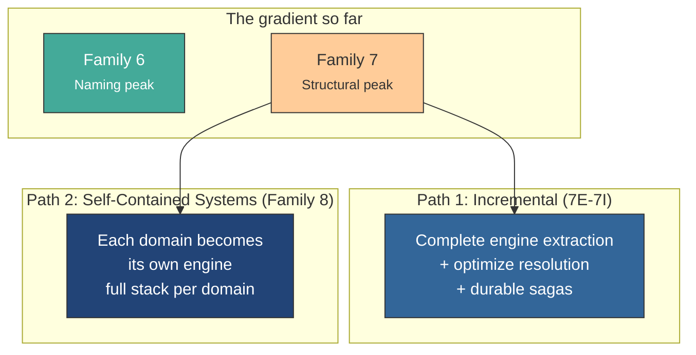
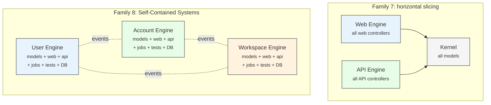

<small>
◂ <a href="/docs/branches/7D-shared-kernel.md">7D</a> | <a href="/docs/03-THE-GRADIENT.md"><strong>The Gradient</strong></a>
</small>

<h1 align="center" style="border-bottom: none;">
  
  Rails Whey App
  
</h1>

  

# What's Next <!-- omit in toc -->

> The gradient doesn't end at 7D. Here's where it's going.

---

Twenty-eight branches. Seven families. One codebase. From a single fat controller to fully isolated engines with separate databases — using only Rails' own tools. Every point on the gradient is valid. Every tradeoff is named honestly.

But the arc isn't over.

7D proved that Rails can enforce physical boundaries through engines and multi-database isolation. It also revealed a tension: the structural enforcement that serves teams comes at a cost to the developer navigating between them. The naming gap between `Web::Task::*` controllers and `Workspace::*` models. Tests living in the host, not the engines. A resolver that knows too much about how each engine authenticates.

These aren't flaws. They're the next chapter.

---

## Two paths forward

### Path 1: Complete what 7D started (7E-7I)

Five incremental steps that refine 7D without changing the architecture:

| Step | What it does |
|---|---|
| **7E** | Tests move to engines |
| **7F** | Resolver splits per engine |
| **7G** | Lazy resolution + session persistence |
| **7H** | `ActiveJob::Continuable` replaces custom process manager abstraction |
| **7I** | `Rails.event.notify` + compensation jobs |

Two Rails 8.1 features power the saga evolution: `ActiveJob::Continuable` (durable step-by-step job execution) for forward progress and `Rails.event.notify` (Structured Event Reporting) for event-driven compensation. No new infrastructure tables. The queue backend becomes the durability layer.

### Path 2: Self-Contained Systems (Family 8)

A different question entirely: what if each bounded context owns its **full stack** — models, controllers (web + API), views, jobs, mailers, database, and tests — in a single engine?

Left: 7D slices by delivery mechanism — domain is scattered across three locations. Right: Family 8 slices by domain — everything for a bounded context lives in one engine.

The naming gap disappears. `Workspace::Task` model and `Workspace::Web::Task::ItemsController` share the same engine and namespace. One grep finds everything.

The complexity moves to coordination. Engines communicate through `Rails.event.notify` — Structured Event Reporting from Rails 8.1. Identity propagates via events: when a user registers, the User engine emits an event and each other engine creates its own local copy of the identity (like `Account::Person` and `Workspace::Member` already do in 7A). No engine ever queries another engine's database.

A minimal, acyclic shared kernel provides two domain-agnostic primitives: `AccessToken` (token parsing for API auth) and `DomainEvent` (sync/async event dispatch, with Solid Queue as a transactional outbox). A Design System engine provides UI consistency. Everything else lives in the domain engines.

This is a complete rewrite — not an incremental step. It's for teams whose codebase, team size, or deployment requirements justify the structural investment.

---

## The road ahead

The gradient exists to prove one thing: **the Rails Way has more room in it than most people think.**

The design decisions get harder — bounded contexts, saga compensation, engine extraction, event-driven coordination — but the tools stay the same. Ruby modules. Rails engines. Active Job. Active Record. The framework adapts.

The question was never whether Rails can handle sophisticated architecture. It always was: **how much architecture does your codebase actually need?**

The gradient doesn't prescribe an answer. It demonstrates the range. Every point is a valid choice for a real team shipping real software.

The next chapters will build it. 🦾
